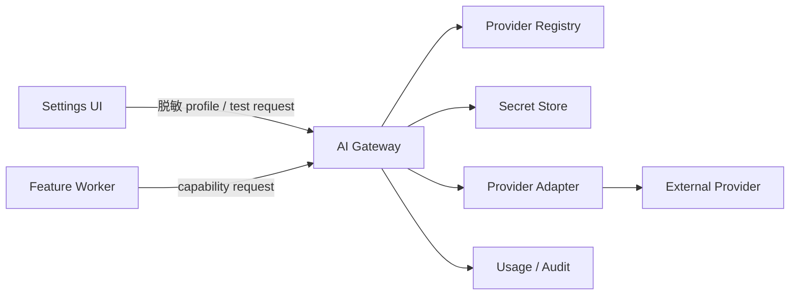
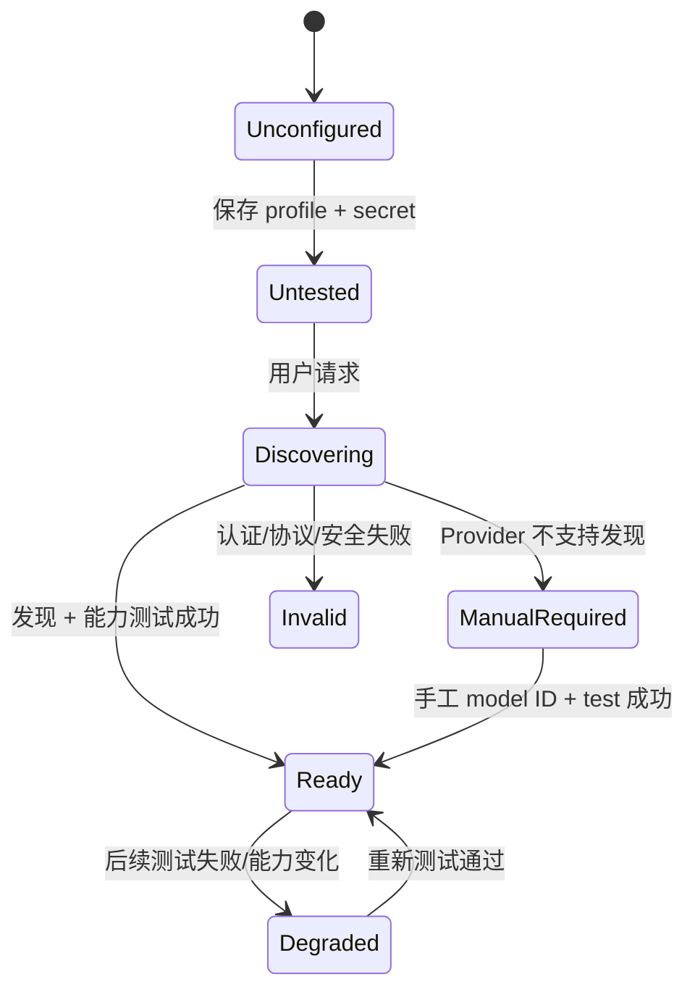
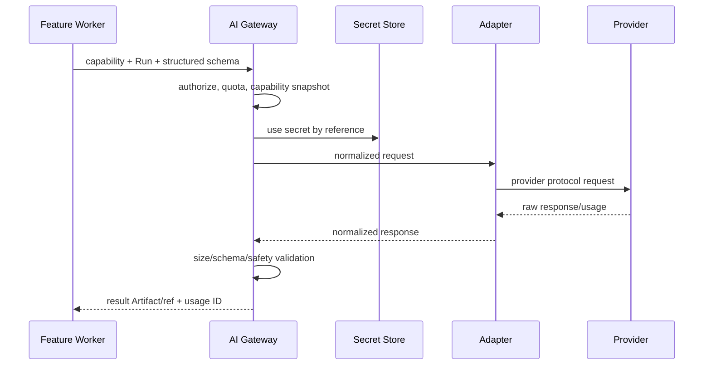

# AI Provider 架构

状态：Draft for Review  
目标：用户可配置 DeepSeek V4 Flash 或受控 OpenAI-compatible Custom Provider，真实发现/选择模型和测试连接；Feature 不接触 Key 或供应商私有协议。

## 1. 边界



- Shell 只处理 profile 表单和脱敏状态，不直接向 Provider 发请求。
- Feature 只声明能力、用途、Run 和输入 Artifact/结构化内容，不指定 Key。
- AI Gateway 负责授权、限额、adapter 选择、Secret 使用、调用、输出验证、usage 和错误正规化。
- Provider Adapter 只实现供应商协议，不包含业务场景提示或模板规则。

## 2. Provider 类型与决策

| 类型 | 状态 | Base URL | 模型发现 |
|---|---|---|---|
| DeepSeek | 已有基础 Chat Completions adapter；V4 Flash 正式版升级待实施 | 新配置默认 `https://api.deepseek.com`；兼容已验证 `/v1/` profile | 真实 `GET /models`，所选模型缺失即不可用 |
| OpenAI-compatible Custom | 已有最小 adapter；完整 Gateway 能力仍待补齐 | 用户可配置，必须通过安全 gate | 优先真实发现，不支持时 manual |
| Nova | `Deferred` | 不猜测 | 当前阶段不验证；未来需要专用支持时再实测 |

DeepSeek 新配置的默认模型固定为 `deepseek-v4-flash`。旧 `deepseek-chat/deepseek-reasoner` 已到官方停用日期，不再作为默认或 ready 模型。普通聊天显式发送 `thinking.disabled`；复杂任务由 capability 显式选择 `thinking.enabled` 与 `low|high|max`。完整官方合同、当前代码差异和迁移边界见 [DeepSeek V4 Flash 官方 API 差异评审](../reviews/DEEPSEEK_V4_FLASH_API_REVIEW.md)。

Nova 协议验证当前不属于首批 Feature 或平台骨架的阻塞项。在未来重新启动专用适配前：

- 不宣称 OpenAI-compatible；
- 不硬编码 endpoint、认证 header、模型 ID 或发现路径；
- 不展示“已支持/测试成功”；
- 可在 registry 中保留 `pending_verification` 设计占位，但不是可点击业务入口。
- 如果用户通过 OpenAI-compatible Custom Profile 配置真实 Nova 服务，仍必须完成 Custom Adapter 的真实连接测试；不能按名称自动推断兼容。

## 3. Adapter 合同

```text
validateConfig(profileWithoutSecret) -> ValidationResult
discoverModels(context) -> ModelDiscoveryResult
testConnection(context, selectedModel?) -> ConnectionTestResult
negotiateCapabilities(model) -> CapabilitySnapshot
chat(request) -> NormalizedResponse
structuredOutput(request, schema) -> NormalizedResponse
normalizeUsage(raw) -> UsageRecord
classifyError(raw) -> OmniaError
redact(raw) -> SafeDiagnostic
```

Adapter 不能：

- 把 Secret、完整 prompt、客户正文写入日志；
- 绕过统一 HTTP client/SSRF gate；
- 任意读取文件或系统代理凭据；
- 自行决定业务重试、模板 Patch 或 Run 终态。

## 4. Provider Profile

设置展示并持久化：

- Profile 名称、provider type；
- 规范化 Base URL；
- `hasSecret` 和脱敏 fingerprint（不回显 Key）；
- 模型列表、默认模型、模型来源 `discovered|manual`；
- capability snapshot 及采集时间；
- 真实 test connection 的时间、时延、模型、结果/错误类别；
- profile revision、启用状态；
- timeout/限额等安全配置（允许项待基准测试）。

Key 新建/替换流程：

1. Shell 经受保护本地通道把本次输入交给 Core；不得进入前端持久 storage。
2. Core 写入 Secret Store，数据库只存 `secretRef/hasSecret/fingerprint`。
3. 内存明文尽快释放；日志/Evidence 只记 Secret 更新事件。
4. API 响应不返回 Key。

## 5. Base URL 安全

Custom endpoint 必须经过保存时和每次连接时验证：

1. 只允许 `https`；`http` 仅可在明确开发模式、loopback 且独立 ADR 后考虑，生产默认禁止。
2. 解析并规范化 scheme/host/port/path；拒绝 username/password、fragment 和混淆编码。
3. 拒绝 loopback、link-local、私网、carrier-grade NAT、multicast、unspecified、reserved、IPv4-mapped IPv6、metadata 地址。
4. DNS 解析所有 A/AAAA，任一落入禁止网段即拒绝。
5. 连接到已验证 IP，并校验证书/SNI/Host；重定向每一跳重新验证。
6. 限制重定向次数、响应大小、header、压缩比、连接/读取总时限。
7. 防 DNS rebinding：解析结果短期 pin；连接后核对 peer IP；连接池复用前重验策略。
8. 不继承系统中可能携带凭据的任意代理配置，除非有明确受控设置。
9. 禁止访问云 metadata、Windows/本机管理接口、Remote Bridge 内部管理面。
10. 日志只保留规范化 host/错误类别，是否记录完整 path 待隐私评审。

禁止网段清单与 DNS/代理行为应成为可更新安全策略，但更新必须签名和测试，不能由 Feature 放宽。

## 6. 模型发现与手工模型



- discovery 只能由后台真实请求触发，不用硬编码列表冒充实时模型。
- 手工 ID 必须显示 `source=manual`，保存不等于可用。
- 默认模型只有在 test connection 与所需 capability 通过后才可供 Feature 使用。
- discovery snapshot 带 `capturedAt` 和 TTL；过期不冒充当前能力。
- 模型被移除或 capability 漂移时依赖 Feature 变为 disabled/degraded，不能静默换模型。

## 7. Test Connection

真实测试分层：

| 阶段 | 检查 | 是否产生模型调用 |
|---|---|---|
| 配置 | URL/SSRF/Secret presence/格式 | 否 |
| 身份 | 最小认证或发现请求 | 依协议 |
| 模型 | 指定模型可访问 | 可能 |
| 能力 | 最小 chat/structured output/schema 测试 | 是，需明确可能计费 |

UI 在执行前说明测试可能联网/计费。结果记录 adapter、model、capability、timestamp、latency、usage（若有）和脱敏 error；不能记录完整响应正文。测试按钮仅在真实 AI Gateway endpoint 存在时开放。

## 8. 能力协商

Feature 声明：

```text
required:
  modality: text
  structuredOutput: strict_json_schema
  minContext: <Proposed per feature>
optional:
  toolCalling
  vision
constraints:
  dataResidency / provider allowlist / timeout class
```

AI Gateway 将其与 profile/model 的已验证 snapshot 匹配。模型名不是能力证明。匹配失败时：

- 不静默切换 provider/model；
- 返回 `dependency.capability_unsatisfied`；
- 禁用相关 action 或要求用户显式选择并测试另一个 profile；
- 保留 Run 的原始 capability request 供审计。

## 9. 调用与输出验证



- AI 输出是不可信候选数据，必须通过 Scenario Schema、source/provenance 和业务 validator。
- AI 不能直接写 Template、Module DB 或 Omnia。
- 结构化输出解析失败不得“修一修”后冒充成功；允许的修复策略需 Feature 合同明确且留存每次调用 usage/Evidence。
- 输入 minimization：只发送本次用途所需片段；客户完整文件不自动发送。
- 是否允许具体 Provider 处理某类数据由数据分类策略决定。

## 10. Usage、限额与重试

UsageRecord 至少包含：

- `usageId/runId/stepId/featureId/providerProfileId/model`；
- `capability/purpose`；
- input/output/cached/reasoning token（Provider 能提供时）；
- 请求次数、时延、provider request ID 的脱敏/散列表示；
- 费用只在价格版本已知时计算，并标记 currency/price source/capturedAt；
- `unknown` 不填零。

重试：

- 连接前失败可按 adapter policy 有限重试；
- 429/瞬时只读请求按 `Retry-After` 和预算；
- 已可能计费/已返回但响应丢失时，不盲目重试生成请求；
- 每次重试都计 usage/attempt 并受 Run deadline；
- 数值上限为 `Proposed / 待基准测试和成本策略`。

## 11. 隐私与日志

- Prompt/response 正文默认不进入普通日志或指标。
- 若业务要求保存 AI 输入输出，保存为受控 Artifact，绑定 Run、retention 和权限。
- Provider 错误先经 adapter + Gateway 双层脱敏。
- 不向 Provider 发送本机路径、Secret、Connector 身份材料或无关 Evidence。
- Remote Bridge 不参与 AI 请求。
- “测试连接”与真实业务调用均进入 Audit，但不含 Key。

## 12. 验收门槛

- [ ] 新 DeepSeek profile 默认 `deepseek-v4-flash`，且真实 `/models` 必须列出所选模型。
- [ ] 请求显式声明 thinking；普通聊天不依赖供应商默认开启思考。
- [ ] DeepSeek 图片不冒充已送模，安全文本文件按文字输入合同处理。
- [ ] DeepSeek/Custom adapter 均通过相同合同套件。
- [ ] Nova 当前保持 deferred/pending，不阻塞首批范围，也无猜测实现或“已支持”入口。
- [ ] Base URL 保存/重定向/连接全程阻断 SSRF、DNS rebinding 和 metadata IP。
- [ ] Key 不回显，不进入 Shell 持久化、Worker、DB、日志、Artifact 或 Bridge。
- [ ] discovery 是真实请求；manual model 明确标记并经 test。
- [ ] capability 不满足时不静默换模型。
- [ ] usage 的未知值不填零，重试与计费可追溯。
- [ ] AI 输出经过 schema/业务/provenance 验证，不能直接产生 Omnia effect。
