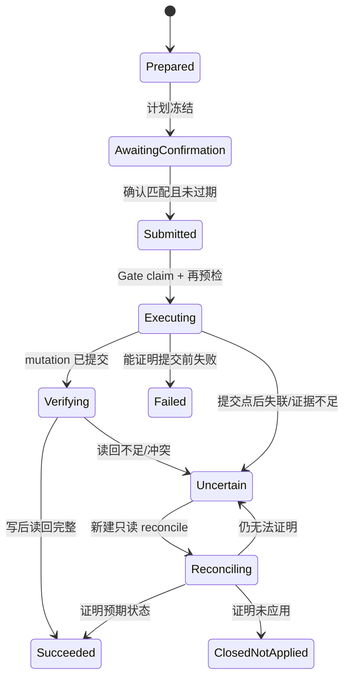
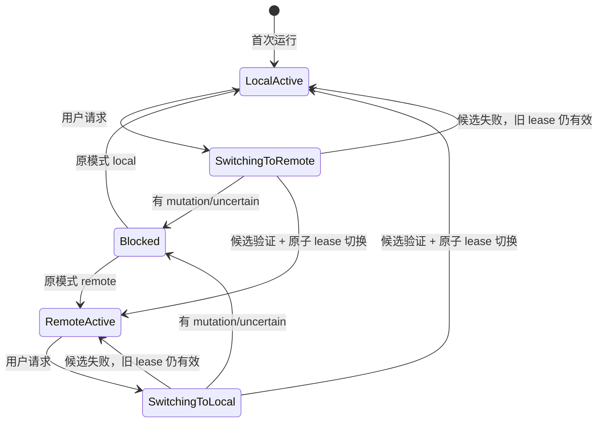
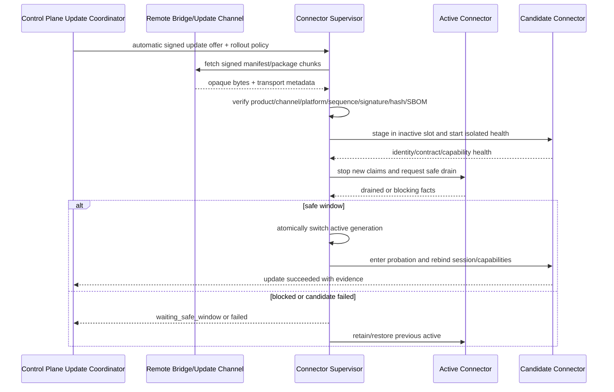

# Connector Gate 与 Transport 合同

状态：Draft for Review  
核心原则：Connector Core 只做 Transport、Session、Gate；业务能力由签名、受限、隔离的 Operation/Capability Module 扩展。

## 1. 边界

### 1.1 Connector Core 拥有

- Local/Remote Transport 接入、设备身份、配对、撤销和心跳；
- 既有 Omnia 登录 Session 的持有与精确 Engagement/Pack 绑定；
- 签名 Operation Registry、版本协商、权限与资源门禁；
- 标准命令信封校验、claim、deadline、取消、并发和作用域控制；
- read-only 有限重试与 mutation uncertain 保护；
- 受控 Omnia Session API；
- progress/result/artifact/evidence 通道与双层脱敏；
- Operation Worker 监督、健康、隔离、升级和回滚；
- 最小诊断，不含客户正文、Secret 或绝对路径。

### 1.2 Connector Core 禁止

- 出现 Phase 1、Phase 2、Controls、删除、EMS 等业务分支；
- 选择模板、解析资料、比较用户输入、调用 AI；
- 编排一个 Feature 的多步业务流程或保存业务主数据；
- 提供 `url + method + headers + body` 任意 HTTP 代理；
- 提供任意系统命令、任意网络、任意文件路径；
- 把 Omnia Cookie/Authorization/会话材料上传给 Core/Bridge/Feature；
- 将超时或断线解释为 mutation 未发生。

## 2. 单一 `ConnectorTransport`

`LocalTransport` 与 `RemoteBridgeTransport` 必须实现完全相同的业务无关接口：

```text
pair(request) -> PairingResult
bind(identity, proof) -> Binding
negotiate(binding) -> CapabilitySnapshot
acquireActiveLease(mode, generation) -> TransportLease
submit(commandEnvelope) -> SubmissionReceipt
subscribe(commandId, afterSequence) -> ProgressStream
cancel(commandId, reason) -> CancellationReceipt
uploadArtifact(commandId, descriptor, stream) -> ArtifactReceipt
downloadArtifact(artifactId, range) -> stream
reconcile(reconcileRequest) -> ReconcileReceipt
health() -> TransportHealth
revoke(bindingId) -> RevocationReceipt
```

Transport 只感知连接拓扑、传输顺序、重连和流控，不修改命令 payload 或业务状态。

## 3. Local/Remote 等价性

| 语义 | LocalTransport | RemoteBridgeTransport | 必须相同 |
|---|---|---|---|
| 身份 | 本机受保护通道 + Connector 设备身份 | 用户/设备配对 + 双向认证 | 逻辑 connector/session binding |
| 提交 | 本机 IPC/受保护 loopback（选型待定） | 加密认证中继 | receipt、commandId、幂等 |
| 进度 | 本机有序流 | 远程有序流/断点续传 | sequence、重放边界 |
| Artifact | 本机受控流 | 分块密文中继 + TTL | digest、size、type、provenance |
| 故障 | 进程/IPC 断开 | 网络/Bridge/设备断开 | mutation → uncertain 规则 |
| 对账 | 只读新命令 | 只读新命令 | 原 mutation 不重放 |

## 4. Operation/Capability Module

每个 Connector 能力包必须：

- 有稳定 `capabilityId`、semver、合同范围、publisher key、单调 sequence；
- 声明精确 operation ID、effect、参数 Schema、endpoint allowlist 和 target 类型；
- 使用 Connector 提供的受控 Session SDK，不取得原始 Cookie/Authorization；
- 在独立 Operation Worker 运行，有 CPU/内存/时间/并发配额；
- 声明 read-back/bilateral verification 和 Evidence Schema；
- 默认无任意网络、文件系统或子进程；
- 通过签名、hash、兼容、候选健康、probation 和 rollback 门禁。

新 Feature 通常只添加 Feature Package 和必要的 Operation Module，不修改 Connector Core。只有 Transport、Session 或 Gate 协议本身改变时才允许 Core 变更，并需独立 ADR。

## 5. 命令信封

完整字段见 `../contracts/CONTRACTS.md`。Gate 至少验证：

- `commandId/idempotencyKey/contractVersion/createdAt/deadlineAt`；
- `runId/stepId/traceId/featureId/featureVersion`；
- `connectorId/sessionId/engagementId/packId` 的冻结绑定；
- `capabilityId/capabilityVersion/operationId/effect`；
- `payload` 与 digest；
- mutation 的 `planDigest/preflightDigest/concurrencyToken/confirmationId`；
- artifact descriptors；
- retry policy 必须与 effect 一致。

以下为**合同示例**，不代表真实 Omnia 对象或真实命令：

```json
{
  "schemaVersion": "omnia.connector-command/v1",
  "commandId": "cmd_contract_example_01",
  "idempotencyKey": "idem_contract_example_01",
  "runId": "run_contract_example_01",
  "stepId": "step_contract_example_03",
  "traceId": "trace_contract_example_01",
  "feature": {"id": "com.example.feature", "version": "1.2.0"},
  "binding": {
    "connectorId": "connector_contract_example",
    "sessionId": "session_contract_example",
    "engagementId": "engagement_contract_example",
    "packId": "pack_contract_example"
  },
  "operation": {
    "capabilityId": "com.example.capability",
    "version": "2.0.0",
    "operationId": "example.read",
    "effect": "read_only"
  },
  "payload": {"contractExample": true},
  "payloadDigest": "sha256:CONTRACT_EXAMPLE_ONLY",
  "createdAt": "2030-01-01T00:00:00Z",
  "deadlineAt": "2030-01-01T00:01:00Z",
  "retry": {"maxAttempts": 2}
}
```

## 6. 身份绑定与实时检查

命令提交时冻结：

```text
active transport generation
  + connector identity
  + Omnia session identity
  + engagement/pack identity
  + feature/operation version
  + run/step
  + target IDs
  + effect and plan digest
```

Gate 在 claim 和执行前重新验证 active lease、Connector 身份、Session 新鲜度、Engagement/Pack、Operation 版本、deadline 和取消状态。mutation Operation 再进行实时业务预检；零匹配、多匹配、范围漂移、安全锁变化或并发 token 变化均失败关闭。

### 6.1 Workspace 读取 Operation

Connector 只提供两个业务无关、签名 allowlist 的读取 profile：

| Profile | 允许范围 | 禁止 |
|---|---|---|
| `workspace_light_read` | 当前 Pack 的权威 Section/部分 identity、实时名称、直接 Workspace identity/名称/状态/最小 capability | 元素正文、名称推断分类、全 Pack 关系 |
| `workspace_heavy_read` | 用户选定 Workspace + 当前 Feature capability 声明的对象类型/字段/关系与锁摘要 | 未选 Workspace、未声明类型、全包无界 dump |

规则：

- Section/Workspace identity 必须来自 Omnia 权威字段；`TEST`、`20000`、`IT Elements` 等显示名称不能决定层级、权限或 operation；
- 无父级 identity 时返回稳定错误 `authority_hierarchy_unavailable`，不得在 Connector 内猜测；
- 结果必须返回 `sections[]` 与携带 `parentSectionId` 的 `workspaces[]`；不得靠名称或数组顺序重建父子关系；
- 重抓取请求冻结 authority/tenant/Pack/Workspace/Feature/capability/type scope，并支持分页、deadline、取消、checkpoint、计数和 Evidence；
- 每次重抓取必须携带 Workspace/Object/Relation/Page/Byte/Duration 硬预算；有效预算取签名 capability、平台策略和请求三者最小值，超限返回 partial/limit + coverage/checkpoint；
- `full` 只表示声明 scope 完整；无 authority snapshot/cursor/watermark 时标记 `non_atomic_observation`；
- observation 绑定当前 principal 和访问 revision/Evidence；Session 无法重新证明访问时不得向 UI 返回缓存业务名称；
- 历史读取结果不能进入 Gate 授权。mutation 计划和提交前仍各执行一次窄范围实时检查；
- 详细决定见 [ADR-0025](../adr/0025-authoritative-light-heavy-workspace-reads.md)。

## 7. mutation 状态机

下图跨越 Run/Plan 与 ConnectorCommand：`Prepared/AwaitingConfirmation` 发生在命令创建前，`Reconciling` 是独立只读 reconcile Step；原 ConnectorCommand 本身只使用 `../contracts/CONTRACTS.md` 的状态枚举。



`ClosedNotApplied` 对应合同状态 `closed_not_applied`，只表示原 uncertain 命令经新的只读 reconcile Evidence 证明预期 effect 未应用，不授权重放。此时父 Run 进入 `failed`，错误使用 `effectState=not_applied`；再次尝试必须新建 Run/计划、确认、幂等键和命令。若对账证明已应用，原命令转为 `succeeded`；若仍无法证明则保持 `uncertain`。

## 8. Progress、Artifact 与 Reconcile

### Progress

- 每条 progress 有递增 `sequence`、`commandId`、`stage`、`occurredAt` 和可脱敏 payload。
- Transport 可重传已持久化事件，但不能伪造 sequence 或百分比。
- 百分比只在 Operation 能证明可计算总量时提供；否则使用阶段/计数。

### Artifact

- 上传前声明 type、mediaType、size、digest、retentionClass、source；
- Gate 对 type/size/count 进行 allowlist；
- 内容分块校验，完成后再发布 Artifact；
- Remote Bridge 仅临时中继，TTL 到期删除；持久 owner 是后台 Artifact Store；
- Artifact 不可包含 Cookie、Authorization 或未脱敏诊断。

### Reconcile

- reconcile 是新的 `read_only` 命令，有独立 commandId，并引用原 uncertain command；
- 只能读取冻结目标和必要邻接对象，不能产生 mutation；
- 结果为 `applied | not_applied | inconclusive | drifted`，附 Evidence；
- `applied` 将原命令转为 `succeeded`；`not_applied` 将原命令转为 `closed_not_applied`；`inconclusive/drifted` 保持原命令和 Run 为 `uncertain`。

## 9. Transport 切换状态机



切换步骤：

1. 获取全局 switch lock，拒绝新 Run 进入 Connector effect。
2. 查询活动命令；存在任何非终态 mutation、未解决 `uncertain`、Connector Artifact 上传、无法判断状态，或只读命令无法按合同取消/完成时阻断。
3. 验证候选地址、TLS/身份、配对、Connector 绑定、健康、capability snapshot。
4. 创建新 generation lease，原子更新 active pointer。
5. 撤销旧 generation 的 claim 权；旧事件仍可按 commandId 回传和审计。
6. 持久化上次有效模式并解除 switch lock。

当前 active Transport 故障时，不自动走另一 Transport；状态为 degraded/unavailable 并要求用户修复或显式切换。

## 10. Remote Bridge 最小化

Bridge 可拥有：

- 用户/设备身份、配对、撤销和路由绑定；
- 消息序号、ACK、流控、短期重放窗口；
- 加密命令/结果/Artifact 分块的短期存储；
- 已签名 Connector 更新 manifest/package 分块的短期不透明中继；Bridge 不决定版本、不解包、不签名；
- 脱敏操作摘要和安全审计；
- TTL 清理与容量保护。

Bridge 禁止拥有：

- Omnia Cookie、Authorization 或可复用会话；
- AI Key、Core DB、模板主文件、Feature 业务数据；
- 解密后长期保存客户附件；
- 运行 Feature/Operation 业务逻辑；
- 任意 HTTP 转发器或 Connector 管理后门。

Remote 面向全部 v5 版本已经确定。Bridge 身份架构、部署位置、端到端保护、TTL 和 SLA 仍为 `Proposed / 待威胁建模与技术评审`；未满足这些真实门禁时，Remote 入口必须禁用并显示原因。

## 11. Remote Connector 分层在线升级

Remote Connector 必须能在线升级，但“可在线升级”不等于“所有功能都升级 Core”。升级优先级固定为：

| 层级 | 适用变化 | 是否重启 Connector Core | 频率原则 |
|---|---|---:|---|
| Operation/Capability Module | 新对象类型、endpoint 合同、read-back、兼容修复 | 否；side-by-side + Run pinning | 默认路径 |
| Connector Core/runtime | Transport、Session、Gate、受控 SDK、安全边界、基础 Omnia 兼容 | 是；A/B 原子切换 | 尽可能少 |
| Supervisor/bootstrap/trust root | 更新器自身、信任根或不可兼容启动协议 | 独立 bootstrap | 极少、显式批准 |

### 11.1 在线升级控制面



Control Plane 自动下发官方签名 offer 和 rollout policy，但不能签发任意代码执行命令。Bridge 可以中继加密 manifest/package 分块，不决定目标版本、不修改包、不持有发布私钥。最终信任判断和槽位切换由 Remote Connector 工作站上的最小 Supervisor 完成。

### 11.2 更新合同与状态

每次更新必须持久化 `ConnectorUpdate`，至少包含：

- `updateId/connectorId/deviceId/channel/platform`；
- `scope=operation_module|connector_core|supervisor_bootstrap`；
- current/target 版本、合同版本、publisher key、单调 sequence；
- manifest/package digest、size、SBOM digest、兼容范围和撤销状态；
- rollout policy、securitySeverity、newRunStopAt/maxDrainUntil/offerExpiresAt、active/candidate/previous slot 和 generation；
- `offered/downloading/verified/staged/waiting_safe_window/activating/probation/succeeded/failed/rolled_back`；
- 阻断原因、健康报告、回滚证据和脱敏错误。

更新状态来自 Supervisor/Control Plane 的真实记录。设置页没有对应 action、权限、状态和恢复合同前，不显示“检查更新”“立即升级”或“回滚”按钮。

### 11.3 安全窗口

Operation Module 可在旧版本仍被活动 Run 引用时 side-by-side 安装；新版本通过候选健康后只服务新 Run。Connector Core 激活前必须：

1. 停止领取新命令；
2. 等待可安全完成/取消的只读命令和 Artifact 分块；
3. 阻断任何在途 mutation、未解决 `uncertain`、状态未知和不能安全终止的命令；
4. 持久化 active generation、命令 checkpoint 和更新状态；
5. 在新进程验证身份、Session/Engagement、capability 和 lease 后才恢复领取。

用户选择 `remote` 时，更新期间 Transport 状态为 `maintenance/upgrading`；升级失败保持 Remote 选择并恢复 previous，不启动 Local claim。

高危/严重更新到达 `newRunStopAt` 后，admission rule 停止接收会继续扩大风险暴露面的新高风险 Run。到达 `maxDrainUntil` 仍存在已提交 mutation 时不得强杀、重放或切 Local；仅允许既有 effect 安全完成、兼容 read-only reconcile 或明确人工处置。

### 11.4 回滚与防降级

- candidate 不覆盖 active；切换前失败直接丢弃或隔离 candidate；
- probation 失败恢复 previous，但不回滚/重放已发生的 Omnia effect；
- previous 必须与当前本地状态和合同兼容；
- publisher sequence 永不降低；回滚使用受签名回滚授权或更高 sequence 的修复发布；
- Supervisor/trust root 更新使用独立 bootstrap 和双重验证，不能由普通 Operation 包替换；
- 更新失败、回滚和撤销都生成 Evidence。

### 11.5 撤销与活动版本固定

“活动 Run 固定旧版本”只适用于仍被信任的 previous payload。撤销必须携带签名严重度和生效策略：

| 严重度 | 新 Run | 尚未提交 effect | 已提交/uncertain | 历史 payload |
|---|---|---|---|---|
| `no_new_runs` | 禁止 | 可按安全窗口 drain | 原版本可完成只读验证 | 保留审计，禁止新执行 |
| `stop_before_commit` | 禁止 | 立即停止并记录失败 | 不强杀已提交命令 | 保留审计，禁止执行 |
| `execution_revoked` | 禁止 | 立即停止 | 进入 `uncertain`；仅允许受批准安全版本的 read-only reconcile | bytes 可保留，永不可执行 |
| `trust_root_compromise` | 全部禁用 | 全部停止 | 隔离设备，人工恢复/新信任根 reconcile | 隔离保存，不参与版本解析 |

- 撤销列表必须有签名、sequence、发布时间、获取 TTL 和离线行为；超过 TTL 且无法刷新时，Remote mutation 失败关闭；
- 历史 payload “可读取用于审计”与“可执行”是两个权限，已撤销版本不能因 Run pinning 被重新加载执行；
- 安全 reconcile 版本必须声明可解释旧 Command/Evidence schema；无法证明兼容时保持 `uncertain` 并转人工处理；
- Supervisor 定义最低安全版本、key 轮换和撤销传播 Evidence。默认策略为 `automatic_safe_window`：自动取得/验证/暂存，并在真实安全窗口自动激活；撤销失败关闭规则不可被设置关闭。

分层升级决定见 [ADR-0019](../adr/0019-remote-connector-online-upgrade.md)；默认自动安全窗口和截止策略见 [ADR-0028](../adr/0028-remote-automatic-safe-window-rollout.md)。

### 11.6 当前实施状态

`2026-07-31` 已发布 v5 Remote Connector `0.1.0` 的独立便携包、固定签名更新清单、候选/active/previous、安全窗口、probation 和回滚基线。它使用独立于 v4 的 Windows 根、服务器根、产品身份和更新路径；共存验收见 [Remote Connector 0.1.0 发布与共存记录](../implementation/REMOTE_CONNECTOR_0_1_0_RELEASE.md)。

该基线尚未实现本章的 Remote Bridge 配对、命令、进度、Artifact 或 reconcile 传输，运行时明确报告 `bridgeState=unconfigured`。因此“更新通道已发布”不能解释为“Remote Transport 已可执行业务命令”。

## 12. 禁止任意 HTTP 后门

即使为了减少 Core 变更，也禁止暴露：

```text
executeHttp(url, method, headers, body)
executeScript(command)
openFile(path)
```

允许的扩展方式只有：

```text
签名 capability
  → 注册稳定 operationId
  → 精确输入 Schema
  → 精确 endpoint/target/effect allowlist
  → 受控 Session SDK
  → 标准 Evidence 与 read-back
```

新增 endpoint 必须发布新的 Operation Module 版本并通过合同/真实 canary；不能用配置热加任意域名和方法。

## 13. 第四阶段“新建与关联”综合切片如何经过 Gate

“新建与关联”的首个 canary 不向 Connector 发送工作簿或整份业务流程，而是由后台把已确认的声明式计划拆成小型 Operation：

```text
精确解析 Workspace/安全锁
  → 精确查询 APP/DB/GRA/回收站
  → 创建 Generic APP → 读回
  → 创建 APP GRA → 读回
  → 创建 Generic DB → 读回
  → associate DB → APP
  → 从 Infrastructure 与 Application 双方读回并验证继承 RAIT
  → 创建 DB GRA → 读回
```

具体 Operation ID 和 endpoint 需在协议验证后冻结，但每个 Operation 必须独立声明 effect、Schema、目标类型、提交点、幂等和 read-back。Connector Core 不出现“Phase 1”“新建与关联”“解析 Excel”或整批 workflow 分支。

其中任何 mutation 在提交点后结果未知都使父 Run 进入 `uncertain`；后续步骤停止。已经读回成功的对象以 `effectOutcome=partial` 保留，不能由 Connector 自动补偿删除。

## 14. 验收门槛

- [ ] Core 代码与 Schema 不含具体业务 Feature 分支。
- [ ] Local/Remote 通过同一 Transport 合同与故障注入测试。
- [ ] 单 active lease 在并发启动、崩溃恢复和切换中保持。
- [ ] mutation 在提交点后所有断线场景进入 `uncertain`，无自动重放。
- [ ] reconcile 只读且不能复用原命令。
- [ ] Operation Worker 越权网络/文件/Secret/endpoint 请求被拒绝。
- [ ] Artifact/progress 支持有序恢复、digest 校验和双层脱敏。
- [ ] Remote Bridge TTL、撤销、重放窗口和隐私删除经过测试。
- [ ] Remote Connector 能在线升级 Operation Module 和 Connector Core；篡改/降级/不兼容失败关闭，活动 mutation/uncertain 阻断激活，失败不 fallback 到 Local。
- [ ] Remote Connector 自动接收官方签名 offer，并只在真实安全窗口自动激活；不存在关闭签名、A/B、回滚或 active mutation/uncertain 阻断的设置。
- [ ] 轻抓取只返回权威 Section + Workspace；重抓取只读取冻结的 Pack/选定 Workspace/Feature capability scope，且分页、可取消、可观测。
- [ ] Section 缺失父级 identity 或改名时不使用名称推断，Local/Remote 返回等价错误/显示元数据。
- [ ] 真实 Omnia canary 验证 identity binding、预检、确认和写后读回。
- [ ] “新建与关联”的首个 canary 通过小型 Operation 创建并读回两个 IT Element、两个 GRA core 和唯一 DB → APP 双边关系，Connector Core 无 Feature 业务分支。
