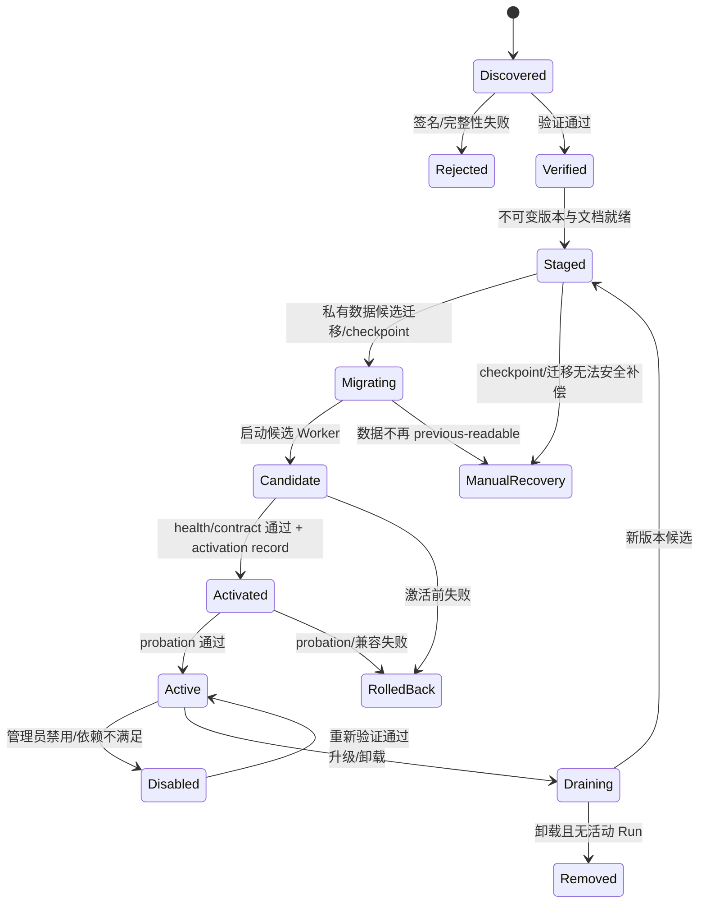

# Feature Package 标准

状态：Draft for Review  
目标：让每个业务功能成为可独立安装、运行、升级、回滚和验收的真实部署单元。

2026-08-01 执行说明：本标准的包边界、真实接线和官方签名原则继续有效；根据
[ADR-0031](../adr/0031-fast-local-feature-iteration-and-automated-integrity.md)，Windows 强隔离认证
不再是安装/启用前置条件，成员 digest 与签名由工具自动完成，日常开发者无需手工核对 SHA。

## 1. 强制目录蓝图

```text
features/<feature-id>/
├─ feature.json
├─ README.md
├─ contracts/
│  ├─ input.schema.json
│  ├─ output.schema.json
│  ├─ events.schema.json
│  ├─ errors.schema.json
│  └─ connector-operations.schema.json
├─ worker/
│  ├─ entry.*
│  └─ health.*
├─ ui/
│  ├─ registration.json
│  └─ <feature-owned-view-source>
├─ migrations/
│  ├─ manifest.json
│  └─ <ordered-forward-migrations>
├─ template-bindings/
│  └─ bindings.json
├─ connector-capability/
│  └─ <optional signed operation package reference>
├─ docs/
│  ├─ documentation.json
│  ├─ overview.md
│  ├─ implementation-map.json
│  ├─ implementation-map.md
│  ├─ planes/
│  │  ├─ delivery.md
│  │  ├─ execution.md
│  │  ├─ control-data.md
│  │  └─ integration.md
│  ├─ data-and-migrations.md
│  ├─ operations-and-recovery.md
│  ├─ testing-and-canary.md
│  └─ changelog.md
├─ tests/
│  ├─ contract/
│  ├─ unit/
│  ├─ integration/
│  ├─ isolation/
│  ├─ upgrade/
│  ├─ rollback/
│  └─ canary/
├─ SBOM.*
└─ SIGNATURE
```

扩展名和构建工具为 `Proposed`，目录职责为强制。模板正文不复制进 Feature 包；`template-bindings` 只引用后台已发布的不可变 TemplateVersion。

## 2. `feature.json`

必须包含：

| 字段 | 类型 | 规则 |
|---|---|---|
| `manifestVersion` | string | 当前 `omnia.feature-manifest/v1` |
| `featureId` | string | 全局稳定、反向域名或组织命名；发布后不可改名 |
| `displayNameKey` | string | 本地化键，不作为身份 |
| `version` | semver string | 包版本 |
| `contractRange` | string | 支持的 `omnia.contracts` 范围 |
| `workerRuntime` | object | runtime、entry、protocol、health endpoint |
| `navigation` | object | 2–3 段稳定 path；一级 group，末段 feature；排序键、route、icon token |
| `permissions` | array | 声明式最小权限 |
| `effects` | array | `read_only`、`artifact_write`、`omnia_mutation` 等显式 effect |
| `resources` | object | CPU、内存、时间、并发、临时空间；数值待基准测试 |
| `schemas` | object | 输入、输出、事件、错误 schema URI + digest |
| `templates` | array | scenario/template/version range 与 validator 要求 |
| `connectorCapabilities` | array | capability ID、version range、operation allowlist |
| `aiCapabilities` | array | 所需能力而非固定模型名 |
| `dataDomain` | object | owner ID、schema version、migration policy |
| `managedContent` | object | 读取类型/Schema 范围、mutation target 类型、所需 freshness；Feature 只能查询和声明结果映射，不能直写共享 Store |
| `artifacts` | object | 可读类型、可写类型、大小与保留分类 |
| `confirmationPolicy` | object | 哪些 effect 必须确认、计划 TTL |
| `retryPolicy` | object | 仅允许声明白名单只读重试；mutation 不自动重试 |
| `compatibility` | object | Core/OS/Connector/模板范围 |
| `healthcheck` | object | timeout、依赖、ready 判定 |
| `rollback` | object | previous-compatible range、数据回退条件 |
| `publisher` | object | key ID、sequence、签名算法 |
| `uiRuntime` | object | 独立 `sandboxed_surface` 的 `surfaceId`、默认/允许 placement、入口 digest、Shell UI Bridge 版本、CSP/资源声明；禁止 Shell renderer 内任意代码 import |
| `documentation` | object | `omnia.feature-documentation/v1` manifest 路径、digest、默认语言和实现映射路径；文档版本必须等于包版本 |

以下为**合同示例**，仅展示字段形状，不代表已安装功能或真实业务数据：

```json
{
  "manifestVersion": "omnia.feature-manifest/v1",
  "featureId": "com.example.review",
  "displayNameKey": "feature.review.title",
  "version": "1.2.0",
  "contractRange": "^1.0.0",
  "workerRuntime": {
    "runtime": "proposed-node",
    "entry": "worker/entry.js",
    "protocol": "omnia.feature-rpc/v1"
  },
  "uiRuntime": {
    "mode": "sandboxed_surface",
    "surfaceId": "feature.com.example.review.surface",
    "defaultPlacement": "docked",
    "placements": ["docked", "detached", "minimized"],
    "entry": "ui/registration.json",
    "bridgeVersion": "^1.0.0",
    "entryDigest": "CONTRACT_EXAMPLE_DIGEST"
  },
  "documentation": {
    "manifest": "docs/documentation.json",
    "manifestDigest": "CONTRACT_EXAMPLE_DIGEST",
    "defaultLocale": "zh-CN",
    "implementationMap": "docs/implementation-map.json"
  },
  "navigation": {
    "path": [
      {"id": "domain.example", "kind": "group", "labelKey": "domain.example"},
      {"id": "feature.review", "kind": "feature", "labelKey": "feature.review"}
    ],
    "route": "/features/com.example.review"
  },
  "permissions": ["artifact:read:run-input", "artifact:write:run-output"],
  "effects": ["artifact_write"],
  "resources": {
    "memoryMb": "PROPOSED_BENCHMARK_REQUIRED",
    "timeoutMs": "PROPOSED_BENCHMARK_REQUIRED",
    "maxConcurrency": "PROPOSED_BENCHMARK_REQUIRED"
  },
  "schemas": {
    "input": "contract://com.example.review/input/v1",
    "output": "contract://com.example.review/output/v1"
  },
  "templates": [],
  "connectorCapabilities": [],
  "aiCapabilities": [],
  "dataDomain": {"owner": "com.example.review", "schemaVersion": 1},
  "managedContent": {
    "readTypes": [],
    "mutationTargetTypes": [],
    "requiredSchemaRanges": {}
  },
  "retryPolicy": {"readOnlyMaxAttempts": 2, "mutationAutoRetry": false},
  "compatibility": {"core": "^1.0.0"},
  "publisher": {"keyId": "contract-example-key", "sequence": 7}
}
```

示例中的资源值和发布身份不可用于生产。

`navigation.path` 长度只能为 2 或 3。长度 2 时第二段就是 Feature；长度 3 时第二段必须 group、第三段必须 Feature。Feature ID 与 route 不从 path 推导，菜单重组不会改变运行身份。

## 3. SDK/RPC 边界

Worker 只能通过 job-scoped SDK 使用以下能力：

```text
RunContext.getMetadata()
Artifacts.openInput(handle)
Artifacts.createOutput(type, declaredSize)
Artifacts.commitOutput(handle, digest)
ModuleData.query(command, payload)
ModuleData.transact(command, payload)
ManagedContent.query(query)
Templates.getFrozenInstance(templateVersionId)
AI.request(capabilityRequest)
Events.append(progress|checkpoint|diagnostic)
Confirmations.request(planDigest, effect, summary)
Connector.propose(commandProposal)
```

规则：

- SDK 请求携带 `runId/stepId/moduleId/contractVersion/traceId`。
- Worker 不传数据库路径、本机路径、Secret 或 Connector token。
- `Connector.propose` 只提交业务计划和已登记 operation 参数；Core 负责身份冻结、确认、命令信封和 active Transport。
- `ManagedContent.query` 只返回授权、版本兼容且满足 freshness 的后台投影；Worker 不取得 Store 路径或写权限。
- RPC 输入输出必须经过双方 Schema 验证；未知字段默认拒绝还是忽略由 schema 版本明确声明，安全相关对象必须拒绝。
- 取消是协作式信号；外部 effect 已提交后不得把取消等同于“未发生”。

## 4. 权限与隔离

| 资源 | 默认 | 获取方式 | 禁止 |
|---|---|---|---|
| 输入 Artifact | 无 | Run 限定只读句柄 | 枚举全局 Store、任意路径 |
| 输出 Artifact | 无 | 类型/大小受限上传句柄 | 覆盖模板或其他 Run |
| 模块数据 | 私有 namespace | owner repository 命令 | 打开 Core/他模块 DB |
| 网络 | 无 | AI/Connector 等受控 broker | 任意 socket/HTTP |
| Secret | 无 | 不下发；broker 代用 | 明文 Key/Cookie |
| CPU/内存/时间 | 配额 | manifest + 平台上限 | 自行提升 |
| 子进程 | 无 | 经批准 runtime policy | 任意 shell/系统命令 |

Feature Worker 以独立 OS 进程和受限端口作为目标故障边界。具体 Windows sandbox 技术为可选后续加固；不能因为 sandbox 方案未定而取消权限模型，也不能因尚未通过强隔离认证阻止本地安装、启用或开发测试。

## 5. 数据所有权

- `featureId` 是模块数据域唯一 owner。
- Core 只保存通用索引、Run 关联、迁移版本、配额和审计，不读取模块内部业务列作跨功能逻辑。
- 跨模块数据共享必须使用版本化公共 Artifact/Event，或由 Accepted ADR 指定的共享域查询合同（当前仅 Managed Content Service）；消费者不能直连 owner Store 或另立事实源。
- Agent 创建/修改/删除并供多个 Feature 使用的业务对象与关系属于 Managed Content Service，共享 current/revision/change 不能复制到各 Feature 私有 Store 作为新 owner。
- Feature 声明 mutation target 与类型 Schema；Control Plane 只在读回 Evidence 证明后推进 Managed Content current。Feature/Connector 均不能直写。
- 不允许外键直接指向另一模块私有表；使用稳定逻辑 ID + 合同校验。
- 卸载默认保留模块数据为 disabled orphan；删除数据是独立、明确确认、可审计的操作。

## 6. UI 注册

`ui/registration.json` 声明隔离 Feature Surface 入口、支持的 view contract 与允许的 `docked|detached|minimized` placement。Shell 只有在后台返回真实 `FeatureNavigation` 且 Worker/依赖健康时，才允许受控 SurfaceHost 打开或聚焦 Surface；第二列不加载 Feature 内容。

Feature UI 也是不可信包代码，不能因为它属于“前端”就与 Shell 共用执行权限。强制边界：

- Shell 自己拥有应用 Rail、纯功能树、第三列 `Comments`/Feature 标签框架、聊天输入、全局会话控件、全局缩放、Splitter、SurfaceHost/WindowManager、焦点恢复和顶层错误边界；
- Feature 内容只运行在独立、无特权、可单独终止的 sandboxed renderer/WebContents 中；允许由 Shell 合成进第三列 docked viewport，但不提供与 Shell renderer 同进程/同 DOM 的内联模式；
- 任意 Feature JavaScript/CSS 不得直接 import/执行在特权 Shell renderer，不得访问 Shell DOM、其他 Feature DOM、路由对象、全局 store 或原型链；
- sandboxed view 禁用 Node/文件系统/任意网络/新窗口/任意导航/未经授权下载和持久浏览器存储；使用按 `featureId/viewInstanceId` 隔离的 origin/partition；
- 唯一跨边界能力是版本化 Shell UI Bridge；消息绑定 `featureId/viewInstanceId/runId/stateVersion/actionId`，双方校验 origin、schema、权限和时序；
- Feature UI 卡死、崩溃、内存超限、违反 CSP 或发送非法消息时只卸载该 surface，Shell、聊天和其他 Feature 继续运行；
- 具体 Electron 独立 renderer 技术由 runtime/sandbox 原型 ADR 冻结，但不得降低上述行为边界，也不得退回任意 `window.open` URL。

模块 UI：

- 只能使用 Shell SDK 获取 Run、状态、上传、只读确认投影和 Artifact；高风险确认/取消/终止控件只由主 Shell `Comments` 消息卡渲染；
- 不能直连 Worker、DB、AI、Connector 或任意 endpoint；
- 不能自报“成功”；终态来自 Core；
- 每个按钮声明后端 action ID、所需状态和 effect；
- 不存在真实 action 时必须隐藏/禁用/标注未开放；
- route 只可由受控 SurfaceHost/WindowManager 打开；直接请求仍由后台重新授权并检查 `stateVersion`，不能绕过主 Shell 创建孤立 mutation Surface。

若 Feature 包含两个或以上相邻长期功能区域，`ui/layout.json` 必须使用公共布局 schema 声明：

- 稳定 `surfaceId/layoutVersion`；
- panel ID、最小尺寸和默认行为；
- splitter ID、相邻 panel、方向和默认比例；
- 小窗口/高 UI scale 的响应式 policy；
- layoutVersion 升级和偏好迁移策略。

Feature 必须使用 Shell SDK 的 `ResizableLayout/Splitter`，不得私自监听 pointer 后把像素写入 localStorage，也不得读取或修改其他 Feature/Shell 的 LayoutPreference。详细合同见 [统一可调整分区系统](../product/RESIZABLE_LAYOUT_SYSTEM.md)。

## 7. Feature 文档包与四 Plane 实现映射

Feature 的实现文档不是发布后的补充说明，而是签名包的强制成员。代码、合同、迁移和文档共享同一个 `featureId + featureVersion`；文档发生实质变化时至少发布 patch 版本并重新签名，不允许直接修改已安装版本的文档。

### 7.1 必备内容

每个包必须包含：

- `documentation.json`：机器可校验的文档清单、路径、类型、语言、digest 和版本；
- `overview.md`：用途、范围、非目标、依赖、用户可见能力和已知限制；
- `implementation-map.json`：供安装器和 CI 双向核对的四 Plane 实现映射；
- `implementation-map.md`：与机器映射同源的人类可读总览；
- `planes/*.md`：Delivery、Execution、Control & Data、Integration 各自的职责、入口、合同、数据和失败语义；
- `data-and-migrations.md`：数据 owner、schema、迁移、保留、删除、备份和恢复；
- `operations-and-recovery.md`：安装、升级、回滚、故障定位和恢复；
- `testing-and-canary.md`：合同测试、隔离测试、真实 canary 条件和证据；
- `changelog.md`：本版本实现、合同、数据和文档变化。

涉及模板、AI 或 Connector 时，对应文档必须记录依赖 ID、版本范围、失败关闭策略和真实验收条件；不涉及时显式写 `not_applicable` 与原因，不能留空让读者猜测。

若 Feature 创建、修改、删除或读取 Agent 管理内容，文档还必须逐类型记录 Managed Object/Relation Schema、current/revision/change/tombstone 语义、Phase 2/下游查询字段、freshness、provenance、adopted baseline 和 projection 恢复；不能只写“保存到数据库”。

### 7.2 每个能力的实现记录

每个 `capabilityId` 必须恰好有四条实现记录：

| Plane | 至少记录 |
|---|---|
| Delivery | 菜单/route、view、action、上传与状态呈现、用户确认和交付方式 |
| Execution | Worker 入口、步骤、算法/规则、Validator、资源限制与失败语义 |
| Control & Data | Run/Step/Event、repository command、数据 owner、迁移、Confirmation、Artifact 与 Evidence |
| Integration | Connector capability/operation ID、effect、preflight、commit point、写后读回以及 Local/Remote 一致性 |

每条记录至少包含 `capabilityId/plane/responsibility/entrypoint/actionOrContractIds/dataOwner/effect/dependencies/testIds/status`。某 Plane 不适用时，`status=not_applicable` 且必须给出可评审原因；`planned` 不能冒充已安装实现。

机器校验只能证明 entrypoint/ID 可解析，不能自动证明责任、effect、数据 owner、失败和恢复文字在语义上真实。发布工具必须生成可解析的 symbol/contract catalog，并交叉校验 manifest permission/effect、repository owner、migration、Connector operation 和 canary；同时：

- `omnia_mutation`、Secret、跨边界 Artifact、Managed Content 写入、模板发布、Remote 更新或新权限的 capability 必须有人工作出的 architecture/security review Evidence；
- 无理由或重复的 `not_applicable`、未使用 contract ID、文档声明为 read-only 而 operation effect 不一致均阻止发布；
- 自动检查通过不等于语义评审通过，不能由包作者自报责任说明为真。

### 7.3 安装到项目文档

Package Manager 只把通过校验的文档发布到 Documentation Registry。逻辑地址固定为：

```text
project-docs/features/<featureId>/<featureVersion>/
```

物理存储实现需由后续存储 ADR 冻结，Feature 本身不得获得项目文档目录的任意写权限。Documentation Registry：

- 保存不可变版本副本及 candidate/active/previous 指针；
- 生成“已安装 Feature 文档”索引，不手工复制或拼接文档；
- 只把已安装、已激活版本标为当前，不能把设计稿或未安装包伪装成运行事实；
- 为历史 Run/Evidence 保留其绑定版本文档；卸载不等于立即销毁历史文档；
- 对 Markdown 使用受限渲染策略，拒绝脚本、危险 HTML、外部主动内容、绝对路径、路径穿越和符号链接逃逸。

详细决定、合同与填写格式分别见 [ADR-0023](../adr/0023-feature-documentation-bundle.md)、[公共合同](../contracts/CONTRACTS.md)和 [Feature 随包文档模板](../development/FEATURE_DOCUMENTATION_TEMPLATE.md)。

## 8. Shell Baseline 与独立包验证

Shell Baseline 已在后续用户授权中实现，且不内置业务 Feature。未来 Feature 按真实纵向切片完成后即可自动打包、安装到专用便携根并立即测试；D5/D6 可用于具体风险或候选复核，不再是统一开发前门槛。不得用静态菜单、模拟 Worker 或示例数据代替真实接线。

干净安装的基线状态：

```text
Shell/Core/Registry/Package Manager/Documentation Registry/Managed Content Registry = installed + healthy
Active business Feature packages = []
Feature navigation leaves = []
Managed content objects/relations = []
Chat/session foundation = real local state
AI/Connector-dependent actions = available only when real dependencies are healthy
```

四个首批包按“录制 → 删除元素 → 删除聊天记录 → 新建与关联”逐个进入同一安装/启用/运行/升级/回滚矩阵。每加入一个包都必须证明：

1. 安装前没有该 Feature 的菜单、action、数据或硬编码统计；
2. 候选由工具自动通过签名、兼容、私有 migration 和合同检查；运行时导航/action 由真实 Worker 与依赖健康决定，不要求 Windows 强隔离认证；
3. 真实 Run 成功后，禁用再启用可以恢复同一后台事实；
4. candidate 失败保持 active/previous，不污染其他 Feature；
5. 升级或回滚不重启无关 Worker，不修改其他模块 store；
6. 安装后续包时，全部已验收前序包继续通过健康和最小真实回归；
7. 第四个“新建与关联”通过窄 canary 后，才完成首批四 Plane 综合验收。

该交付模式见 [ADR-0022](../adr/0022-shell-first-independent-feature-packages.md)。生产只允许官方签名 Feature 包；首版不开放第三方或任意离线导入，见 [ADR-0026](../adr/0026-official-signed-package-supply-chain.md)。开发/测试直接使用受信开发签名包和专用便携测试根，构建器与安装器自动处理签名/digest；不增加人工 SHA 或 Windows 认证步骤。

## 9. 生命周期



任何失败只影响该 `featureId`。Registry 必须保存候选、active、previous 版本及失败原因。安装器持久化 append-only 或等价崩溃安全 journal；重启后只能恢复扫描或进入 `manual_recovery`，不得依据临时目录猜测成功。

## 10. 安装、升级与回滚

整个安装过程不是一个跨文件系统、多个 Store、进程和 Registry 的 ACID 事务。可承诺的边界是：**crash-safe staged install + atomic activation record**。只有已完整 staged、通过 migration/checkpoint 和候选 health 的不可变版本，才能通过一个持久 activation record 对外可见。

1. 创建持久 install journal，将包复制到不可执行的 candidate 目录。
2. 安装器自动校验成员 allowlist、大小、SBOM、签名、hash、publisher sequence；开发者不逐项手工核对。
3. 校验 `documentation.json`、必备文档、版本/digest、内部链接、语言、大小、敏感信息和安全渲染约束；文档失败即拒绝整个候选。
4. 对照 manifest/contracts/migrations/operation IDs 双向校验四 Plane 实现映射，不允许代码有能力而文档遗漏，也不允许文档宣称不存在的实现。
5. 校验 Core/合同/模板/Connector Capability/Managed Content 类型 Schema/OS 兼容范围。
6. 将候选文档暂存到 Documentation Registry 的隔离 candidate 区，不覆盖 active 文档。
7. 对模块私有数据创建备份或可恢复 checkpoint，dry-run migration。
8. 运行候选迁移；不得触及 Core 或其他模块 store。
9. 以隔离权限启动候选 Worker，运行 health 和合同测试。
10. 阻止该模块新 Run，等待其旧版本 Run drain；是否允许版本并行由 manifest 明确。
11. 写入单一 activation record，绑定 `featureId/packageDigest/documentationDigest/schemaVersion/dataCompatibility/checkpointDigest/active/previous`；Feature Registry 与 Documentation Registry 只从该记录投影 active/previous，不允许两个独立提交产生分叉。
12. 观察期内监测 crash、错误率、资源和 contract violation；阈值为 `Proposed / 待基准测试`。
13. probation 通过后晋升；若失败，按 journal 和 activation record 恢复 previous-readable 代码、数据兼容版本和文档指针。文件 staging、migration 和进程生命周期通过幂等恢复/补偿完成，不宣称属于同一数据库事务。

回滚只有在数据仍处于 previous-readable 状态时自动执行；若 migration 已跨越不可逆边界，必须停止并要求恢复备份，不得假装回滚成功。

安装 journal 至少记录：

```text
discovered → verified → staged → checkpointed → migrated
→ health_passed → activated → probation
→ promoted | rolled_back | manual_recovery
```

每个阶段记录输入 digest、owner、时间、完成 Evidence 和补偿/恢复动作。逐阶段进程终止、断电、磁盘满、重复恢复和 candidate 目录损坏必须进入 installer fault-injection kit。

Feature 引用的 Remote Connector Operation Module 作为独立签名包在线升级，遵循相同 candidate/active/previous 思路，但默认 side-by-side：活动 Run 继续绑定旧 Operation 版本，只有新 Run 使用已晋升版本。新增业务能力不得要求同步升级 Connector Core；确需 Core 变化时按 [ADR-0019](../adr/0019-remote-connector-online-upgrade.md) 单独评审和发布。

## 11. 兼容规则

- 合同使用 semver；破坏性 schema 变更提升 major。
- 同一 Run 冻结 Feature、contract、template、validator、AI profile capability snapshot 和 Connector Operation 版本。
- 活动 Run 不在中途升级版本。
- Feature 与 Operation Module 分别版本协商；不兼容只禁用该 Feature 的 Connector effect。
- 新增可选字段必须有默认语义；安全字段不能默认为宽松权限。
- 数据 migration 采用 expand → 双读/验证（若需要）→ contract 切换 → 延迟 contract；是否需要双写逐模块 ADR 决定。
- active Feature 文档版本必须与 active Feature 版本完全一致；历史 Run 始终解析到运行时冻结的文档版本。
- Feature 声明的 Managed Content 类型 Schema 与查询范围必须兼容；不兼容只禁用相关 capability，不允许返回未校验字段。
- 生产身份使用 publisher-scoped canonical ID，例如 `<publisher>/<featureId>`；同一 namespace 内发布后禁止重用。
- publisher/Feature 更名、拆包、并包或 owner 转移必须携带旧发布者和新发布者共同授权的 transfer statement，并生成不可变 alias/tombstone；历史 Run、权限和文档仍解析原 canonical ID。
- 未冻结生产信任根与 namespace ADR 前，D5 只允许单一受控测试 publisher；不得据此开放第三方或任意离线包。
- 生产 publisher 必须属于官方信任根；测试根与生产根隔离。用户、本机管理员或 Feature 包不能添加第三方根或关闭签名/撤销/sequence 门禁。

## 12. 故障隔离

| 故障 | 平台行为 |
|---|---|
| Worker crash | 回收 lease；无外部 effect 的 Step 可按合同恢复；模块标 degraded |
| Feature UI crash/死循环/CSS 或 DOM 越界 | 终止并重建该隔离 surface；Shell、聊天和其他 Feature renderer 不受影响 |
| 资源超限 | 终止该 Worker，Run 失败或进入 reconcile；其他模块不受影响 |
| RPC schema violation | 拒绝消息、记录 Evidence、隔离包 |
| 模块 store migration 失败 | 不写 activation record；按 journal 恢复 checkpoint，无法 previous-readable 时进入 manual recovery |
| 文档校验/发布失败 | 不切换 Feature 或文档 active；清理隔离 candidate，不覆盖任何其他 Feature 文档 |
| Connector Capability 缺失 | 禁用需要它的 effect，不禁用模块纯本地能力（若合同允许） |
| AI Provider 不可用 | 明确失败/暂停；不得生成假结果 |
| Core 重启 | 从 Run/Event/Lease 恢复；mutation 不自动重放 |

## 13. 合同测试套件

每个包必须通过同一 kit：

- manifest/schema/signature/hash/SBOM；
- 文档 manifest、必备文件、版本/digest、内部链接、语言和文件大小；
- 每个 capability 的四 Plane 映射完整，action/schema/operation/migration/test ID 与包内容双向一致；
- symbol/contract catalog 可解析；permission/effect/data owner/migration/canary 可推导字段交叉一致；
- `not_applicable` 有原因，未实现或未安装能力不在当前文档中宣称可用；
- 高风险 capability 具备独立 architecture/security review Evidence；机器 ID 校验不替代语义审核；
- Markdown/HTML/URI/路径穿越/符号链接/敏感信息攻击被拒绝或安全处理；
- staged 文件、migration、Worker 和 Registry 的每个 journal 阶段均通过崩溃/断电恢复；单一 activation record 保证 Feature 与文档 active/previous 投影一致，且不能覆盖其他 Feature 文档；
- Managed Content create/update/delete/adopt/partial/uncertain/reconcile 和 projection outbox 恢复；
- Phase 2/跨 Feature 只能通过版本化查询读取 schema/freshness/provenance，不能直连共享 Store；
- RPC 正反向兼容与未知字段策略；
- 权限拒绝：DB 路径、任意网络、Secret、跨模块 Store；
- Run 取消、超时、重启、lease 过期；
- Artifact 类型/大小/hash/provenance；
- 模板全默认、缺失≠默认、最小 Patch、验证失败关闭；
- AI capability 不满足/usage 正规化/Secret 不泄露；
- Connector read-only、mutation 确认、uncertain、reconcile；
- Worker crash/资源耗尽/升级/回滚；
- UI action 与真实后端 action 对应；
- UI bundle 不在 Shell renderer 内执行；跨 DOM/CSS、Node/文件、网络、导航、存储和非法 Bridge 消息攻击被隔离/拒绝；
- Feature UI crash、死循环、内存超限和重载不阻断 Shell、聊天或其他 Feature UI；
- UI layout manifest、统一 Splitter、键盘/最小尺寸和 LayoutPreference 升级；
- Local/Remote parity；
- Remote Operation Module side-by-side 在线升级、Run pinning、撤销和 previous 回滚；
- 官方信任根、未知/测试/第三方 publisher、篡改、sequence 回退和撤销拒绝；生产无任意包导入入口；
- 受控真实 Omnia canary（若声明 Connector effect）。

发布不得只依赖源码正则或快照测试。行为、进程、迁移和真实闭环证据才可晋升。

## 14. Definition of Conformance

- [ ] 目录与 manifest 通过 schema。
- [ ] 生产包由官方信任根签名；第三方、未签名、测试根和任意离线包无法激活。
- [ ] 签名文档包完整，文档版本等于 Feature 版本，所有文件 digest 与内部链接通过校验。
- [ ] 每个 capability 恰好记录四个 Plane 的实现或有理由的 `not_applicable`，并与 action/schema/operation/migration/test ID 双向一致。
- [ ] 安装、升级和回滚使用崩溃安全 journal 与单一 activation record；代码/项目文档 active/previous 一致，历史 Run 可解析原版本文档。
- [ ] 无跨 Feature import、无 DB/Secret/任意网络能力。
- [ ] 独立启动、停止、升级和回滚不重启 Core/其他 Feature。
- [ ] Operation Module 在线升级不重启 Remote Connector Core；确需 Core 更新时有独立必要性证据。
- [ ] UI 所有入口有真实 action 和状态合同。
- [ ] Feature UI 使用 SurfaceHost/WindowManager 创建的独立 sandboxed renderer/WebContents；docked 时只合成到 Shell viewport，不在 Shell renderer 中 import、共享 DOM/CSS/Store。
- [ ] UI Bridge、origin/partition、CSP、资源限制、崩溃恢复和跨 Feature DOM/CSS 隔离通过攻击测试。
- [ ] 所有相邻长期功能区域使用公共 Splitter，布局偏好只属于本 Feature surface。
- [ ] 模板/Artifact/AI/Connector 权限符合最小范围。
- [ ] Agent 管理内容 mutation 与查询声明最小化；current/revision/change/tombstone 只由 Evidence 驱动的 Managed Content Service 维护。
- [ ] 所有外部 effect 可追溯到 Run/Step/Confirmation/Evidence。
- [ ] 故障不会造成其他模块不可用或 mutation 自动重放。
