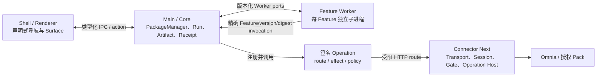

# Omnia Agent v5 系统架构

状态：实现现状与目标边界（2026-08-10）

产品版本：Shell 源码 `0.4.15`
传输决策：Remote-only；无 Local Connector fallback

这份文档只描述当前可从源码验证的架构。四个官方 Feature 的独立性尚未通过发布门禁，详见 [Feature 独立性审计](FEATURE_INDEPENDENCE.md)。

## 1. 运行边界

- Shell 只渲染签名导航和 Surface，不保存 Feature 业务真相。
- PackageManager 负责验签、不可变包目录、sequence、activation head、Worker 生命周期与 Operation 注册。
- 每个 Feature 在独立 Node 子进程运行；进程隔离目前不是 OS sandbox，Worker 仍继承父进程环境。
- Core 是 Run、Artifact、Command、Receipt、confirmation 和恢复账本的 system of record。
- Connector Next 只拥有凭据、Session、Pack binding、通用 Gate、声明式 Operation host 与 read-back transport。

## 2. 数据所有权

| 数据 | 物理位置/所有者 | 必须绑定的身份 |
|---|---|---|
| 激活头、包登记、发布 sequence | Core SQLite | `featureId + version + packageDigest + generation` |
| Run/Artifact/Command/Receipt | Core SQLite 与 `data/features/<featureId>/artifacts` | Feature、版本、Run、Operation digest、authority |
| Feature 私有状态 | `data/features/<featureId>/store.sqlite` | 单一 Feature namespace 与迁移版本 |
| Worker 临时文件 | Feature-scoped temp root | Feature、Run、handle、digest、TTL |
| Session/credential | Connector/平台保护存储 | Connector、authority、tenant/org、Pack、generation |

Core 共享表只应保存通用控制面事实。业务 Schema、Feature 专属恢复算法和特定版本兼容规则应留在签名 Feature 包，或通过通用版本化合同进入平台；不得作为 Feature ID 分支写入共享 Store。

## 3. 激活与故障语义

正常目标序列是：验签并落不可变候选 → 校验迁移/导航/Operation → 启动候选 Worker → 远端 Operation prepare/commit → CAS 切换 head → 停旧 Worker → finalize。启动或交接失败时旧 head 和旧 Worker 保持权威。

当前实现已有 durable Operation handoff ledger、activation-head CAS、按 Feature 的 supervisor map，以及 mutation Worker 超时/退出后的 fail-closed recovery。它们是良好基础，但仍有以下未闭环边界：

- 无 resource-owner 的 Operation 升级会先换 Core head，首次业务调用才向 Connector 注册；旧注册存在时可能被 Connector 拒绝。
- resource-owner 兼容规则要求 sequence 增加且 capability fingerprint 完全相同，阻止正常 handler 演进，并使回滚到旧 sequence 不可达。
- Feature 私有迁移目前只有 `version=1` 的建表语义，且在候选 activation 事务前直接作用于 live Store。
- Runtime `storePorts` 尚未作为调用 allowlist 执行，部分共享 Store 写入口没有完整 Feature owner 校验。

因此当前不能把“可安装候选”表述为“可独立升级、回滚和持久恢复”。

## 4. 安全与业务边界

- Connector Next 禁止包含 Feature ID、Feature 版本或 Feature 业务分支；业务只存在于独立签名 Feature/Operation 包。
- Mutation 必须由官方签名 Operation 发起，绑定精确 package digest、effect、route、authority、session generation、plan/request digest 和幂等身份。
- 响应丢失或进程崩溃后的 mutation 不自动重放；只能用 receipt 和只读 read-back 进入 reconcile。
- Worker 子进程不是强权限边界。正式安全声明前还需要最小环境、文件系统/网络限制、资源配额与逃逸测试。

## 5. 当前官方 Feature 源码候选

| Feature | 源码候选 | sequence | 当前说明 |
|---|---:|---:|---|
| `omnia.create-associate` | `0.2.103` | 105 | 包脚本与候选测试存在；当前版本 live acceptance pending |
| `omnia.delete-elements` | `0.3.20` | 29 | 包脚本与候选测试存在；当前版本 live acceptance pending |
| `omnia.recording` | `0.4.19` | 32 | 包脚本与候选测试存在；当前版本 live acceptance pending |
| `omnia.workpaper-preparation` | `0.1.3` | 4 | 直接 Node 包脚本存在；npm 发布入口与当前版本 live acceptance pending |

“源码候选”仅指当前构建脚本中的版本常量，不表示已安装、已推广或已在授权 Pack 通过。

## 6. 相关合同

- [Feature Package 标准](FEATURE_PACKAGE_STANDARD.md)
- [Feature 独立性审计](FEATURE_INDEPENDENCE.md)
- [统一合同](../contracts/CONTRACTS.md)
- [Connector Gate](CONNECTOR_GATE.md)
- [数据与存储](../data/DATA_AND_STORAGE.md)

旧 Remote Connector/Bridge 已退出源码构建、发布资产与运行选择；当前唯一 Connector 实现为 Connector Next。
