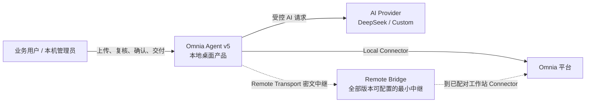
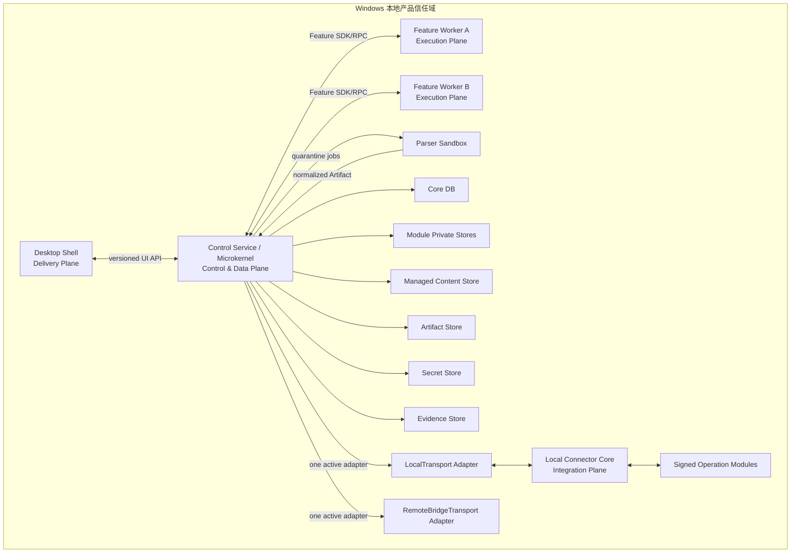
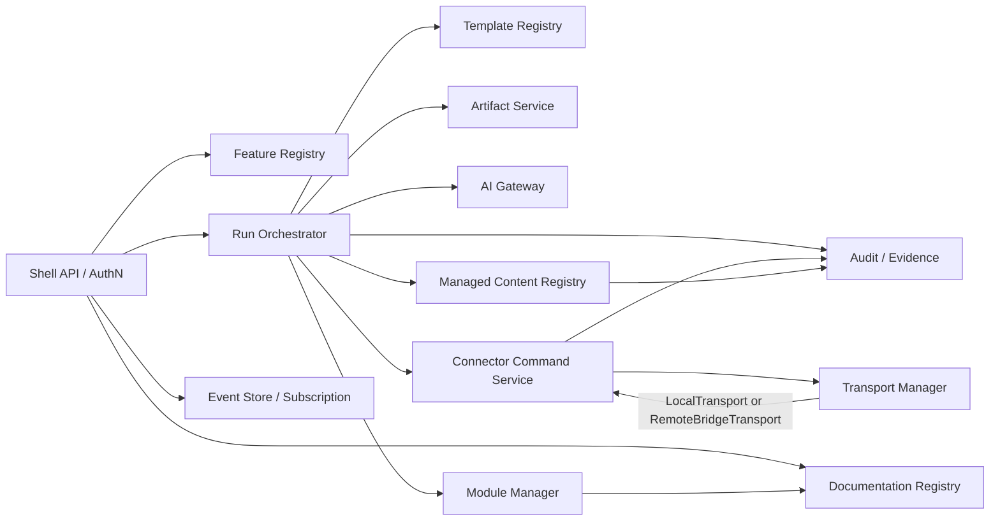
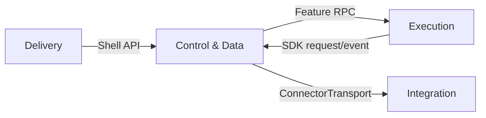
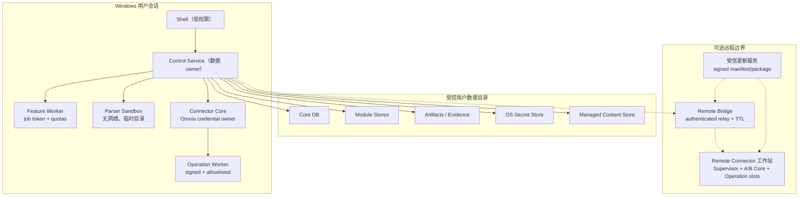
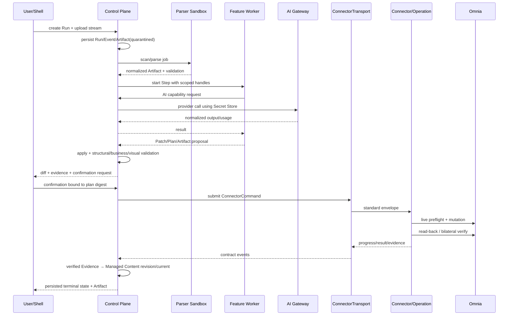
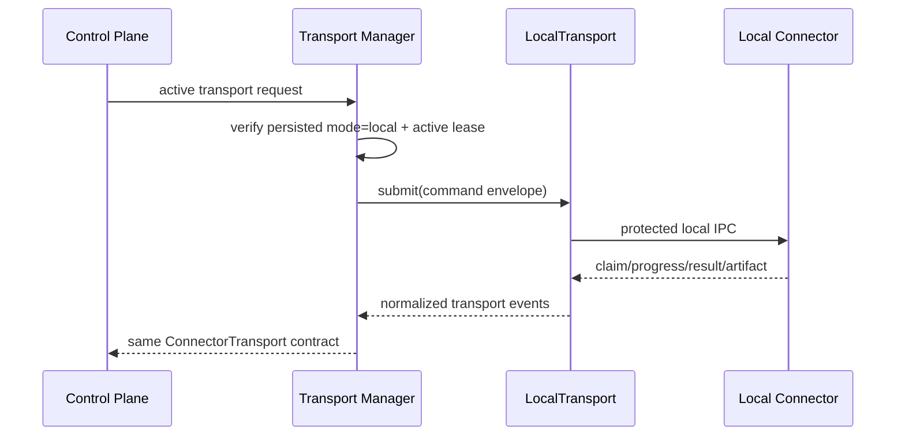
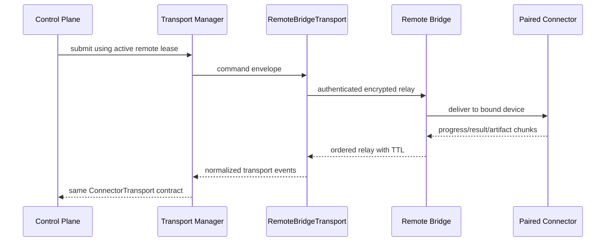

# Omnia Agent v5 系统架构

状态：Draft for Review  
架构风格：微内核控制面 + 隔离 Feature Worker + 可替换 Connector Transport  
合同基线：`omnia.contracts/v1`（开发前冻结；变更规则见 `../contracts/CONTRACTS.md`）

## 1. 决策状态

| 决策 | 状态 | 说明 |
|---|---|---|
| 单一 Local 桌面产品 | Accepted（需求约束） | Remote 仅为 Connector Transport |
| Remote 面向全部版本 | Accepted（用户决策） | 不按 Edition 裁剪；未满足安全/配对门禁时仍禁用 |
| 三列 Shell，第三列保留聊天 | Accepted（用户决策） | 第二列只放 Feature 树；第三列用固定 Comments + docked Feature 标签，工作台可主动弹出；聊天绑定持久 FeatureContext |
| 首批四个 Feature | Accepted（用户决策） | 新建与关联、删除元素、删除聊天记录、录制 |
| 首批开发顺序 | Accepted（用户决策） | 录制 → 删除元素 → 删除聊天记录 → 新建与关联；第四项用窄 canary 完成四 Plane 综合验收 |
| 功能树深度 | Accepted（用户决策） | 最大三级；二级或三级均可为 Feature 叶子 |
| 所有一级界面统一全局缩放 | Accepted（用户决策） | 右上角 `− 百分比 +`，Core UserPreference 持久化并跨窗口同步 |
| 所有相邻功能区域边界可调整 | Accepted（用户决策） | 公共 ResizableLayout/Splitter，Core LayoutPreference 持久化 |
| 四 Plane 与独立进程边界 | Accepted（需求约束） | 不能以目录分层替代 |
| 每 Feature 独立 Worker、版本、数据 owner | Accepted（需求约束） | 跨 Feature 禁止 import/DB 访问 |
| 后台是 system of record | Accepted（需求约束） | Run、模板、Artifact、业务数据、AI broker、命令均归后台 |
| Connector Core = Transport/Session/Gate | Accepted（需求约束） | 业务能力由签名受限 Operation Module 扩展 |
| Remote Connector 在线升级 | Accepted（用户决策） | 优先升级 Operation Module；Core 仅在基础协议/安全/兼容变化时 A/B 在线升级 |
| Shell-first 与独立 Feature 包 | Accepted（用户决策） | 首个交付为无内置业务 Feature 的真实 Shell Baseline；四个首批功能随后逐包安装和验收 |
| Feature 实现文档随包安装 | Accepted（用户决策） | 每个能力记录四 Plane 实现；代码与项目文档同版本、同签名，以 crash-safe staging + 单一 activation record 一致激活/回滚 |
| Agent 管理内容登记簿 | Accepted（用户决策） | 后台保存创建/修改/删除内容的 current projection 与不可变 revision/change，供 Phase 2 读取 |
| Workspace 轻/重抓取 | Accepted（用户决策） | 轻抓取权威 Section + Workspace；重抓取限选定 Workspace/capability；禁止名称推断 |
| 生产包信任边界 | Accepted（用户决策） | 只允许官方签名 Feature/Operation；首版无第三方或任意离线导入 |
| 便携数据与更新边界 | Accepted（用户决策） | 同一产品根分离 releases/data；默认无按年龄删除；更新不覆盖 data；Secret Windows 保护 |
| Remote 默认更新策略 | Accepted（用户决策） | 服务器自动下发，自动验证并在真实安全窗口自动激活 |
| Electron + React + TypeScript Shell | Proposed | 延续 Windows/Electron 经验；需评估安装体积、可访问性和安全更新 |
| TypeScript/Node 后台与 Worker SDK | Proposed | 有利于共享 Schema/合同；需基准测试 CPU 密集文档任务 |
| SQLite Core DB + 后台托管模块私有库 | Proposed | 适合单机；写并发、迁移和备份需基准测试 |
| 内容寻址文件 Artifact Store | Proposed | SHA-256；大文件、去重和杀毒集成需验证 |
| 本机 Shell↔后台使用受保护 IPC/loopback | Proposed | 优先类型化 IPC；若保留 loopback，必须随机端口/token/Host/Origin |
| JSON Schema 2020-12 + RPC over framed IPC | Proposed | 合同形式已建议，具体 RPC runtime 待原型验证 |
| OpenTelemetry 语义 | Proposed | 本地 sink/导出范围待隐私评审 |

未标记 Accepted 的实现选型不得在评审前被当作已决定事实。

## 2. C4 Context

边界说明：

- Omnia 凭据、Cookie、Authorization 只存在于 Connector 所在工作站。
- AI Key 只存在于本地 Secret Store；Feature Worker 通过 AI Gateway 使用逻辑 profile。
- Remote Bridge 不是后台副本，不保存业务主数据、Omnia 会话或 AI Key。

## 3. C4 Container

`FW1/FW2` 代表任意数量的隔离 Worker，并非预置业务功能。Shell、Core、每个 Worker、Parser 和 Connector 均是独立进程或等价强隔离边界。

## 4. C4 Component

Core 组件只实现跨功能通用机制。任何含 Phase 1、Phase 2、Controls、删除、EMS 等业务分支的实现都属于 Feature/Operation Module，不得进入这些组件。Documentation Registry 只拥有已安装文档的不可变版本、candidate/active/previous 指针和生成索引；它不能代替 Feature Registry、Run 或健康状态成为运行事实源。Managed Content Registry 提供类型 Schema、current/revision/change、投影提交和版本化查询机制；RAIT、Factors Considered 等具体业务规则仍由域合同定义，不能变成 Core `if/else`。

### 4.1 Core 准入规则

一个能力只有同时满足下列条件才可进入 Core：

1. 它是身份/授权、生命周期、调度、版本路由、通用持久化协议或跨模块安全 broker，而不是某个业务场景的算法或枚举；
2. 不需要知道具体 `featureId`、域对象名、Operation ID、模板字段或 UI route 才能正确工作；
3. 有明确 owner、版本化公共合同、数据 owner、故障域、资源预算、降级和恢复边界；
4. Feature 可以通过 SDK/RPC 使用它，但不能因此获得其他 Feature Store、Secret、任意网络或 Connector 命令能力；
5. 若该能力只服务一个或少数 Feature，提案必须证明放在 Feature/公共域服务中无法满足安全或一致性要求。“被两个 Feature 复用”不是进入 Core 的充分条件。

Core service 必须可单独审计其导入和合同边界。自动架构测试拒绝 Core 中出现已登记业务 Feature ID、业务 Operation ID、场景 enum、Feature 私有 Schema/import 或面向某 Feature 的条件分支。新共享业务语义进入版本化公共域服务或独立包，不扩大 Orchestrator 的业务判断。

图中的组件是逻辑服务目录，不表示它们必须在 Shell Baseline 第一批同时实现。正式实现按最小内核激活后逐项加入；每项都要有独立 DoR/DoD、故障预算和 D5 原型证据。

## 5. 四个 Plane

| Plane | 拥有 | 可调用 | 禁止 |
|---|---|---|---|
| Delivery | 导航、表单、上传流、真实状态呈现、复核、确认、下载 | 版本化 Shell API | 解析资料、AI、DB、Omnia、构造任意 Connector 命令 |
| Execution | 场景算法、规则计算、通过 Gateway 的 AI 请求、Patch/Plan/验证 | Feature SDK、Run 限定 Artifact、模块私有 repository | 直连 Core DB/Omnia/Secret、导入其他 Feature、任意路径/网络 |
| Control & Data | Registry、Run/Event、模板/Artifact/业务数据、Agent 管理内容 current/ledger、AI broker、命令、审计 | Feature RPC、Transport、受控 Store | 堆放具体业务算法、直连 Omnia |
| Integration | Transport、Session、Gate、Operation Registry、Omnia 调用、证据 | 单一 Transport 合同、受控 Session SDK | 模板选择、资料处理、AI、业务编排、业务主数据 |

### 5.1 允许依赖

规则：

- Delivery 不能直接依赖 Execution 或 Integration。
- Execution 与 Feature 之间不能直接依赖；协作经 Core 的版本化事件/Artifact 合同。
- Integration 不回调 Feature 内部 API，只回传标准 progress/result/evidence。
- 存储访问由 owner 的 repository/service 提供；数据库文件路径永不作为合同字段。
- “同一安装包”不构成共享内部代码或共享数据库权限的理由。

## 6. 进程、信任与部署拓扑

信任规则：

- Shell 输入始终不可信；上传先 quarantine。
- Feature 包与 Operation 包只接受官方信任根，并在加载前验证签名、hash、版本、发布序列、撤销、SBOM 和权限；生产不接受第三方/未签名/测试根包。
- Feature 文档作为不可信包内容一起验证 digest、必备类型、内部链接、四 Plane 映射、敏感信息和安全渲染；拒绝路径穿越、符号链接逃逸、脚本、危险 HTML 和主动外部内容。
- Feature UI 视为不可信包代码，只能运行在受控 SurfaceHost/WindowManager 创建的独立无特权 sandboxed renderer/WebContents；可以由 Shell 合成到第三列 docked viewport，也可主动弹出为独立窗口，但不得直接在 Shell renderer 中 import、共享 DOM/CSS/Store，唯一入口是版本化 Shell UI Bridge。
- Remote Connector Supervisor 在工作站本地验证在线更新的目标身份、签名、hash/SBOM、sequence 和兼容性；Bridge/更新服务不能代替最终信任判断。
- Worker 只获得短期 job token、只读输入句柄、专属输出上传句柄和资源配额。
- Parser 默认无网络，不继承用户环境秘密；压缩包递归、文件数、解压比、CPU、内存、时间上限均需配置。
- Connector 是 Omnia credential owner；Core 只持有设备/会话逻辑 ID 和受控命令状态。

## 7. 统一 Run 数据流

若功能不需要 AI 或 Omnia，相应步骤被合同明确省略，不创建假调用。Run 仍使用同一状态、事件和 Evidence 模型。Agent 发起的 create/update/delete 只有在真实读回或 reconcile 证明后才推进 Managed Content current；`partial/uncertain` 不把计划值写成当前事实。

## 8. Local 时序

Local 可优化拓扑，但不得改变业务命令 Schema、确认、幂等、结果或 uncertain 语义。

## 9. Remote 时序

Bridge 只知道路由所需逻辑身份和密文/受控摘要。Remote 故障不触发 Local fallback。

## 10. 架构不变量

1. Run/Event/Command 必须先持久化再产生外部 effect。
2. 同一时刻仅一个 active Transport lease。
3. mutation 命令绑定 connector/session/engagement/pack/run/operation/effect/plan digest。
4. 内存状态只是缓存或 lease 投影；重启后的真相来自数据库和 reconcile。
5. Core 不解析业务文档；通用 quarantine/解析调度与具体场景算法分离。
6. Feature 不能取得明文 Provider Key 或 Connector 凭据。
7. Connector Core 不出现业务场景分支，也不提供任意 URL/method/body。
8. 任何模块或其 UI surface 不健康只禁用自身入口/视图，不阻断 Shell、聊天或其他健康模块。
9. 快照必须带 `capturedAt/source/schemaVersion/currentStateVerified`。
10. 无法证明时返回 `not_evaluable` 或 `uncertain`，不得猜测。
11. 每个 active Feature 的每个 capability 必须有四 Plane 实现映射；不适用项显式说明原因。
12. active Feature 与 active 项目文档版本必须一致，代码和文档不能分别晋升或回滚。
13. Agent 管理内容的 current 只来自已验证 Evidence；create/update/delete intent、AI 输出或前端状态不能直接覆盖。
14. Phase 2/其他 Feature 通过版本化 Managed Content 查询读取 schema/freshness/provenance，不直连共享 Store，也不以本地投影替代危险操作的实时 Omnia 预检。
15. Workspace 所属 Section/部分只来自 Omnia 权威 identity；显示名称不决定分类、权限、operation 或缓存复用。
16. 轻抓取仅含带权威 `parentSectionId` 的 Section + Workspace；重抓取仅含当前 Pack、选定 Workspace 和 Feature capability 的声明元素，并受对象/关系/页/字节/时长硬预算约束，禁止全包无界 dump。
17. 不可变 release 与可变 `data` 分离；更新、回滚、旧 release 清理不能覆盖 data。含客户正文的数据做实例级静态保护，外部 Secret/Remote 注册/服务进入 instance external inventory。

## 11. 部署与升级边界

- 基础安装包先包含稳定 Shell/Core/Transport/Connector Core，不内置首批业务 Feature；干净安装的业务 Registry 为空。
- 四个首批功能是可独立安装、启停、升级和回滚的签名 Feature 包，按录制 → 删除元素 → 删除聊天记录 → 新建与关联逐包验收，见 [ADR-0022](../adr/0022-shell-first-independent-feature-packages.md)。
- 每个 Feature 包携带签名文档 manifest、四 Plane 实现映射和运维/测试文档；Package Manager 将其发布到 Documentation Registry，并与 Feature Registry 在同一提交中切换 active/previous，见 [ADR-0023](../adr/0023-feature-documentation-bundle.md)。
- Feature 独立交付已确定；生产仅通过官方受控发布服务取得官方签名 Feature/Operation 包。首版不开放第三方或任意离线导入；未来只可另行评审官方签名离线包，见 [ADR-0026](../adr/0026-official-signed-package-supply-chain.md)。
- Remote Connector 必须支持在线升级；Operation Module 默认 side-by-side，Connector Core 使用 candidate/active/previous 与安全窗口，见 [ADR-0019](../adr/0019-remote-connector-online-upgrade.md)。
- Remote 默认由服务器自动下发，Supervisor 自动取得/验证，并在真实安全窗口自动激活；安全阻断和回滚门禁不可关闭，见 [ADR-0028](../adr/0028-remote-automatic-safe-window-rollout.md)。
- 新 Feature 默认不升级 Connector Core；只有 Transport/Session/Gate/受控 SDK/安全边界或基础 Omnia 兼容变化才能提出 Core 更新。
- Core 升级前 drain 新 Run、活动 upload 和 mutation；`uncertain` 必须保留并在升级后只读对账。
- Feature A 升级不能重启 Core、Connector Core 或 Feature B。
- Module Store migration 只由其 owner 运行，使用 candidate 副本/expand-contract 和观察期。
- Remote 面向全部版本已确定；Bridge 的部署、身份系统、端到端保护、TTL 与 SLA 仍为 `Proposed`。
- 产品根内 `releases` 与稳定 `data` 分离；更新/回滚只切换 release/activation，Secret 在复制或迁机后要求重配；受控移除实例还必须撤销外部 Secret、Remote 注册和服务，见 [ADR-0027](../adr/0027-portable-data-root-and-update-boundary.md)。

## 12. 架构验收门槛

- [ ] 依赖扫描证明无 Feature→Feature import、Feature→Core DB、Delivery→AI/Omnia。
- [ ] 进程测试证明 Feature A 崩溃/升级时 Feature B 的 Run 连续。
- [ ] Local/Remote 通过同一合同套件和同一命令 replay fixture。
- [ ] Transport 切换在在途 mutation、未解决 uncertain、Connector Artifact 上传、状态未知或只读任务无法安全结束时被阻断。
- [ ] Core/Connector 源码结构门禁拒绝业务 Feature ID/操作分支进入核心。
- [ ] 每个 capability 的四 Plane 实现映射与 UI action、schema、migration、Template binding、Connector operation 和测试 ID 双向一致。
- [ ] 文档缺失、digest/链接错误、敏感内容或危险 Markdown 会拒绝候选；代码与项目文档的安装/升级/回滚保持原子一致。
- [ ] create/update/delete/adopt/partial/uncertain/reconcile 能正确维护 Managed Content current、revision、relation、change 与 tombstone。
- [ ] Phase 2 查询能取得经验证的 RAIT/Factors 等域字段；schema/freshness/unresolved 不满足时失败关闭，且无法直连 Store。
- [ ] Remote Connector 在线升级通过签名/sequence/A-B/安全窗口/probation/回滚测试，且失败不启动 Local claim。
- [ ] Workspace 轻/重抓取通过权威 identity、改名、同名、缺失父级、分页/取消和 Local/Remote parity 测试。
- [ ] 官方签名包以外的所有生产包失败关闭，且无任意导入绕过入口。
- [ ] 更新、回滚和旧 release 清理不改变 `data`；迁机后 Secret 明确要求重配。
- [ ] 重启恢复只从持久状态重建，不自动重放 mutation。
- [ ] 真机 canary 验证完整身份链和写后读回。
- [ ] 所有 `Proposed` 技术选型在实现前有 ADR、原型证据或基准测试。
