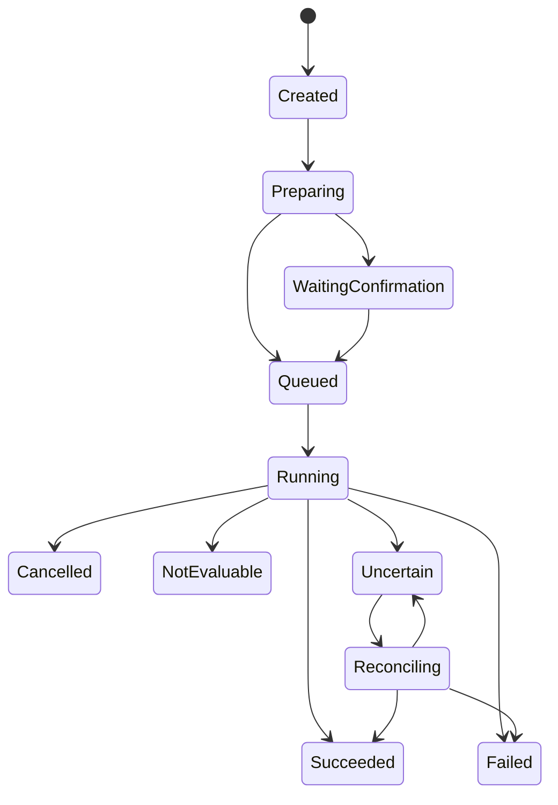
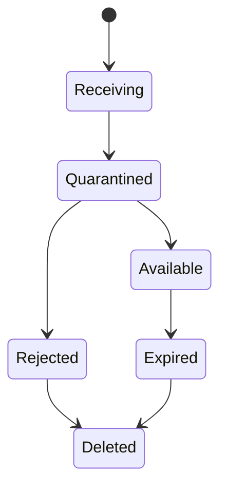
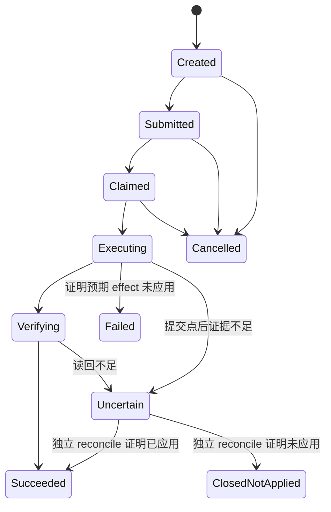
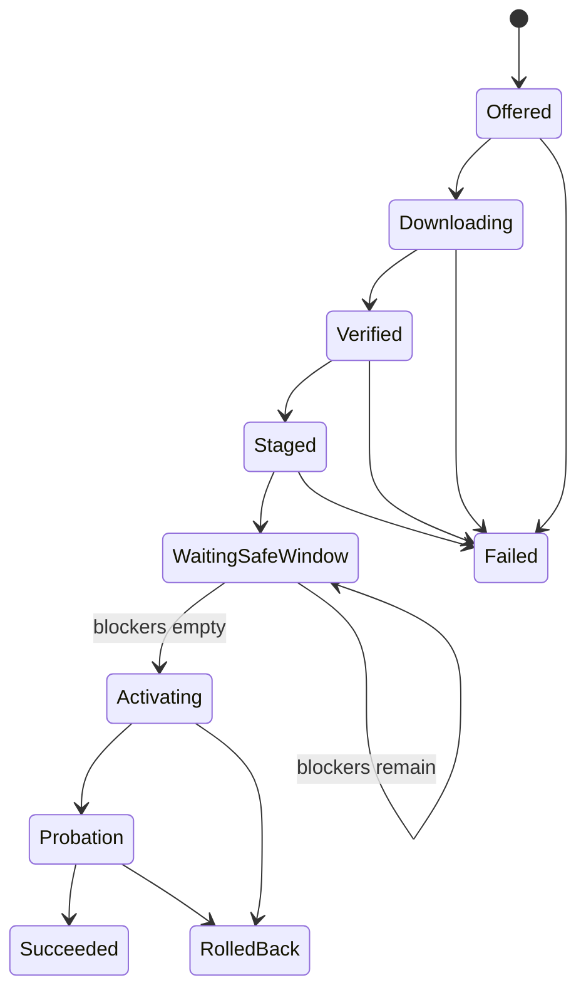

# Omnia Agent v5 统一合同

状态：Draft for Review  
合同族：`omnia.contracts/v1`  
表示建议：JSON Schema 2020-12（`Proposed`，开发前冻结）

本文所有 JSON 都明确是**合同示例**，只用于说明字段形状；它们不是 mock 服务、真实业务数据、真实凭据、真实对象 ID 或可执行命令。

## 1. 共同规则

### 1.1 Envelope

所有 RPC/Event 对象至少含：

| 字段 | 类型 | 规则 |
|---|---|---|
| `schemaVersion` | string | 稳定 schema ID + major，如 `omnia.run/v1` |
| `id` 或专用 ID | string | 不透明、非空；客户端不得推导路径或权限 |
| `traceId` | string | 跨 Shell/Core/Feature/Connector 关联 |
| `createdAt`/`occurredAt` | RFC 3339 UTC | 由 owner 生成 |
| `extensions` | object，可选 | 只容纳已登记命名空间；安全对象默认拒绝未知字段 |

金额/计数不使用浮点表达无法接受的精度；二进制正文不嵌入 JSON，使用 Artifact handle。

### 1.2 版本

- Schema URI/ID 固定；破坏性变更提升 major。
- 新增可选字段不得改变旧消费者语义。
- 安全默认值必须 fail closed。
- 对象记录创建时的精确 schema/producer version；运行中不隐式升级。
- 支持范围使用 semver range，但持久 Run 冻结解析后的精确版本。

## 2. Feature Navigation

必需字段：

| 字段 | 类型 | 说明 |
|---|---|---|
| `schemaVersion` | const `omnia.feature-navigation/v1` | 合同版本 |
| `snapshotId` | string | 本次 registry 快照 |
| `stateVersion` | integer ≥ 0 | 乐观并发/陈旧点击检查 |
| `generatedAt` | timestamp | 后台生成时间 |
| `nodes` | array | 最大三级的混合深度节点 |
| `nodes[].id` | string | 稳定节点 ID |
| `nodes[].parentId` | string/null | 一级为 null |
| `nodes[].level` | integer 1..3 | level 2/3 均可为 Feature 叶子 |
| `nodes[].kind` | `group|feature` | level 1 必须 group；level 3 必须 feature |
| `nodes[].labelKey` | string | 本地化键 |
| `nodes[].order` | integer | 同级稳定排序 |
| `nodes[].feature` | object/null | kind=feature 时必须有 ID、version、route、`defaultPlacement=docked`、允许 placements 和稳定 `surfaceId`；与层级无关 |
| `nodes[].availability` | enum | `available|disabled|unhealthy|incompatible|unauthorized|unknown` |
| `nodes[].reason` | ErrorSummary/null | 禁用原因来自真实状态 |

**合同示例：**

```json
{
  "schemaVersion": "omnia.feature-navigation/v1",
  "snapshotId": "nav_contract_example_01",
  "stateVersion": 4,
  "generatedAt": "2030-01-01T00:00:00Z",
  "nodes": [
    {"id": "domain.contract-example", "parentId": null, "level": 1, "kind": "group", "labelKey": "contract.domain", "order": 10, "feature": null, "availability": "available", "reason": null},
    {"id": "feature.direct-contract-example", "parentId": "domain.contract-example", "level": 2, "kind": "feature", "labelKey": "contract.direct_feature", "order": 10, "feature": {"id": "com.example.direct-feature", "version": "1.0.0", "route": "/features/com.example.direct-feature", "defaultPlacement": "docked", "placements": ["docked", "detached", "minimized"], "surfaceId": "feature.com.example.direct-feature.surface"}, "availability": "disabled", "reason": {"code": "CONTRACT_EXAMPLE_NOT_INSTALLED", "messageKey": "contract.disabled"}},
    {"id": "group.contract-example", "parentId": "domain.contract-example", "level": 2, "kind": "group", "labelKey": "contract.group", "order": 20, "feature": null, "availability": "available", "reason": null},
    {"id": "feature.nested-contract-example", "parentId": "group.contract-example", "level": 3, "kind": "feature", "labelKey": "contract.nested_feature", "order": 10, "feature": {"id": "com.example.nested-feature", "version": "1.0.0", "route": "/features/com.example.nested-feature", "defaultPlacement": "docked", "placements": ["docked", "detached", "minimized"], "surfaceId": "feature.com.example.nested-feature.surface"}, "availability": "disabled", "reason": {"code": "CONTRACT_EXAMPLE_NOT_INSTALLED", "messageKey": "contract.disabled"}}
  ]
}
```

这些禁用节点只示范二级/三级 Feature 合同，不表示产品计划提供对应功能。

结构约束：

- level 1：`parentId=null` 且 `kind=group`；
- level 2：parent 必须为 level 1 group，`kind=group|feature`；
- level 3：parent 必须为 level 2 group，`kind=feature`；
- 禁止 level 4、feature 子节点、空 route、非 `docked` 默认 placement、未知 placement 或重复 surfaceId；
- Feature ID/route/权限/历史 Run 不依赖 parent，移动层级只生成新的导航 snapshot/stateVersion。
- route 是受控 SurfaceHost/WindowManager 的内部注册路由，不是 Renderer 可传给 `window.open` 的任意 URL；docked 打开、弹出、最小化或聚焦都必须携带 FeatureContext/stateVersion 并由 Core 重新授权。

### 2.1 FeatureContext

FeatureContext 是第三列 Comments/Feature 标签 Host 当前所处的真实上下文，由后台持久化，不由前端路由、标签文字或聊天文字推断。

| 字段 | 类型 | 说明 |
|---|---|---|
| `schemaVersion` | const `omnia.feature-context/v1` | 合同版本 |
| `contextId` | string | 不透明 ID |
| `conversationId` | string | 当前本地聊天会话 |
| `selectedFeature` | `{id,version}`/null | 当前 Feature 精确版本 |
| `stateVersion` | integer ≥ 0 | Feature 切换/恢复的并发控制 |
| `availability` | enum | `available|blocked|unhealthy|unknown` |
| `blockingReason` | ErrorSummary/null | 后台真实原因 |
| `activeRunId` | string/null | 当前活动 Run 投影 |
| `updatedAt` | timestamp | 后台更新时间 |

约束：

- 选择 Feature 打开/聚焦 docked Surface 并改变活动 FeatureContext，不删除 `Comments`、聊天输入或后台聊天事实；
- ChatMessage 可以引用 `contextId/featureId/runId`，但聊天文字不是 Feature 业务状态、Plan 或写入授权；
- 刷新或重启后，Shell 从 Core 重读 FeatureContext；
- 清理当前聊天时默认保留 FeatureContext；精确删除语义见首批 Feature 设计；
- Renderer 不能自行把禁用 Feature 改为 available 或伪造 active Run。

### 2.2 FeatureSurfaceInstance

Shell/Core 使用统一实例合同管理第三列标签与独立窗口，Renderer 不得仅靠 DOM 是否存在推断实例状态。

| 字段 | 类型 | 说明 |
|---|---|---|
| `schemaVersion` | const `omnia.feature-surface-instance/v1` | 合同版本 |
| `surfaceInstanceId` | string | 不透明单实例 ID |
| `feature` | `{id,version}` | 精确已激活 Feature 版本 |
| `contextId` | string | 绑定 FeatureContext |
| `placement` | `docked|detached|minimized` | 当前宿主位置 |
| `lifecycleState` | `bootstrapping|ready|blocked|dirty|crashed|closing` | 后台确认生命周期 |
| `active` | boolean | docked 时是否为当前标签；detached/minimized 时为 false |
| `stateVersion` | integer ≥ 0 | placement/生命周期 CAS |
| `updatedAt` | timestamp | Core 更新时间 |

动作合同：

- `openFeatureSurface(featureId, contextVersion, placement="docked")`：新建或聚焦同一 `featureId + contextId` 实例；
- `setFeatureSurfacePlacement(surfaceInstanceId, placement, expectedStateVersion)`：实现 `↗` 或 `−`，失败保持原宿主；
- `closeFeatureSurface(surfaceInstanceId, expectedStateVersion)`：关闭 UI 实例，不卸载 Feature、不隐式终止 Run；dirty 时返回需要标准确认；
- `focusFeatureSurface(surfaceInstanceId)`：激活 docked 标签或恢复/聚焦 detached/minimized 窗口；成功返回 `instanceId/placement/attached` 及完整 manager snapshot，unknown、closed、identity drift 或非法 placement 必须显式失败。docked 成功时 `activeInstanceId` 必须等于目标且 `attachedInstanceIds` 只能包含目标；
- `setFeatureMenuCollapsed(collapsed, expectedLayoutStateVersion)`：由 Core 持久化折叠状态，折叠时菜单与 Splitter 同时归零。

迁移 placement 不改变 `surfaceInstanceId/contextId/activeRunId`，也不允许重放 mutation。minimized 必须先建立 detached 宿主并完成状态接续，再调用 Windows 原生最小化。

### 2.3 UserViewPreference

全局界面缩放使用公共用户偏好合同：

| 字段 | 类型 | 说明 |
|---|---|---|
| `schemaVersion` | const `omnia.user-view-preference/v1` | 合同版本 |
| `profileId` | string | 当前本地 profile |
| `uiScalePercent` | integer | 后台验证过的当前值 |
| `showFeatureVersions` | boolean | 是否在 Shell Feature 菜单显示真实 active package 版本；默认 `true` |
| `stateVersion` | integer ≥ 0 | CAS/多窗口同步 |
| `updatedAt` | timestamp | Core 写入时间 |
| `source` | `user|reset|migration|default` | 值来源 |

缩放和 Feature 版本可见性的更新 action 都必须携带 `expectedStateVersion`。Core 成功提交后发布 `user_preference.updated`；Shell 和所有独立窗口只应用后台返回值。范围和步长由已发布 UI policy 给出，Renderer 不得自行扩大。Feature 版本文本来自当前 active package manifest，不得用硬编码展示值冒充当前状态。

### 2.4 LayoutPreference

可调整功能分区使用公共布局偏好合同：

| 字段 | 类型 | 说明 |
|---|---|---|
| `schemaVersion` | const `omnia.layout-preference/v1` | 合同版本 |
| `profileId` | string | 当前本地 profile |
| `surfaceId` | string | 稳定界面 ID |
| `layoutVersion` | integer ≥ 1 | manifest 布局版本 |
| `stateVersion` | integer ≥ 0 | CAS/多窗口同步 |
| `splitters` | object | splitterId → basis points |
| `collapsedPanels` | object | panelId → boolean；当前主 Shell 只允许 `feature-menu` |
| `updatedAt` | timestamp | Core 写入时间 |

Splitter 更新 action 携带 `surfaceId/layoutVersion/splitterId/value/expectedStateVersion`；折叠更新 action 携带 `panelId/collapsed/expectedStateVersion`。Core 根据已安装 Shell/Feature 的布局 manifest 校验 splitter、相邻 panel、可折叠 panel 和允许范围，成功后发布 `layout_preference.updated`。拖动 preview 不进入合同；pointerup/cancel 只提交最终值。

## 3. Run

| 字段 | 类型 | 说明 |
|---|---|---|
| `schemaVersion` | `omnia.run/v1` | 必需 |
| `runId/traceId` | string | 必需 |
| `feature` | `{id,version,contractVersion}` | 冻结精确版本 |
| `scenarioVersionId` | string/null | 有场景时必需 |
| `status` | enum | 见状态机 |
| `stateVersion` | integer | 每次迁移递增 |
| `effect` | enum | `read_only|artifact_write|omnia_mutation|mixed` |
| `effectOutcome` | enum | `none|partial|complete|uncertain`；与生命周期正交 |
| `resolutionRequired` | boolean | 是否需要用户处理或 reconcile |
| `effectEvidenceIds` | string[] | 已证明发生/未发生的 effect 证据 |
| `createdAt/updatedAt` | timestamp | 必需 |
| `inputArtifactIds/outputArtifactIds` | string[] | 逻辑引用 |
| `activeStepId` | string/null | 投影 |
| `error` | Error/null | 终态或受阻原因 |
| `uncertainCommandIds` | string[] | 非空时阻止重试/Transport 切换 |

状态：



`succeeded/failed/cancelled/not_evaluable` 为终态；`uncertain` 非终态但禁止 mutation。生命周期状态不表达外部 effect 是否已经部分发生，必须同时读取 `effectOutcome/resolutionRequired/effectEvidenceIds`。因此 `failed` 或 `cancelled` 不能被前端解释成“什么都没发生”。

终态语义：

- `failed`：Run 未达到全部必需后置条件。它可以伴随 `effectOutcome=none`，也可以在多步 mutation 已有部分读回证据时伴随 `effectOutcome=partial`。若由 Connector reconcile 到达，未应用的原命令必须转为 `closed_not_applied`，并记录 `CONNECTOR.RECONCILED_NOT_APPLIED`（或等价稳定错误码）和 `effectState=not_applied`；该终态不授权重试。
- `not_evaluable`：证据不足以评价业务结果，且不存在未解决的外部 effect；若 mutation 可能已发生，必须使用 `uncertain`，不能使用 `not_evaluable`。
- `uncertain`：外部 effect 可能已发生且尚无充分 Evidence；`effectOutcome=uncertain`，只能进入 `reconciling`。

多步 mutation 示例：新对象已读回、必需关系明确未建立时，Run 为 `failed`、`effectOutcome=partial`、`resolutionRequired=true`，并保留新对象 Evidence。系统不得自动删除已创建对象，也不得把同一 Run 重新排队。

**合同示例：**

```json
{
  "schemaVersion": "omnia.run/v1",
  "runId": "run_contract_example_01",
  "traceId": "trace_contract_example_01",
  "feature": {"id": "com.example.feature", "version": "1.0.0", "contractVersion": "1.0.0"},
  "scenarioVersionId": null,
  "status": "created",
  "stateVersion": 1,
  "effect": "artifact_write",
  "effectOutcome": "none",
  "resolutionRequired": false,
  "effectEvidenceIds": [],
  "createdAt": "2030-01-01T00:00:00Z",
  "updatedAt": "2030-01-01T00:00:00Z",
  "inputArtifactIds": [],
  "outputArtifactIds": [],
  "activeStepId": null,
  "error": null,
  "uncertainCommandIds": []
}
```

## 4. Step

| 字段 | 类型 | 说明 |
|---|---|---|
| `schemaVersion` | `omnia.step/v1` | 必需 |
| `stepId/runId/traceId` | string | 关联 |
| `kind` | string | 已登记的步骤类型 |
| `owner` | `core|feature|parser|ai_gateway|connector` | 执行 owner |
| `status` | `created|queued|running|waiting_confirmation|reconciling|succeeded|failed|cancelled|not_evaluable|uncertain` | 状态 |
| `attempt` | integer ≥ 1 | 新执行尝试；mutation uncertain 不增加 |
| `leaseId` | string/null | 活动执行 lease |
| `startedAt/endedAt` | timestamp/null | 时间 |
| `inputRefs/outputRefs` | Reference[] | 仅逻辑句柄 |
| `checkpoint` | object/null | versioned 恢复点 |
| `error` | Error/null | 结构化错误 |

**合同示例：**

```json
{
  "schemaVersion": "omnia.step/v1",
  "stepId": "step_contract_example_01",
  "runId": "run_contract_example_01",
  "traceId": "trace_contract_example_01",
  "kind": "contract.example.validate",
  "owner": "feature",
  "status": "queued",
  "attempt": 1,
  "leaseId": null,
  "startedAt": null,
  "endedAt": null,
  "inputRefs": [{"type": "artifact", "id": "artifact_contract_example_01"}],
  "outputRefs": [],
  "checkpoint": null,
  "error": null
}
```

Step 迁移由 Orchestrator 白名单控制：`created → queued → running`；需要确认时 `running → waiting_confirmation → queued|cancelled|failed`；普通执行进入终态；只有存在可能外部 effect 时可 `running → uncertain → reconciling → succeeded|failed|uncertain`。`failed` 的 reconcile 语义与父 Run 相同，必须有 `closed_not_applied` Command Evidence。

## 5. Event

| 字段 | 类型 | 说明 |
|---|---|---|
| `schemaVersion` | `omnia.event/v1` | 必需 |
| `eventId/runId/traceId` | string | 必需 |
| `stepId/commandId` | string/null | 适用时 |
| `sequence` | integer ≥ 1 | 在 Run 内严格递增 |
| `type` | string | 已登记事件类型 |
| `producer` | `{plane,id,version}` | 来源 |
| `occurredAt/recordedAt` | timestamp | 发生/落库 |
| `payload` | object | 通过 type-specific schema 验证 |
| `payloadDigest` | digest | 审计 |

Event 追加式，不更新或删除；更正使用新事件。订阅从 `afterSequence` 继续。

**合同示例：**

```json
{
  "schemaVersion": "omnia.event/v1",
  "eventId": "event_contract_example_01",
  "runId": "run_contract_example_01",
  "traceId": "trace_contract_example_01",
  "stepId": "step_contract_example_01",
  "commandId": null,
  "sequence": 1,
  "type": "run.created",
  "producer": {"plane": "control", "id": "orchestrator", "version": "1.0.0"},
  "occurredAt": "2030-01-01T00:00:00Z",
  "recordedAt": "2030-01-01T00:00:00Z",
  "payload": {"contractExample": true},
  "payloadDigest": "sha256:CONTRACT_EXAMPLE_ONLY"
}
```

## 6. Lease

| 字段 | 类型 | 说明 |
|---|---|---|
| `schemaVersion` | `omnia.lease/v1` | 必需 |
| `leaseId/resourceType/resourceId` | string | 唯一资源 |
| `holderId` | string | Worker/Transport identity |
| `generation` | integer | 单调递增 fencing token |
| `status` | `active|released|expired|revoked` | 状态 |
| `acquiredAt/expiresAt` | timestamp | 期限 |
| `renewAfter` | timestamp | 建议续租时间 |

旧 generation 的写入必须被 resource owner 拒绝。

Lease 只能从 `active` 转为 `released|expired|revoked`，终态不可恢复；重新获取产生新 `leaseId` 和更高 `generation`。

**合同示例：**

```json
{
  "schemaVersion": "omnia.lease/v1",
  "leaseId": "lease_contract_example_01",
  "resourceType": "transport",
  "resourceId": "active",
  "holderId": "local_contract_example",
  "generation": 3,
  "status": "active",
  "acquiredAt": "2030-01-01T00:00:00Z",
  "renewAfter": "2030-01-01T00:00:20Z",
  "expiresAt": "2030-01-01T00:00:30Z"
}
```

## 7. Confirmation

| 字段 | 类型 | 说明 |
|---|---|---|
| `schemaVersion` | `omnia.confirmation/v1` | 必需 |
| `confirmationId/runId/stepId` | string | 关联 |
| `effect` | enum | 至少 mutation 必需 |
| `planDigest/preflightDigest` | digest | 精确绑定 |
| `summary` | object | 脱敏、真实目标/影响/diff |
| `requestedAt/expiresAt` | timestamp | TTL |
| `status` | `pending|approved|rejected|expired|invalidated` | 决定 |
| `decidedAt/decisionActor` | nullable | 用户身份/本机主体 |
| `consumedByCommandId` | string/null | approved 确认最多绑定一个 mutation command |
| `stateVersion` | integer | 防陈旧确认 |

**合同示例：**

```json
{
  "schemaVersion": "omnia.confirmation/v1",
  "confirmationId": "confirm_contract_example_01",
  "runId": "run_contract_example_01",
  "stepId": "step_contract_example_02",
  "effect": "omnia_mutation",
  "planDigest": "sha256:CONTRACT_EXAMPLE_PLAN",
  "preflightDigest": "sha256:CONTRACT_EXAMPLE_PREFLIGHT",
  "summary": {"messageKey": "contract.confirmation", "targetCount": 1},
  "requestedAt": "2030-01-01T00:00:00Z",
  "expiresAt": "2030-01-01T00:05:00Z",
  "status": "pending",
  "decidedAt": null,
  "decisionActor": null,
  "consumedByCommandId": null,
  "stateVersion": 1
}
```

Confirmation 只能从 `pending` 转为 `approved|rejected|expired|invalidated`。在 pending 阶段发生 plan/preflight/stateVersion 漂移时转为 `invalidated`；approved 后决定记录保持不可变，但 Gate 在 digest/状态漂移时拒绝创建或执行命令。命令创建事务只能将一个 approved confirmation 的 `consumedByCommandId` 从 null 绑定一次；重试创建必须返回同一 command，不能消费第二次。新计划产生新 confirmation ID，不能复活旧确认。

## 8. Artifact

| 字段 | 类型 | 说明 |
|---|---|---|
| `schemaVersion` | `omnia.artifact/v1` | 必需 |
| `artifactId` | string | 授权使用，不等于 digest |
| `state` | `receiving|quarantined|available|rejected|expired|deleted` | 状态 |
| `role` | `input|template|template_instance|intermediate|output|connector_result|evidence|preview` | 角色 |
| `mediaType/detectedType` | string | 声明/检测 |
| `size` | integer ≥ 0 | 字节 |
| `digest` | string | 内容 digest |
| `owner` | `{type,id}` | 所有权 |
| `createdAt/availableAt` | timestamp/null | 时间 |
| `derivedFrom` | string[] | lineage |
| `retentionClass` | string | 已登记策略 |
| `provenanceId` | string/null | 因果链 |

状态转换：



状态只前进；派生物是新的 Artifact，以 `derivedFrom` 关联，不设 `derived` 状态。

**合同示例：**

```json
{
  "schemaVersion": "omnia.artifact/v1",
  "artifactId": "artifact_contract_example_01",
  "state": "quarantined",
  "role": "input",
  "mediaType": "application/octet-stream",
  "detectedType": null,
  "size": 128,
  "digest": "sha256:CONTRACT_EXAMPLE_ONLY",
  "owner": {"type": "run", "id": "run_contract_example_01"},
  "createdAt": "2030-01-01T00:00:00Z",
  "availableAt": null,
  "derivedFrom": [],
  "retentionClass": "contract-example",
  "provenanceId": null
}
```

## 9. Template

| 字段 | 类型 | 说明 |
|---|---|---|
| `schemaVersion` | `omnia.template/v1` | 必需 |
| `templateId/templateVersionId/scenarioVersionId` | string | 身份 |
| `version` | semver | 语义版本 |
| `status` | `draft|review|published|superseded|revoked` | 发布状态 |
| `artifactId/fileDigest/semanticDigest` | string | 正文与身份 |
| `contractVersion/validatorVersion` | string | 冻结 |
| `compatibility` | object | Feature/target/type 范围 |
| `modifiableRegions/protectedRegions` | selector[] | 最小 Patch 边界 |
| `defaultRules` | rule reference[] | 版本化规则 |
| `publisher` | object | 所有者/审批/签名 |
| `publishedAt` | timestamp/null | 时间 |

**合同示例：**

```json
{
  "schemaVersion": "omnia.template/v1",
  "templateId": "template_contract_example",
  "templateVersionId": "template_version_contract_example_01",
  "scenarioVersionId": "scenario_contract_example_01",
  "version": "1.0.0",
  "status": "review",
  "artifactId": "artifact_contract_example_template",
  "fileDigest": "sha256:CONTRACT_EXAMPLE_FILE",
  "semanticDigest": "sha256:CONTRACT_EXAMPLE_SEMANTIC",
  "contractVersion": "1.0.0",
  "validatorVersion": "1.0.0",
  "compatibility": {"features": ["com.example.feature@^1.0.0"]},
  "modifiableRegions": [],
  "protectedRegions": [],
  "defaultRules": [],
  "publisher": {"owner": "contract-example", "approval": "pending"},
  "publishedAt": null
}
```

## 10. Patch

| 字段 | 类型 | 说明 |
|---|---|---|
| `schemaVersion` | `omnia.patch-set/v1` | 必需 |
| `patchSetId/runId/templateInstanceId` | string | 身份 |
| `templateSemanticDigest` | digest | 防错模板 |
| `operations` | array | 有序最小 Patch |
| `operations[].op` | `add|replace|remove` | Scenario 可进一步限制 |
| `operations[].target` | typed selector | 稳定 target |
| `operations[].beforeDigest` | digest/null | 防陈旧覆盖 |
| `operations[].value` | JSON/Artifact ref | 通过 schema |
| `operations[].reasonCode/sourceRefs` | string/string[] | provenance |
| `patchDigest` | digest | 规范化 Patch digest |
| `createdBy` | `{featureId,version}` | producer |

**合同示例：**

```json
{
  "schemaVersion": "omnia.patch-set/v1",
  "patchSetId": "patch_contract_example_01",
  "runId": "run_contract_example_01",
  "templateInstanceId": "instance_contract_example_01",
  "templateSemanticDigest": "sha256:CONTRACT_EXAMPLE_SEMANTIC",
  "operations": [],
  "patchDigest": "sha256:CONTRACT_EXAMPLE_EMPTY_PATCH",
  "createdBy": {"featureId": "com.example.feature", "version": "1.0.0"}
}
```

空 operations 表示经评估合法全默认，不表示缺失已被默认化。

## 10.5 Remote binding 与 Pack Connect

2026-08-03 起，Connector 产品合同为 Remote-only；ADR-0003/0008 的 Local/Remote mode 与切换合同不再生产实现。Shell 不提供 Local fallback。

### `RemotePairingSession`

| 字段 | 规则 |
|---|---|
| `schemaVersion` | `omnia.remote-pairing-session/v1` |
| `sessionId` | Bridge 生成的不透明唯一 ID |
| `pairingCode` | 仅 create response/Connect 引导可见；短期、单次；成功/结束后不再返回 |
| `expiresAt` | 最长十分钟 |
| `state` | `waiting|candidate|matched|expired|cancelled` |
| `replacementPairId` | 重新配对时指向旧 active；否则 null |
| `connector` | 只有认证 polling 且已消费后返回非敏感 `connectorId/name/version/platform/protocol` |

Bridge 只保存 code hash。polling secret 只能作为 Shell pairing session proof；Shell 可在 Migration 11 的短期 pending 表中用实例密钥加密保存以恢复崩溃，但不能保存为设备 credential、进入 Renderer snapshot/普通诊断/导出或写日志，完成、Bridge 确认过期或取消后清除。Shell 不得仅凭本地 code `expiresAt` 删除 pending：ready/active session 在独立 recovery TTL 内仍须通过 Bridge poll 恢复。begin 先在生命周期单飞门禁内执行公开、只读的 Bridge capability health；该预检不创建或改变远端 pairing session，不写 reservation。预检通过后，在创建 session 或发送任何会改变 pairing session 状态的请求前，Core 必须先占 durable `creating` reservation；进程中断时 reservation 持续阻断新流程，直到安全到期。所有 begin/poll/cancel/revoke 生命周期入口保持单飞；错误/过期/已消费 code 对匿名调用方返回不可枚举错误。

### `RemoteBinding`

| 字段 | 规则 |
|---|---|
| `schemaVersion` | `omnia.remote-binding/v1` |
| `pairId/connectorId` | 不透明稳定身份；UI 默认只展示脱敏信息 |
| `generation` | 单调递增 fencing；previous generation 被撤销后不能认证 |
| `protocol/connectorVersion/platform` | 兼容性门禁 |
| `lifecycle` | `candidate|active|revoked|repair_required` |
| `credentialState` | `available|unavailable|revoked`；不包含 token/密文 |
| `createdAt/activatedAt/revokedAt/lastVerifiedAt` | Bridge/Core owner 时间 |
| `replacesPairId` | 重新配对 lineage |

candidate Connector WSS 成功鉴权只把 binding 标为 `ready`，不激活、不撤销 previous，也不允许 Worker 提升长期 credential。Shell 先 poll ready candidate 并把新 token/identity 加密暂存为 `commit_required`，再以同一 poll proof 调用显式 commit。Bridge 在 commit 当下重新验证 candidate socket 为 OPEN/fresh，且 pair、generation、device、protocol、version 全部一致，才原子激活并撤销 previous；随后发送身份绑定的 `binding_committed`，Worker 才提升 candidate credential。断线或校验失败返回冲突，旧 active 不变。

ready candidate 的 recovery TTL 独立于十分钟 code 消费窗口；Bridge 重启或 candidate 重连不得延长 TTL，但在 TTL 内可继续 poll/commit。Shell 在 stage 后、commit 响应丢失或 Bridge commit 后本地 promote 前崩溃，都通过 durable pending 恢复：poll 为 candidate 才重试 commit，poll 为 matched 则不重复切换，直接原子 promote staged binding 并清 pending。普通未 stage pairing 的 poll proof 损坏时，即使 matched pair 尚未知且本地 code 已过期，也必须转为无限期 `manual_reconcile_required` tombstone并持续 gate；只暴露 session hash 供 Bridge 管理员确认 candidate 已取消、recovery TTL 已过或已 revoke，不能自动清理。损坏的 candidate cleanup 或 revocation 证明同样不得通过删除 pending 解除 gate；能从同 pair 当前 binding 恢复则继续，否则保留 `manual_cleanup_required` / `manual_revoke_required` tombstone。

### `RemotePackConnection`

| 字段 | 规则 |
|---|---|
| `schemaVersion` | `omnia.remote-pack-connection/v1` |
| `state` | `bridge_connecting|connector_offline|connector_incompatible|browser_starting|waiting_login|waiting_pack|waiting_authorization|identifying_pack|connected|target_closed|multiple_targets|identity_changed|timed_out|cancelled|repair_required` |
| `binding` | 当前 `pairId/generation/connectorId/protocol` 的非敏感冻结摘要 |
| `bridgeOnline/connectorOnline/browserReady` | 分开的实时事实，不能相互替代 |
| `engagementId/packName` | 仅在同 target Authorization 和实时 hierarchy 一致后可投影 |
| `checkedAt/stateVersion` | freshness 与并发控制 |
| `message/error` | 脱敏稳定状态；不含 credential/Authorization |

Connect 最长等待十分钟并约每 2.5 秒读取 status。polling 不 reload；用户完成登录、Pack 和 Authorization 后无需第二次点击即可进入 `connected`。取消只停止 Core 等待，不关闭受控 Edge。重连必须使旧 Pack identity 失效并重新验证。

## 11. Connector Command

| 字段 | 类型 | 说明 |
|---|---|---|
| `schemaVersion` | `omnia.connector-command/v1` | 必需 |
| `commandId/runId/stepId/traceId` | string | 关联 |
| `idempotencyKey` | string | 同一计划唯一 |
| `feature` | `{id,version}` | producer |
| `binding` | connector/session/engagement/pack ID | 冻结身份 |
| `transportGeneration` | integer | active lease fencing |
| `operation` | capability/version/operation/effect | 登记能力 |
| `payload/payloadDigest` | object/digest | schema-validated |
| `plan` | object/null | mutation 必需：digests/token/confirmation |
| `status` | `created|submitted|claimed|executing|verifying|succeeded|failed|cancelled|uncertain|closed_not_applied` | 状态 |
| `createdAt/deadlineAt` | timestamp | 时间 |
| `retry` | object | mutation `maxAttempts=1` |
| `artifactRefs` | string[] | allowlisted |

**合同示例：**

```json
{
  "schemaVersion": "omnia.connector-command/v1",
  "commandId": "cmd_contract_example_01",
  "runId": "run_contract_example_01",
  "stepId": "step_contract_example_02",
  "traceId": "trace_contract_example_01",
  "idempotencyKey": "idem_contract_example_01",
  "feature": {"id": "com.example.feature", "version": "1.0.0"},
  "binding": {"connectorId": "connector_contract_example", "sessionId": "session_contract_example", "engagementId": "engagement_contract_example", "packId": "pack_contract_example"},
  "transportGeneration": 3,
  "operation": {"capabilityId": "com.example.capability", "version": "1.0.0", "operationId": "contract.example.read", "effect": "read_only"},
  "payload": {"contractExample": true},
  "payloadDigest": "sha256:CONTRACT_EXAMPLE_PAYLOAD",
  "plan": null,
  "status": "created",
  "createdAt": "2030-01-01T00:00:00Z",
  "deadlineAt": "2030-01-01T00:01:00Z",
  "retry": {"maxAttempts": 2},
  "artifactRefs": []
}
```

Command 终态语义：

- `failed` 只在能证明 operation 未进入可能产生 effect 的提交点，或响应明确证明失败且预期 mutation 未应用时使用；否则必须是 `uncertain`。
- `uncertain` 不是可重试终态；原命令被冻结，等待独立的 `read_only` reconcile 命令。
- reconcile 证明预期状态已应用时，原命令转为 `succeeded`；证明未应用时转为 `closed_not_applied`；`inconclusive/drifted` 时保持 `uncertain`。
- `closed_not_applied` 是审计终态，不允许重新 claim 或重放；父 Run 转为 `failed`，任何再次尝试必须新 Run、新计划、新确认、新幂等键和新命令。

Command 转换：



`Failed` 不得作为 `Uncertain` 的捷径；对账仍不确定时状态保持 `uncertain`。

## 12. Connector Update

Remote Connector 在线升级使用 `omnia.connector-update/v1`。它是持久状态合同，不是任意文件下载或远程执行接口。

| 字段 | 类型 | 说明 |
|---|---|---|
| `updateId/traceId` | string | 更新与审计关联 |
| `connectorId/deviceId` | string | 精确目标；不可由显示名称推断 |
| `scope` | enum | `operation_module|connector_core|supervisor_bootstrap` |
| `channel/platform/arch` | string | 必须与目标安装匹配 |
| `current/target` | object | 版本、合同版本、publisher sequence |
| `manifestDigest/packageDigest/sbomDigest` | string | 已签名摘要 |
| `publisherKeyId` | string | 当前受信且未撤销的 key |
| `status` | enum | 见状态机 |
| `rolloutPolicy` | enum | `automatic_safe_window|notify_then_apply|manual_maintenance` |
| `activeSlot/candidateSlot/previousSlot` | string/null | 逻辑槽位 ID，不暴露本机路径 |
| `activeGeneration` | integer | fencing；切换时递增 |
| `blockingReasons` | ErrorSummary[] | 来自真实 Run/Command/Artifact/健康状态 |
| `healthEvidenceIds` | string[] | candidate、probation、rebind 证据 |
| `error` | Error/null | 脱敏失败 |
| `createdAt/updatedAt/completedAt` | timestamp/null | 生命周期 |

状态：



**合同示例：**

```json
{
  "schemaVersion": "omnia.connector-update/v1",
  "updateId": "connector_update_contract_example_01",
  "traceId": "trace_contract_example_update_01",
  "connectorId": "connector_contract_example_01",
  "deviceId": "device_contract_example_01",
  "scope": "connector_core",
  "channel": "stable",
  "platform": "windows",
  "arch": "x64",
  "current": {"version": "1.2.3", "contractVersion": "1.0.0", "publisherSequence": 120},
  "target": {"version": "1.2.4", "contractVersion": "1.0.0", "publisherSequence": 121},
  "manifestDigest": "sha256:contract-example-manifest-digest",
  "packageDigest": "sha256:contract-example-package-digest",
  "sbomDigest": "sha256:contract-example-sbom-digest",
  "publisherKeyId": "contract-example-publisher-key",
  "status": "waiting_safe_window",
  "rolloutPolicy": "notify_then_apply",
  "activeSlot": "slot-a",
  "candidateSlot": "slot-b",
  "previousSlot": null,
  "activeGeneration": 7,
  "blockingReasons": [{"code": "CONNECTOR_UPDATE.MUTATION_ACTIVE", "messageKey": "connector_update.blocked.mutation_active"}],
  "healthEvidenceIds": ["evidence_contract_example_candidate_health_01"],
  "error": null,
  "createdAt": "2030-01-01T00:00:00Z",
  "updatedAt": "2030-01-01T00:01:00Z",
  "completedAt": null
}
```

约束：

- `operation_module` 默认 side-by-side；活动 Run 固定旧版，新 Run 才使用健康候选；
- `connector_core` 激活必须 drain，并受 mutation/uncertain/Artifact/状态未知门禁；
- `supervisor_bootstrap` 不能复用普通 Operation 更新权限；
- manifest 不接受命令携带的任意 URL、脚本或参数；
- 失败恢复 previous 时 sequence 不回退，也不切换到 Local；
- 更新后必须重新验证 Connector 身份、Session/Engagement、capability snapshot 和 active lease。

## 13. Provider

| 字段 | 类型 | 说明 |
|---|---|---|
| `schemaVersion` | `omnia.provider-profile/v1` | 必需 |
| `providerProfileId/name` | string | 身份/显示名 |
| `providerType` | `deepseek|openai_compatible_custom|nova_pending` | Nova 未验证不可 active |
| `baseUrl` | URI | 后台验证后的规范化 URL |
| `hasSecret/secretRef` | boolean/string|null | API 不返回明文 |
| `modelSelection` | object | defaultModel、source |
| `capabilities` | array | chat、structured_output、model_discovery 等 |
| `status` | `unconfigured|untested|ready|degraded|invalid|disabled|pending_verification` | 真实状态 |
| `lastTest` | object/null | 时间、分类、时延、协商摘要 |
| `revision` | integer | 防陈旧保存 |

**合同示例：**

```json
{
  "schemaVersion": "omnia.provider-profile/v1",
  "providerProfileId": "provider_contract_example_01",
  "name": "合同示例 Provider",
  "providerType": "openai_compatible_custom",
  "baseUrl": "https://provider.invalid/v1",
  "hasSecret": false,
  "secretRef": null,
  "modelSelection": {"defaultModel": "contract-example-model", "source": "manual"},
  "capabilities": [],
  "status": "untested",
  "lastTest": null,
  "revision": 1
}
```

`.invalid` 域名只用于合同文档，不能用于连接测试。

## 13.1 Interaction Log

Shell 的诊断日志使用 `omnia.interaction-log/v1`。它是短期、严格脱敏的运行诊断，不替代 Run/Event、Command Evidence、Remote binding audit 或 Feature 随包证据。

每个真实入口先持久化 `phase=start`，再原位完成为 `success|failure`；`interactionId` 标识当前阶段，`traceId` 关联同一次用户交互，`parentId` 关联父阶段。记录包含 timestamp/duration、`surface|middle|core|connector` Plane、component/surface/action、severity、稳定 error code、failure point，以及可选 run/command/request/operation ID。进程启动时遗留的 `start` 必须转为 `APP.PROCESS_INTERRUPTED`，不得伪装成功。

`details` 只允许平面 allowlist 元数据。API Key、token、Cookie、Authorization、password、credential、poll secret、链接码、请求/响应 body、聊天/工作簿正文、文件内容、密文和完整本机路径不得进入日志；文件只允许 basename、大小、媒体类型和 digest。Renderer 只能通过受限查询合同读取已经脱敏的行，不能执行任意 SQL。

查询支持 severity、Plane、时间和 interaction/trace/parent ID 前缀，单页最多 200 条；trace 详情最多 500 个阶段。当前没有清空合同。

设置 → 日志提供本机 `omnia.log-export/v1` 导出合同。`generateTodayLogs` 以当前操作系统本地日期计算 `[当天 00:00, 次日 00:00)`，每次重新收集并生成一份新的 ZIP；`SettingsSnapshot.logs` 只投影最新导出的 ID、文件名、生成时间、大小、SHA-256、条目数和完整/部分状态。`downloadLogExport` 只接受该最新 ID，Main 在显示保存对话框前重新验证托管路径、大小和 SHA-256；Renderer 不能传入源路径或读取任意文件。重新生成提交新 pointer 后，旧的服务自有 ZIP 才可被清理。

ZIP 包含脱敏后的 Interaction Log、当天 Feature Run/Event/Command 诊断、当前 Feature plan 的纯身份投影、Connector Next 控制面已汇聚的脱敏日志、当天本机 Shell/embedded Connector 文本日志，以及不含凭据的 endpoint kind、Connector/Pack session generation 和激活 Feature 版本。Feature plan 投影只允许 schema/plan/run/stage/state、Connector/authority/Pack/Workspace identity、generation/revision、Artifact identity 和时间字段；不得包含制度、参数表、工作簿单元格或其他业务正文。导出不得打包 `core.sqlite`、Feature Store 数据库、Connector state/runtime 数据库、API Key、control token、cookie、Authorization、密文、用户上传原件或任意请求/响应 body。某个来源无法获取或达到明确容量边界时，仍可生成其余真实日志，但状态必须为 `partial` 并在 manifest/UI 列出 warning，不得伪装完整。

## 14. 统一错误模型

**合同示例：**

```json
{
  "schemaVersion": "omnia.error/v1",
  "errorId": "error_contract_example_01",
  "code": "VALIDATION.CONTRACT_EXAMPLE",
  "category": "validation",
  "messageKey": "error.contract_example",
  "retryable": false,
  "effectState": "not_started",
  "details": {"field": "contractExample"},
  "causedBy": null,
  "traceId": "trace_contract_example_01",
  "occurredAt": "2030-01-01T00:00:00Z"
}
```

字段：

- `category`: `validation|authorization|conflict|dependency|resource|timeout|transport|provider|connector|update|internal|uncertain`；
- `retryable` 只表示合同允许调用方重新发起；mutation uncertain 永远 false；
- `effectState`: `not_started|possibly_started|completed|not_applied|not_applicable`；`not_applied` 只在 reconcile Evidence 证明预期 effect 不存在时使用；
- `details` 只含 allowlisted 脱敏值，不含 Key、Cookie、正文、路径或内部堆栈；
- 用户界面使用 `messageKey`，诊断使用 `errorId/traceId`。

## 15. 幂等、重试与 uncertain

| 情况 | 同一 idempotency key | 自动重试 | 处理 |
|---|---|---|---|
| 创建 Run 响应丢失 | 返回同一 Run | 可 | payload digest 必须相同 |
| 只读 Connector 请求提交前失败 | 返回/重试同一逻辑请求 | 白名单有限 | 遵守 deadline/backoff |
| mutation 提交前能证明未开始 | 同一命令可由 Gate 完成一次 claim | 不由客户端盲重试 | Gate 持久状态决定 |
| mutation 提交后断线/超时 | 原命令进入 uncertain | 禁止 | 新建只读 reconcile |
| payload 与已存在 key digest 不同 | conflict | 禁止 | 新 key + 新计划 |
| reconcile 证明未应用 | 原命令转 `closed_not_applied`；父 Run 转 `failed` | 禁止原命令重放 | 需要新 Run/计划/确认/command |

状态转换必须在 Core/Connector owner 侧白名单验证，客户端不能直接设置终态。

## 16. Feature Documentation

Feature 文档与 Feature 代码属于同一签名、版本化发布单元。安装器只接受 `omnia.feature-documentation/v1`：

### 16.1 `FeatureDocumentationManifest`

| 字段 | 类型 | 说明 |
|---|---|---|
| `schemaVersion` | `omnia.feature-documentation/v1` | 必需 |
| `featureId` | string | 必须与 `feature.json` 完全一致 |
| `featureVersion` | semver | 必须与包版本完全一致 |
| `documentationVersion` | semver | 必须等于 `featureVersion`；文档修改至少触发包 patch 版本 |
| `defaultLocale` | BCP 47 string | 当前必须存在对应完整文档集 |
| `locales` | string[] | 只列入实际包含且通过校验的语言 |
| `entries` | `DocumentationEntry[]` | 包内文档文件的封闭 allowlist |
| `implementationMap` | object | 机器实现映射的相对路径、digest 和 schema version |
| `packageManifestDigest` | digest | 绑定同一包的 `feature.json` |
| `documentationDigest` | digest | 按规范化成员顺序计算的整体 digest |

`DocumentationEntry`：

| 字段 | 类型 | 说明 |
|---|---|---|
| `path` | normalized relative path | 必须位于包内 `docs/`，禁止绝对路径、`..`、URI、设备路径和符号链接逃逸 |
| `kind` | enum | `overview|implementation_map|plane|data_migration|operations_recovery|testing_canary|changelog|reference` |
| `mediaType` | allowlisted string | 首版只允许安全处理后的 Markdown 与 JSON；其他类型需合同升级 |
| `digest` | digest | 安装前逐文件校验 |
| `locale` | BCP 47 string/null | JSON 机器合同为 null；人类文档必须标语言 |
| `required` | boolean | 强制种类不可被标成 false 绕过 |

### 16.2 `ImplementationMapEntry`

每个可发布 `capabilityId` 必须恰好包含 `delivery`、`execution`、`control_data`、`integration` 四条记录：

| 字段 | 类型 | 说明 |
|---|---|---|
| `capabilityId` | stable string | 包内稳定能力身份 |
| `plane` | `delivery|execution|control_data|integration` | 四 Plane 之一 |
| `responsibility` | non-empty string | 该 Plane 对此能力实际负责什么 |
| `entrypoint` | string/null | route/view/Worker/repository/operation 等真实入口；不适用时为 null |
| `actionOrContractIds` | string[] | action/schema/event/repository command/capability/operation/migration 等稳定 ID |
| `dataOwner` | string/null | Core、featureId、Connector 或明确不适用 |
| `effect` | `read_only|local_state_write|artifact_write|omnia_mutation|not_applicable` | 与 manifest/command 合同一致 |
| `dependencies` | string[] | 版本化依赖 ID，不写秘密、任意 URL 或机器路径 |
| `testIds` | string[] | 至少可追溯到合同/集成/隔离测试；有外部 effect 时还需 canary |
| `status` | `implemented|not_applicable|deprecated` | installed/active 文档不能使用 `planned` 冒充实现 |
| `reason` | string/null | `not_applicable` 时必填，其他状态可为空 |

双向一致性规则：

- manifest、UI action、schema、migration、Template binding 和 Connector operation 中出现的发布 ID，必须能在实现映射中找到；
- 实现映射宣称的入口和 ID 必须实际存在于同一包，或解析到明确版本化的外部合同；
- `not_applicable` 必须说明为何该 Plane 不参与，不能以空数组或空文档代替；
- 一个 Feature 有多个 capability 时逐个记录，不能只写一个笼统的模块架构说明。

### 16.3 Documentation Registry

Package Manager 以单一事务提交 Feature 与项目文档版本指针。Registry 记录：

| 字段 | 类型 | 说明 |
|---|---|---|
| `featureId/version` | string/semver | 文档所属不可变 Feature 版本 |
| `packageDigest/documentationDigest` | digest | 证明代码与文档绑定 |
| `logicalPath` | string | `project-docs/features/<featureId>/<version>/` |
| `lifecycle` | `candidate|active|previous|historical|rejected` | 与包生命周期协调 |
| `installedAt/installedBy` | datetime/subject | 安装审计；不写系统明文身份秘密 |
| `validationEvidenceId` | string | 指向文档、签名、链接、漂移和安全扫描证据 |

约束：

- Feature Registry 与 Documentation Registry 的 active/previous 指针必须原子一致；任一侧失败都不提交；
- active 文档版本必须等于 active Feature 版本，历史 Run 解析其冻结版本；
- 项目文档首页从 Registry 生成，不能通过手工文件复制声称某 Feature 已安装；
- 卸载默认保留历史版本及 Run/Evidence 引用；物理清理由独立保留策略决定；
- Markdown 渲染禁止脚本、危险 HTML、主动外部内容和特权 URI；秘密、用户上传正文、真实生产 ID、绝对生产路径和私钥位置不得进入文档包。

## 17. Agent Managed Content

Agent 创建、修改或删除 Omnia 内容时，后台通过 `omnia.managed-content/v1` 保存当前已验证投影和不可变变更历史。该合同不允许调用方直接写数据库或把计划值声明为当前值。

### 17.1 `ManagedObject`

| 字段 | 类型 | 说明 |
|---|---|---|
| `schemaVersion` | `omnia.managed-object/v1` | 公共 envelope 版本 |
| `managedObjectId` | string | 本地稳定不透明 ID |
| `entityType/entitySchemaVersion` | string/semver | payload 必须通过已发布类型 Schema |
| `logicalKey` | string | 跨 Run 稳定业务身份 |
| `externalIdentity` | object | `system/id`；只保存不可变逻辑身份，不保存 Session/Cookie |
| `scope` | object | 规范化 `engagementId/workspaceId` 等允许字段 |
| `origin` | `agent_created|adopted_on_mutation|external_observed` | 不能把 adopted/observed 伪装成 Agent 创建 |
| `lifecycle` | `active|deleted|drifted` | 删除为 tombstone，不表示历史已物理清除 |
| `currentRevision` | positive integer | 只指向最后一次已验证 revision |
| `currentStateDigest` | digest | 规范化对象 payload；关系使用独立 relation digest |
| `payload` | schema-bound object | RAIT/Factors Considered 等类型化业务字段；禁止任意未校验 JSON |
| `lastVerifiedAt` | datetime | 对应 Evidence 的真实读取时间 |
| `freshness` | `verified_current|stale|unknown` | unresolved/漂移时不能声称 current |
| `unresolvedChangeIds` | string[] | partial/uncertain/投影恢复中的 change |
| `createdByRunId/lastChangedByRunId` | string/null | 来源 |
| `deletedAt` | datetime/null | active 时必须为 null |

### 17.2 `ManagedObjectRevision` 与 `ManagedRelation`

`ManagedObjectRevision` 不可变，至少包含：

- `managedObjectId/revision/entitySchemaVersion/payload`；
- `changeKind/source/beforeDigest/afterDigest`；
- field-level Patch 或等价规范差异；
- `runId/stepId/commandId/confirmationId/evidenceIds`；
- `connectorId/operationId/operationVersion/verifiedAt`；
- 字段 provenance，尤其 RAIT、Factors Considered 和后续 Phase 2 必需字段。

`source` 只能为 `agent_verified|reconcile_verified|adopted_baseline|external_observed`。`external_observed` 不得被呈现为 Agent 修改。

关系使用 `omnia.managed-relation/v1`：

| 字段 | 类型 | 说明 |
|---|---|---|
| `managedRelationId/relationType` | string | 稳定身份与版本化类型 |
| `fromManagedObjectId/toManagedObjectId` | string | 本地两端 |
| `fromExternalId/toExternalId` | string | 真实读回两端 |
| `direction/schemaVersion` | string | 方向和合同版本 |
| `lifecycle` | `active|deleted|drifted` | 关系 tombstone 独立于对象 |
| `currentRevision/currentStateDigest` | integer/digest | 最后已验证版本 |
| `lastVerifiedAt/evidenceId` | datetime/string | 读回来源 |

### 17.3 `ManagedContentChange`

| 字段 | 类型 | 说明 |
|---|---|---|
| `schemaVersion` | `omnia.managed-content-change/v1` | 必需 |
| `changeId/idempotencyKey` | string | 唯一且 payload digest 冲突失败 |
| `kind` | `create|update|delete|reconcile|external_observation` | 变更类型 |
| `targetIds` | object | logical/managed/external identity |
| `expectedBaseRevision` | integer/null | create 可为 null；update/delete 必须绑定 current |
| `planDigest/plannedPatchDigest` | digest | 绑定已确认计划 |
| `state` | `planned|submitted|verifying|verified|failed|partial|uncertain|closed_not_applied` | 持久状态 |
| `effectOutcome` | `none|complete|partial|unknown` | 与父 Run/Command 一致 |
| `runId/commandId/evidenceIds` | string/string/string[] | 来源链 |
| `verifiedTargetIds/unresolvedTargetIds` | string[] | partial 必须逐项说明 |
| `projectionAppliedAt` | datetime/null | null 不得被 Phase 2 当作 current |

状态规则：

- `planned/submitted/verifying` 只记录 intent，不改变 `ManagedObject.currentRevision`；
- `verified` 必须有写后读回或 reconcile Evidence，才能在同一事务中追加 revision 并推进 current；
- `failed + effectOutcome=none` 不改变 current；
- `partial` 只推进 `verifiedTargetIds`，未证明部分保留旧 current；
- `uncertain` 保留最后已验证 payload，设置 `freshness=unknown` 并列入 `unresolvedChangeIds`；
- delete verified 写 tombstone，不物理删除 revision/change；
- projection 提交失败不授权重放 Omnia mutation；由 outbox/Evidence 幂等恢复。

### 17.4 `ManagedContentQuery`

Phase 2 与其他 Feature 使用版本化只读查询，至少声明：

| 字段 | 说明 |
|---|---|
| `scope/entityTypes/ids` | 明确查询范围，禁止全库任意扫描 |
| `requiredSchemaRanges` | 调用方可理解的类型 Schema |
| `minimumFreshness` | `verified_current|allow_stale`；不允许把 unknown 隐式降级 |
| `includeDeleted/includeRelations/includeRevisions` | 默认均为 false |
| `requiredFields` | 例如经域 Schema 定义的 RAIT/Factors Considered |
| `purpose/runId` | 授权、审计和最小化依据 |

响应必须带 `currentRevision/currentStateDigest/lastVerifiedAt/freshness/provenance`。schema 不兼容、字段缺失、权限不足、存在 unresolved change 或未达到 freshness 时返回明确 blocker；需要 Omnia 当前事实时调用方必须走 Connector 实时读取。

首版至少保留稳定错误码：`MANAGED_CONTENT.SCHEMA_INCOMPATIBLE`、`MANAGED_CONTENT.REVISION_CONFLICT`、`MANAGED_CONTENT.FRESHNESS_UNKNOWN`、`MANAGED_CONTENT.PROJECTION_PENDING`、`MANAGED_CONTENT.TARGET_DELETED` 和 `MANAGED_CONTENT.ACCESS_DENIED`。

## 18. 合同验收

- [ ] 所有 schema 有 `$id`、major、required、enum、格式、大小/深度上限。
- [ ] 正/负/边界 fixture 明确标注“合同示例”。
- [ ] 生产测试不从合同示例生成假 UI 业务数据。
- [ ] Remote Shell/Bridge/Worker、Core/Feature Worker、Shell/Core 双方执行同一 schema；源码与 package 证明无 Local/fallback 消费者。
- [ ] Feature Navigation 同时覆盖二级/三级 Feature 叶子，拒绝 level 1 feature、level 3 group、level 4 和 feature 子节点。
- [ ] unknown field、安全默认、版本不兼容均有测试。
- [ ] Event sequence、Lease fencing、stateVersion conflict 可重启恢复。
- [ ] Error 脱敏、幂等冲突和 uncertain reconcile 有故障注入测试。
- [ ] Connector Update 覆盖签名、sequence、A/B 槽、安全窗口、probation、previous 回滚和 Remote 不 fallback。
- [ ] Feature Documentation 覆盖必备文档、路径/digest/链接/语言/大小/敏感信息和安全渲染负例。
- [ ] 每个 capability 恰好有四 Plane 记录，并与 action/schema/operation/migration/test ID 双向一致。
- [ ] 安装、升级、回滚和卸载测试证明 Feature 与项目文档版本指针一致，历史 Run 仍能解析原版本。
- [ ] Managed Content 的 create/update/delete/adopt/partial/uncertain/reconcile 状态均有正负和重启恢复 fixture。
- [ ] RAIT、Factors Considered 等域字段只能通过类型 Schema 写入，并可从 revision/provenance 追溯到读回 Evidence。
- [ ] 删除默认查询不可见但 tombstone/历史可解释；关系不会残留为错误 active 状态。
- [ ] Phase 2 只通过 `ManagedContentQuery` 读取，schema/freshness/unresolved 不满足时失败关闭。

## v5 Shell 正式版实施增量（2026-07-31）

本节记录本轮实现对上述规范合同的落地情况；上文仍是完整的开发前合同基线。

### Shell IPC

唯一 Renderer API 由 `src/shared/contracts.ts` 定义。本轮新增真实操作：

- `chooseAttachments / removeAttachment / previewAttachment`
- `sendMessage({content, attachmentIds})`
- `saveComposerHeight`
- `saveAiSettings / testAiProvider`
- `beginRemotePairing({repair,confirmed,expectedStateVersion}) / pollRemotePairing`
- `diagnoseRemoteConnection / revokeRemoteBinding({confirmed,expectedStateVersion})`
- `connect / cancelConnect / refresh`（只使用 Remote binding）

所有输入均由 Main/Core 再验证。API Key、链接码之外的 pairing proof、Remote token 和任何 credential 密文不返回 Renderer。Connector Settings、Local/Remote mode IPC 和匿名 discovery 已删除。

### Connector IPC

实现 Schema 为 `omnia.connector-ipc/v1`，当前 Shell 只开放：

- `health`
- `connect`
- `status`
- `refresh`
- `workspace_light_read`

只有 Remote WSS/Bridge/公司电脑 Worker 使用该请求/响应合同；Shell 不再打包或启动 Local 子进程。本版本仍禁止任意 HTTP 代理；mutation 只通过已登记签名 Operation。

### Bridge 合同

实现 Schema 为 `omnia.v5.bridge/v1`，Remote-only 升级的协议标识为 `omnia.v5.remote-connector/v2`：

- `POST /v1/pairing/sessions`：Shell 建立十分钟、单次、产品/协议/角色绑定 session，并取得链接码和受保护 polling proof；
- `POST /v1/pair`：公司电脑 Connector 消费一次性链接码，形成 candidate binding；
- `GET /v1/pairing/sessions/:id`：只有持有 polling proof 的 Shell 可读取 candidate/matched；
- `POST /v1/pairing/sessions/:id/commit`：同一 polling proof 提交两阶段激活；candidate socket 必须在提交瞬间新鲜且身份/协议/版本一致，否则 `409` 且 previous 继续 active；已 active 的同 session 可幂等返回 matched；
- `DELETE /v1/pairing/sessions/:id`：只有持有同一 polling proof 的 Shell 可取消；waiting 立即使 code 永久不可消费，未激活 candidate 被 revoke。若 activation 已先赢，Bridge 返回 `409 matched`，Shell 必须继续 poll/save 新 binding，或在本地 expected identity 已变化时以持久 cleanup proof 撤销该新 binding；网络失败不得清本地 pending。
- `WS /v1/connect`（Connector role）：candidate 通过身份/协议/generation 鉴权并上线时仅进入 ready；active 重连会收到 `binding_committed(pairId,generation)`，不会通过 WSS open 隐式激活；
- `DELETE /v1/bindings/:id`：持有当前 Shell binding credential 的用户显式撤销；
- `GET /v1/health`：返回无敏感 `version/build/release/protocol/startedAt`；
- `WS /v1/connect`：Bearer token 鉴权，只中继合同化 Connector command/result/state。

Bridge credential 绑定 `role/pairId/generation/protocol`。WebSocket 使用 ping/pong freshness；`onlineConnectors` 只统计新鲜、协议兼容的 active generation。请求 owner 绑定 pair/generation/deadline，双方断连时确定性清理在途请求并返回准确的失败或 uncertain 语义。

### AI Provider 合同

- DeepSeek：新默认 profile 使用 `https://api.deepseek.com` 与 `deepseek-v4-flash`；OpenAI-compatible `/models` 必须明确返回该模型，缺失时失败，不自动改选其他模型；
- DeepSeek 普通聊天的 `/chat/completions` 必须携带 `thinking:{type:'disabled'}`，仅当 `finish_reason='stop'` 且 assistant content 非空时才持久化为成功；附件能力固定为 `text_only`；
- 只迁移“仍使用旧默认 Base URL + 旧默认模型”的 DeepSeek profile；用户自定义值不改，API Key 密文字节保持不变；
- Custom：相同 OpenAI-compatible 合同，能力由用户显式选择；
- Nova 专有协议仍未验证，不进入本轮合同。

Custom 图片按 OpenAI-compatible `image_url` data URL 发送；允许的 UTF-8 文本文件转换为 text content；其他文件被明确阻止发送。本地存储状态与模型送达状态分别持久化和显示。
