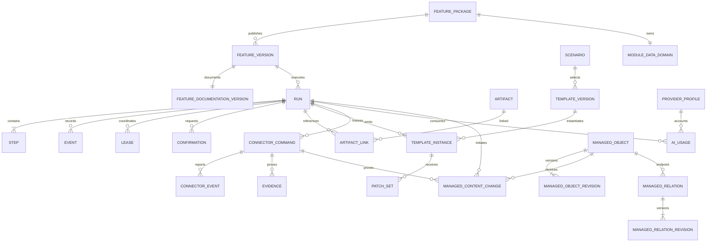
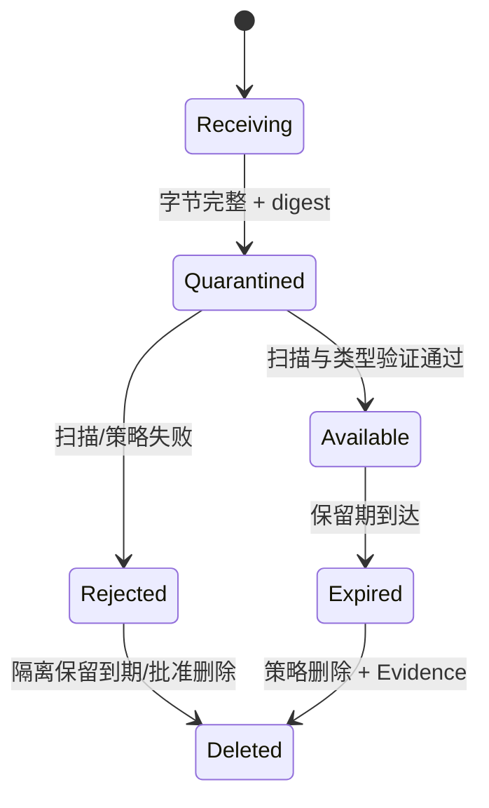

# 数据与存储架构

状态：Draft for Review  
原则：后台是 system of record；数据库保存关系、状态、版本和哈希，正文进入受控 Artifact Store，秘密进入 OS Secret Store。

产品数据边界采用 [ADR-0027](../adr/0027-portable-data-root-and-update-boundary.md)：同一稳定产品根内将不可变 `releases` 与可变 `data` 分开。更新、回滚和旧 release 清理不得覆盖 `data`。

```text
product-root/
├─ releases/                # 不可变程序版本
├─ current                  # active release 逻辑指针/记录
└─ data/                    # 稳定可变数据
   ├─ stores/
   ├─ artifacts/
   ├─ templates/
   ├─ evidence/
   ├─ documentation/
   ├─ packages/
   ├─ updates/
   ├─ logs/
   └─ temp/
```

该图只冻结职责，不提前选择物理链接、数据库或安装器技术。Secret Store 是 Windows 保护边界，不因“便携”降级为根目录明文文件。包含客户正文的 Store/Artifact 使用实例 DEK 做静态保护，DEK 由 Windows Secret Store 包装；算法、密钥轮换和恢复门槛由 D5 冻结。

## 1. 存储分层

| 存储 | Owner | 内容 | 禁止 |
|---|---|---|---|
| Core DB | Control & Data Plane | Feature registry、Run/Step/Event、Lease、Confirmation、Template 元数据、Artifact 元数据、Provider profile、Connector command、UserPreference、LayoutPreference、审计索引 | 大型文件正文、明文 Key、Feature 私有业务表 |
| Module Private Store | 单一 `featureId` | 模块业务实体、投影、私有 migration version | Core 业务逻辑读取内部列、跨模块读写、共享 owner |
| Managed Content Store | Managed Content Service | Agent 创建/修改/删除对象与关系的 current projection、revision、change ledger、tombstone | Feature 直写、未校验任意 JSON、用计划值覆盖已验证 current |
| Artifact Store | Artifact Service | 上传、模板正文、中间产物、输出、Omnia 回传、渲染预览 | 任意用户路径、未提交临时文件、秘密 |
| Secret Store | Secret Service / OS | AI Key、Remote 配对私钥、启动 token 等 | 明文进入数据库/日志/前端/Worker |
| Evidence Store | Audit/Evidence Service | 追加式执行摘要、合同/版本/hash、确认、写后验证、发布证据 | 可变业务缓存、无来源推断 |
| Documentation Store | Documentation Registry | 已验证 Feature 文档的不可变版本、manifest、四 Plane 映射和生成索引 | 运行状态真相、任意 Feature 写路径、秘密/客户正文、原地编辑 |
| Quarantine | Intake Service | 尚未扫描/解析的上传 | 直接供 Feature/用户下载、执行宏、联网解析 |
| Ephemeral Worker Space | Worker Supervisor | 单 Run 临时处理内容 | 跨 Run 复用、长期保存、访问其他目录 |

`Proposed` 实现：Core DB 与每个 Module Store 使用独立 SQLite 文件或同一引擎的强 owner namespace；最终选择须用并发、备份和升级原型验证。无论物理实现如何，权限和 migration owner 不变。

## 2. 数据原则

1. ID 是不透明字符串；生成算法 `Proposed` 为 UUIDv7 或 ULID，待排序、隐私和库支持评审。
2. 时间为 RFC 3339 UTC，显示层本地化；数据库同时保存必要的单调 sequence。
3. 业务对象带 `schemaVersion`、`createdAt`、`updatedAt`；不可变对象不提供 update。
4. 外部 effect 前先提交 Core DB 事务；文件先写临时对象、校验 hash，再原子发布元数据。
5. 所有 Store 路径由后台解析；API/RPC 不接受本机绝对路径。
6. 历史快照必须有 `capturedAt/source/schemaVersion/currentStateVerified`。
7. 无来源或证据不足使用 `not_evaluable`，不猜测 pass/fail。
8. `uncertain` 是可持久恢复的受阻状态，不是可自动重试的临时错误。
9. Feature 文档版本等于 Feature 包版本；Feature Registry 与 Documentation Registry 的 candidate/active/previous 指针原子一致。
10. Agent 管理内容采用“当前投影 + 不可变变更登记”；外部 mutation 只有经读回 Evidence 证明后才推进 current。
11. 程序 release 与 `data` 生命周期分离；任何安装/更新命令均不得将整个产品根作为覆盖目标。
12. 当前没有公司级保留期限；业务数据默认不按年龄自动删除，用户显式清理并经过引用/活动 effect 检查。

## 3. 实体关系



### 3.1 Core 实体

| 实体 | 关键字段 | 可变性/所有权 |
|---|---|---|
| `FeaturePackage/FeatureVersion` | ID、版本、manifest digest、publisher、状态、兼容 | Registry owner；版本不可变 |
| `FeatureDocumentationVersion` | feature/version、documentation/package digest、logical path、lifecycle、validation Evidence | Documentation Registry；版本不可变，active/previous 与 Feature 原子切换 |
| `Run/Step/Event` | 统一状态、版本、关联、sequence、error、effectOutcome/resolutionRequired/Evidence 引用 | Orchestrator owner；Event 追加式；失败不得掩盖已发生的 partial effect |
| `Lease` | resource、holder、generation、expiresAt、fencingToken | Lease service；通过 CAS 更新 |
| `Confirmation` | planDigest、effect、expiresAt、decision | Confirmation service；决定后不可改 |
| `Scenario` | scenarioId、schema、模板选择规则、默认规则 | Template service；发布版本不可变 |
| `TemplateVersion` | semantic/file digest、Artifact、兼容、验证器 | Template service；发布后不可变 |
| `TemplateInstance/PatchSet` | Run 冻结副本、Patch、provenance | Document service；不可变追加 |
| `Artifact` | digest、size、mediaType、state、retention | Artifact service；正文在文件 Store |
| `ConnectorCommand/Event` | identity binding、effect、状态、progress | Command service；事件追加式 |
| `ConnectorUpdate` | connector/device、scope、版本/sequence、slot/generation、状态、blocker、health Evidence | Update coordinator/Supervisor 共同 owner；不保存任意下载路径或发布私钥 |
| `ProviderProfile/AIUsage` | 脱敏配置、能力、usage、错误类别 | AI Gateway；Secret 仅存引用 |
| `PackRecord/WorkspaceReadObservation` | Pack 连接历史、权威 Section/Workspace 轻抓取、选定 Workspace/capability 的有界重抓取、coverage/freshness | Workspace Catalog owner；显示名不作为身份，不与 Managed Content 混合 |
| `UserViewPreference` | profileId、uiScalePercent、stateVersion、updatedAt | Preference service；跨窗口唯一事实 |
| `LayoutPreference` | profileId、surfaceId、layoutVersion、splitter ratios、stateVersion | Layout preference service；按 surface 隔离 |
| `ManagedObject/Revision` | 类型 Schema、logical/external identity、current、RAIT/Factors 等业务 payload、provenance、freshness | Managed Content Service；current 可变指针，revision 不可变 |
| `ManagedRelation/Revision` | 类型/方向、两端 identity、current、读回 Evidence | Managed Content Service；关系是一等记录 |
| `ManagedContentChange` | create/update/delete intent、状态、Run/Command/Evidence、projection applied | Managed Content Service；外部 effect 前建立，追加式推进 |
| `Evidence/AuditRecord` | subject、kind、digest、source、occurredAt | Evidence service；追加式 |

### 3.2 Module 私有数据

- 每个 `featureId` 只有一个 `dataDomain.owner`。
- Core 保存 domain ID、schema version、大小、备份状态，不理解内部业务字段。
- Worker 通过模块 repository 命令访问；不能拿数据库连接或文件路径。
- 共享数据通过公共 Artifact/Event，或 Accepted ADR 指定的共享域查询合同发布；消费者不能直连 owner Store 或复制为新的事实源。
- Feature 卸载不自动删数据；清除需独立确认、备份策略和 Evidence。

### 3.3 Agent 管理内容共享域

- 新建、修改、删除以及后续 Phase 2 会共同使用这类数据，因此它不属于任一 Feature 私有 Store。
- Managed Content Service 是唯一写 owner；Feature 只提交计划/查询，Connector 只返回 effect 和 Evidence。
- create/update/delete intent 不改变 current；写后读回或 reconcile 成功才追加 revision 并推进 current。
- delete 保存 tombstone 和历史，不等于本地物理清除；partial/uncertain 只更新 Evidence 已证明部分。
- 修改/删除非 Agent 创建对象时，先以真实读取建立 `adopted_on_mutation` baseline。
- Phase 2 通过版本化查询读取 schema、revision、freshness 和 provenance，不能打开 Store。

完整设计见 [Agent 管理内容登记簿](AGENT_MANAGED_CONTENT_REGISTRY.md)和 [ADR-0024](../adr/0024-agent-managed-content-registry.md)。

## 4. Artifact Store

### 4.1 状态



上传流程：

1. 后台分配 upload ID、大小/类型上限和临时句柄。
2. 流式写入受控临时文件，同时计算 digest；不信任客户端 media type 或文件名。
3. 完整性通过后进入 quarantine，不立即供 Feature 使用。
4. 扫描、真实类型识别、压缩边界检查和 parser sandbox。
5. 通过后创建不可变 Artifact 元数据；派生物是新的 `available` Artifact，并用 `derivedFrom` 关系连接，不另设 `derived` 状态。
6. 下载经授权、Run/用户作用域和内容处置头，不暴露路径。

### 4.2 内容寻址

- `digest` 建议 `sha256:<hex>`，算法升级需带 algorithm 前缀。
- 相同正文可物理去重，但逻辑 Artifact、所有权、保留和审计不能合并丢失。
- 不用 digest 作为访问授权；需要独立 opaque ID。
- 模板、Evidence 和客户输入即使 digest 相同也保持不同 logical role。

### 4.3 Documentation Store

- 逻辑路径为 `project-docs/features/<featureId>/<featureVersion>/`；物理路径和数据库/文件布局属于存储实现 ADR，不能暴露为 API。
- 安装器是唯一写入者；Feature Worker、Feature UI 和普通用户不得直接写项目文档目录。
- 文件先进入隔离 candidate，校验 manifest、digest、链接、敏感信息和安全渲染，再与 Feature active 指针原子提交。
- 文档正文可按 digest 去重，但逻辑版本、发布者、保留和历史 Run 引用不能合并丢失。
- 项目文档首页和“已安装 Feature”清单由 Registry 投影生成；文档内容本身不能声明或修改运行健康状态。
- 卸载移除 active 入口但默认保留历史文档；清理由 Run/Evidence 引用和后续数据保留策略共同决定。

## 5. Secret Store

- `ProviderProfile` 只保存 `secretRef/hasSecret/lastUpdatedAt`，不保存 Key。
- Windows 10/11 使用当前用户/设备保护的 Secret Store（具体选择由 D5 冻结）；便携根只保存 `secretRef`。
- Key 新建/替换后 API 只返回成功与脱敏 fingerprint，永不回显原值。
- Worker、Shell、日志、Evidence、Remote Bridge 不取得明文。
- Secret 使用由 broker 完成；对外错误分类不得包含请求 header/body。
- Secret 备份默认排除；恢复后要求重新配置，除非用户确认采用受保护密钥导出方案。
- 复制便携根到另一电脑或 Windows 用户后，Provider Key、Connector 配对和其他 Secret 必须显示 unavailable 并要求重新配置，不得静默回退到明文文件。

## 6. Evidence 与审计

Evidence 至少包含：

- `evidenceId/subjectType/subjectId/kind/occurredAt`；
- `runId/stepId/commandId/traceId`（适用时）；
- `source`、`schemaVersion`、`contentDigest`；
- frozen feature/template/validator/operation/provider capability 版本；
- preflight/plan/confirmation/concurrency/read-back 摘要；
- `currentStateVerified` 与采集时间；
- 脱敏后的 outcome/error 分类。

Evidence Store 建议追加式并周期性生成链式/批次 digest（`Proposed`，具体防篡改实现待威胁评审）。任何“当前状态”展示必须说明它来自实时读取还是历史 Evidence。

## 7. 事务、并发与一致性

- Core DB 事务原子地写入状态变更和待发布 Event（outbox）；事件投递可重试，消费者按 event ID 幂等。
- Lease 使用 generation/fencing token；过期 holder 的后续写入被 owner 拒绝。
- Run 状态使用 `stateVersion` 乐观并发；陈旧前端确认或 action 返回 conflict。
- Artifact “正文完成”和“元数据 available”采用两阶段提交/恢复扫描。
- 外部 Omnia effect 不可能与本地 DB 形成分布式事务，因此使用持久命令 + Evidence + reconcile。
- AI 请求是否重试由 capability/effect 决定；结构化生成调用不应在结果已到达但响应丢失时盲目重复计费，策略须记录。

### 7.1 Managed projection 与跨 Store 恢复

Command、Run/Event、Evidence、Managed projection 和 Feature 私有 Store 不假装处于同一事务域。每个 owner 必须在合同中列出：

| 事实 | owner/事务域 | 幂等与恢复 |
|---|---|---|
| Connector Command 与 effect outcome | Core Command Store | `commandId/idempotencyKey`；uncertain 只读 reconcile |
| Run/Event/outbox | Core DB | 同一 Core DB 事务；Event 按 ID 幂等 |
| Evidence metadata/body | Evidence Service/Artifact | immutable digest；available 前不被引用为完整证据 |
| Managed revision/current/change | Managed Content Store | `projectionKey=authorityIdentity+changeId+evidenceDigest`；CAS + repair queue |
| Feature 私有业务投影 | 该 Feature Store | 只能从版本化 Event/Artifact 幂等重建，不直连其他 Store |

外部 effect 已验证但 Managed projection 失败时，不重放 Connector mutation，也不把 Run 标为整体成功；使用 `MANAGED_CONTENT.PROJECTION_PENDING`、`resolutionRequired=true` 和持久 repair queue。repair queue 必须有 lease/fencing、dead-letter、人工 owner 和一致性扫描。

## 8. Migration

### 8.1 Core migration

- 有显式全局 schema version、按序 migration 文件、checksum 和执行记录。
- 发布前支持 `plan/dry-run/backup/verify`。
- 优先 expand → 应用兼容窗口 → contract；破坏性删除延后。
- migration 失败时应用不得以半兼容状态开放入口。
- Core rollback 是否可回退取决于数据 compatibility；不可回退必须明确并要求从备份恢复。

### 8.2 Module migration

- 只由 module owner 执行且只触及自己的 Store。
- candidate 版本在副本或 checkpoint 上 dry-run。
- active Run 冻结 schema/Feature 版本；升级需 drain 或明确支持版本并行。
- 失败只回滚/禁用该模块，不阻断 Core 与其他模块。

### 8.3 模板与 Artifact migration

- 发布模板永不原地迁移；生成新 TemplateVersion 并保留旧版本。
- Artifact 正文原则上不改写；元数据 schema 升级不改变 digest 含义。
- hash 算法升级同时保存旧、新 digest，完成验证后再切换默认。

## 9. 备份与恢复

### 9.1 一致性备份集

```text
backup-manifest
  ├─ backupEpoch + barrier evidence
  ├─ Core DB consistent snapshot
  ├─ Module Store snapshots
  ├─ Managed Content Store + Domain Schema inventory
  ├─ Artifact inventory + required objects
  ├─ Template/Evidence inventory
  ├─ Documentation Registry + required immutable document versions
  ├─ active package/document/schema/data-compatibility activation records
  ├─ authority identity + unresolved Command/outbox inventory
  ├─ schema/feature/version manifest
  └─ checksums and completion evidence
```

- 备份协调器先创建全局 `backupEpoch`，让 Core、各 Module/Managed Store、Artifact、Evidence、Documentation/Package Manager 进入 barrier；仅在所有参与者返回该 epoch 的 durable checkpoint 后复制数据。
- barrier 开始后阻止新 mutation、candidate activation、migration、Artifact finalize 和 GC；活动只读任务只有在不创建新引用时才可继续。
- 在途远端 effect、Artifact upload、outbox/repair 和无法在超时内 drain 的任务会使本次 backup 失败，不生成“成功” manifest；不得强杀后继续复制。
- 数据库使用引擎支持的一致性 snapshot，不复制活动 WAL 的不完整组合。
- Artifact 采用 manifest 增量备份，恢复后逐对象校验 digest。
- Secret 默认不进入普通备份；恢复计划必须明确重新配置或安全密钥迁移。
- backup manifest 保存每个 participant checkpoint/digest、Artifact 引用闭包、active activation record、authority identity、未解决 Command/outbox 和 barrier Evidence。
- 备份成功只有在同一格式的 restore rehearsal 通过后才算可用。

### 9.2 恢复门禁

1. 在隔离目录验证 manifest、签名/校验和、schema 和软件兼容。
2. 恢复 Core/Module/Managed Content/Artifact/Documentation，校验所有 participant 属于同一 backup epoch，运行 migration plan、activation record 和引用闭包检查。
3. 所有 active/uncertain/pending mutation、projection repair、candidate activation 和 claimed command 标记待 reconcile/recovery，不直接恢复为 succeeded 或 active，不自动重放。
4. Connector/Provider Secret 缺失时禁用相关入口并提示重新配对/配置。
5. 生成恢复 Evidence；原数据保留到用户确认新实例可用。

当前无公司级 RPO/RTO、自动备份频率或云同步要求。首版只承诺破坏性 migration/升级前的同根受控 checkpoint，以及未来由真实管理 action 触发的一致性导出/备份；checkpoint 不能在 UI 中冒充长期备份。恢复格式和可行阈值仍由 D5 演练冻结。

## 10. 保留、引用与删除

所有数据 owner 使用统一 retention class 与引用图，不能各自按天数直接删除：

```text
legal_or_security_hold
  > unresolved_effect_or_repair
  > active_business_reference
  > run/evidence_audit_reference
  > user_retention_policy
  > owner_default
```

每类数据都必须分别定义 logical delete、tombstone、物理 GC、导出、备份传播和不可恢复删除语义。物理 GC 先解析 Core/Feature/Managed/Artifact/Documentation/backup 引用闭包；存在更高优先级引用时只完成逻辑删除并向用户列出保留原因。低磁盘时先停止新的大 Artifact/录制或 mutation 准入，不能删除仍被引用的 Evidence、文档或 revision。

| 数据类 | 默认方向 | 最终期限 |
|---|---|---|
| Run/Event | 默认保留；用户显式清理时解析引用 | 无按年龄自动删除 |
| 输入/输出 Artifact | 默认保留；用户显式清理和容量准入 | 无按年龄自动删除 |
| Quarantine reject | 短期隔离后安全删除 | Proposed，待安全评审 |
| Evidence | 默认保留、append-only；显式清理受引用/未解决 effect 阻断 | 无按年龄自动删除 |
| Feature 文档版本 | active/previous 必留；历史 Run 引用版本随 Evidence 保留 | 无按年龄自动删除 |
| Managed Content current/revision/change/tombstone | current 按业务使用；历史随 Run/Evidence/Phase 2 引用保留 | 无按年龄自动删除 |
| 普通日志/指标 | 短期滚动、严格脱敏 | 待容量基准 |
| Remote Bridge payload | 最短 TTL，ACK/过期即删除 | 待 Remote 威胁模型 |
| Secret | 直到替换/删除；不进入普通导出 | 用户明确操作 |

“无按年龄自动删除”不等于承诺永久保存。UI 只有在真实引用扫描、显式确认、物理 GC 和结果 Evidence 均存在时才提供清理；不得提供只有设置项、没有真实清理器的保留入口。

### Interaction diagnostics 的当前滚动策略

Shell 0.4.5 的 `interaction_logs` 是普通诊断日志：保留 14 天且最多 20,000 行，启动及每 250 次完成时自动清理终态记录。单条脱敏 details 上限 2 KiB，查询单页最多 200 条。该滚动不删除或降级 Run/Event、Command Evidence、Feature evidence、Remote binding audit 或 `uncertain/reconcile` 事实。设置页只提供真实查询和 trace 详情，不提供未实现的清空/导出入口。

正式业务 Feature 前仍须由 D5 冻结：各 owner 的配额与软/硬阈值、低磁盘准入、Windows ACL/Secret Store、checkpoint/导出完整性和真实恢复能力。删除聊天记录的正文/附件/Evidence 具体语义仍由 P-10 决定；卸载 Feature、清除历史文档和移除 Pack 历史都必须复用引用与 GC 合同。

### 10.1 受控移除实例

产品根外仍可能存在 OS Secret、设备私钥、Remote 注册和 Supervisor/服务，因此“删除文件夹”不是完整卸载。Core 维护 `instanceId + externalResourceInventory`，受控移除按以下真实状态机执行：

```text
requested
  → draining_or_blocked
  → remote_revocation
  → secret_and_device_key_removal
  → supervisor_service_removal
  → data_release_removal
  → completed | local_removed_pending_remote | failed
```

- 活动 mutation、录制或 `uncertain` 阻断物理删除；
- Remote 注册使用有最大 TTL 的租约；设备私钥删除后不能继续认证；
- Remote 不可达时，在删 `data` 前把最小签名 `PendingRevocationCapsule` 保存到产品根之外的 Windows 保护区；受控卸载 helper、下次安装或服务器确认/租约过期后再清除，期间状态为 `local_removed_pending_remote`；
- 删除 data 前验证用户选择的范围和一致性导出/放弃决定；
- 完成后逐项证明本地 data/releases、OS Secret、服务和 Remote 注册的结果；
- 直接用资源管理器删除根目录无法执行这些步骤，不能被产品描述为“彻底删除”。

## 11. v4 导入

首版从空 v5 数据根开始，不自动迁移 v4。只有用户提出某类历史资料需求时，才为该类别启用只读、可重复、生成报告的打捞/导入工具；不直接启动 v4、访问 Omnia 或扫描整个 v4 根后批量复制。

| v4 数据 | v5 处理 | 规则 |
|---|---|---|
| Run/事件/命令语义 | 转换到统一合同或归档为 legacy Evidence | 保留原 ID 映射、时间、来源；不伪装为 v5 实时 Run |
| 附件 | 扫描后导入 Artifact Store | 重新 hash/类型验证；失败进入报告 |
| 模板/参考工作簿 | 经所有权/许可/合同验证后发布新 TemplateVersion | 不按路径扫描直接使用 |
| EMS/Safe Write settings JSON | 专用解析器映射到候选实体或只读归档 | 禁止整块塞入新 KV |
| Agent/Employee/Group/Room | 首版不迁入产品 IA | 以后仅在用户点名该类别时只读打捞必要来源映射/归档 |
| AI Key | 默认不复制 | DPAPI/宿主边界不同；要求用户重新配置，除非有受控迁移方案 |
| Connector 配对/凭据 | 不直接复制 | 重新配对和身份验证 |
| 活动/uncertain 命令 | 不恢复执行 | 标记 legacy unresolved，人工只读核对 |
| 日志/生产路径/个人密钥路径 | 不导入 | 防止敏感信息泄漏 |

按类打捞阶段：

1. inventory：只读统计对象、大小、schema、未知项，不输出敏感正文。
2. plan：生成每类 `import/archive/skip/manual` 决策和校验和。
3. rehearsal：在隔离 v5 数据目录导入并生成差异报告。
4. approval：用户确认范围，尤其模板许可和客户数据。
5. import：幂等执行，每条记录保存 legacy source ID。
6. verify：引用、hash、计数、抽样渲染与业务 owner 复核。
7. cutover：保留 v4 只读快照和回滚点；不得双向写。

## 12. 验收门槛

- [ ] Feature 无法打开 Core/其他模块 DB 文件。
- [ ] 上传从 quarantine 到 available 全程可恢复、可审计。
- [ ] Secret 不出现在 DB、日志、RPC、Artifact、备份或诊断包。
- [ ] Run/Event/Command 外部 effect 前持久化。
- [ ] Core 与每个模块 migration 可 dry-run、校验、失败关闭。
- [ ] 一致性备份完成真实 restore rehearsal。
- [ ] 恢复后 mutation 只读 reconcile，不自动重放。
- [ ] Documentation Store 恢复后，active/previous Feature 与文档版本一致，历史 Run 的文档引用无断链。
- [ ] Managed Content create/update/delete 的 current、revision、change、关系和 Evidence 一致；partial/uncertain 不写入未经证明的计划值。
- [ ] Phase 2 只能通过版本化查询读取 RAIT/Factors 等允许字段，schema/freshness 不满足时失败关闭。
- [ ] v4 导入幂等、有映射报告、未知数据不猜测转换。
- [ ] 程序更新、回滚和删除旧 release 不改变 `data`；安装器对覆盖 `data` 的计划失败关闭。
- [ ] 复制便携根后 Secret 不可用且不泄漏，用户可重新配置/配对。
- [ ] 默认无按年龄自动删除；用户显式清理列出已删除与因引用/`uncertain` 保留的对象。
- [ ] v4 首版零迁移，需要时只读按类打捞，不执行全库自动导入。
