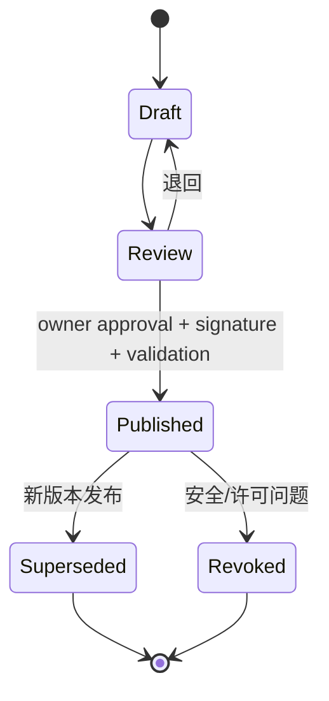
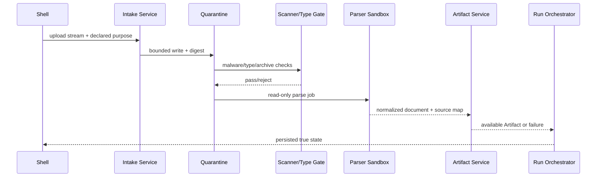
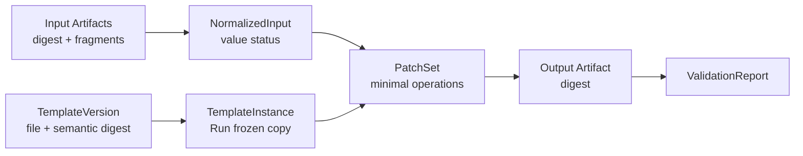

# 模板与文档管线

状态：Draft for Review  
原则：场景与模板是一等实体；默认不等于缺失；任何输出必须有不可变模板实例、最小 Patch、provenance 和验证证据。

## 1. 实体与版本

| 实体 | 含义 | 不可变内容 |
|---|---|---|
| `ScenarioVersion` | 输入 Schema、字段语义、默认规则、模板选择和验证规则 | 发布后全部 |
| `TemplateVersion` | 模板正文、file/semantic digest、兼容范围、可修改区域、验证器 | 发布后全部 |
| `TemplateInstance` | 某 Run 的模板不可变副本 | source template、字节、digest、Run |
| `NormalizedInput` | 用户资料经解析和证据化后的场景数据 | 值、状态、source refs |
| `PatchSet` | 对 Instance 的白名单最小变更 | op、target、before/after、reason、source |
| `ProvenanceManifest` | 输入→模板→Patch→输出→验证的因果链 | 全部 |
| `ValidationReport` | 结构、业务、视觉、安全结果 | validator 版本、结果、Evidence |

版本与 digest：

- `version`：语义版本，表达合同兼容；
- `fileDigest`：模板原始字节 SHA-256；
- `semanticDigest`：规范化结构/公式/样式/命名范围/文档节点的语义摘要；
- `schemaDigest`：Scenario/合同 Schema；
- `validatorDigest`：验证器发布物；
- 所有 digest 带算法前缀，不能用文件名或路径代替身份。

semantic digest 的格式为 `Proposed`，必须按文档类型形成独立规范和 fixture；不能凭实现猜测“等价”。

## 2. 发布状态



`Published` 后禁止原地修改。Run 只能引用在创建时有效且兼容的发布版本；历史 Run 继续读取被冻结版本，即使其后来 Superseded。Revoked 模板是否允许历史下载由原因和权限策略决定，但不得用于新 Run。

规范生命周期 enum 为 `draft|review|published|superseded|revoked`。校验结果是独立字段 `validationStatus=pending|passed|failed`，不使用 `validated` 作为生命周期状态；`deprecated` 也不作为同义 enum。只有 owner approval、有效签名和 `validationStatus=passed` 同时满足，`review` 才能进入 `published`。

### 2.1 发布权限与 Evidence

首版模板可以由以下主体发布：

- 用户本人；
- 用户针对具体发布请求明确授权的 Codex。

这不是让 Codex 成为常驻、自授权模板 owner。每次发布必须分别记录：

- `requestedBy`：提出发布/修改请求的用户身份；
- `authorizedPublisher`：用户本人或本次获授权的 Codex 执行身份；
- `authorizationRef`：用户授权记录及其 scope、时间和目标 TemplateVersion；
- `publisherKeyId/signature/packageDigest/sequence`；
- 来源、许可声明、Feature/Scenario/Omnia 兼容范围；
- validation 输入、validator 版本、结构/业务/视觉结果；
- 发布、拒绝、撤销和默认指针变化 Evidence。

Codex 不得根据自己创建、修改或校验了文件而推定具有发布授权，也不得把自动 validation 通过当作用户批准。首版不强制第二人审批；如果未来引入双人审批或组织角色，新增治理 ADR，不原地改变既有发布 Evidence。

Codex 使用的 `authorizationRef` 必须解析为单次 `omnia.template-publication-authorization/v1`，绑定 authenticatedUser、instance、Scenario/TemplateVersion、精确 Artifact/package digest、`allowedAction=publish`、issued/expires、single-use nonce 和撤销/消费状态。普通聊天或长期角色声明不构成发布授权。Codex 只能提交 candidate；受控发布服务验证授权、validation 和签名后执行激活，Codex 不持有用户长期签名私钥。详见 [ADR-0029](../adr/0029-user-or-authorized-codex-template-publication.md)。

模板正文和 Registry 数据位于稳定便携 `data` 根，程序更新/回滚不得覆盖；Secret、签名私钥和用户授权凭据不进入模板 Artifact。

## 3. 上传、quarantine 与解析 sandbox



强制门禁：

- 不信任扩展名、MIME、文件名、公式、宏、外链或嵌入对象；
- parser 进程无网络、无 Secret、只读输入、独立临时目录；
- 限制上传大小、文件数、压缩层数、解压总量/比例、CPU、内存、时间、输出字符和节点数；
- 限值为 `Proposed / 待恶意样本与代表性文件基准测试`；
- 宏/主动内容默认不执行；外链默认不解析；
- 解析失败不产生“部分可用”业务值，除非 Scenario 明确把该字段标为可独立评估并保留缺失 Evidence；
- quarantine 内容不进入 AI，不提供普通下载，不作为模板。

## 4. 输入值状态

每个规范化字段不只是 `value`，还必须有：

```text
status =
  explicit_value
  | explicit_default
  | contract_default
  | missing
  | conflicting
  | not_evaluable
```

| 状态 | 含义 | 可自动使用模板默认值 |
|---|---|---|
| `explicit_value` | 用户资料明确提供非默认值 | 否，按证据生成 Patch |
| `explicit_default` | 用户明确填写了与默认相同的值 | 是，但记录用户 Evidence |
| `contract_default` | Scenario 明确允许在无输入时采用默认 | 是，记录规则版本 |
| `missing` | 资料没有值且字段非 defaultable | 禁止 |
| `conflicting` | 多来源冲突或目标不唯一 | 禁止 |
| `not_evaluable` | 解析/来源不足，无法判断 | 禁止 |

因此空白、null、解析不到、文件缺失都不能自动等于默认。

## 5. 模板选择

选择结果必须唯一且可解释：

```text
scenarioVersion
  + target type/version
  + feature/template compatibility
  + effective date
  + locale (如适用)
  → exactly one TemplateVersion
```

零匹配、多匹配、已撤销、不兼容或 digest 不符均失败关闭。不得按“找到的第一个文件”、旧文件名 fallback 或安装目录扫描选择。

## 6. 决策表

| 输入评估 | 模板 | 处理 | 可交付 |
|---|---|---|---|
| 全部 `explicit_default/contract_default` | 唯一、兼容、已发布 | 创建 Run 专属完整不可变副本；`PatchSet=[]`；生成 provenance | 通过全部验证后可以 |
| 有 `explicit_value` 差异 | 唯一、兼容、已发布 | 仅对白名单 target 生成最小 Patch | 通过全部验证后可以 |
| 存在非 defaultable `missing` | 任意 | 停止并请求真实补充资料 | 否 |
| 存在 `conflicting/not_evaluable` | 任意 | 停止，展示证据冲突/不可评估 | 否 |
| 模板零/多匹配或 digest 异常 | 无唯一结果 | 失败关闭 | 否 |
| Patch 越界/改变禁止结构 | 任意 | 拒绝 Patch，Run 失败 | 否 |
| 验证失败 | 任意 | 不发布输出 | 否 |
| Omnia 目标漂移 | 已验证输出 | 作废旧计划，重新预检/确认 | 不得写入 |

## 7. 全默认模板副本

即使零 Patch，也必须：

1. 冻结 `ScenarioVersion/TemplateVersion/FeatureVersion/validator`。
2. 将模板 Artifact 复制或内容寻址引用为 Run 专属逻辑 `TemplateInstance`。
3. 生成新的 instance ID，禁止把模板主 Artifact 作为可写输出。
4. 记录每个字段为何采用默认：用户明确、合同规则或不适用。
5. 生成 `ProvenanceManifest`，明确 `inputAssessment=all_default`、`patchCount=0`。
6. 对实例执行结构、业务、视觉验证。
7. 只有验证通过才发布输出 Artifact。

对用户的描述应为“依据已发布模板和默认规则生成”，不得声称 AI 分析了不存在的资料。

## 8. 最小 Patch

Patch target 使用模板合同定义的稳定 selector，不使用不受控文件路径或脆弱的 UI 坐标。示例：

```text
Excel: sheet stable ID + table/name/cell selector
DOCX: content control/bookmark/semantic node ID
PDF: 默认不对任意版面做可逆 Patch；需场景专用合同
Structured data: JSON Pointer + schema constraint
```

以下为**合同示例**，不代表真实模板或业务数据：

```json
{
  "schemaVersion": "omnia.patch-set/v1",
  "patchSetId": "patch_contract_example_01",
  "templateInstanceId": "instance_contract_example_01",
  "operations": [
    {
      "op": "replace",
      "target": {"kind": "json_pointer", "selector": "/contractExample/title"},
      "beforeDigest": "sha256:CONTRACT_EXAMPLE_BEFORE",
      "value": "合同示例值",
      "reasonCode": "explicit_user_value",
      "sourceRefs": ["artifact_contract_example_01#fragment-1"]
    }
  ]
}
```

Patch 规则：

- target 必须在 `modifiableRegions`；
- before digest 不匹配即冲突，禁止强制覆盖；
- 只保留支持业务差异的最小 operation；
- 禁止改变公式、样式、隐藏结构、宏、命名范围或关系，除非该区域明确列入白名单；
- 每条 Patch 都有 source ref、reason 和 validator；
- 应用顺序确定，重复应用同一 PatchSet 必须得到相同 output digest 或明确 conflict。

## 9. Provenance



ProvenanceManifest 至少记录：

- Run/Step、Scenario/Feature/Template/validator 版本；
- 输入、实例、Patch、输出 Artifact ID/digest；
- 每个 normalized 字段的 status 与 source refs；
- 默认规则 ID/版本；
- AI 调用（若有）的 provider profile ID、model、capability、usage 和输出 fragment，不含 Secret；
- validation 结果、时间和渲染环境；
- 如果计划写 Omnia，记录目标预检/确认/命令/Evidence 的引用。

## 10. 验证

### 10.1 结构验证

- 文件真实类型、可打开性、sheet/section/table/node；
- 必需字段、公式、命名范围、数据验证、关系；
- 模板禁止区域 digest；
- 无残留临时文件、外链、未批准宏或占位符。

### 10.2 业务验证

- Scenario Schema、必填、枚举、跨字段规则；
- 默认值仅来自 versioned rule；
- Patch 与 source evidence 一致；
- 目标 ID/范围唯一；
- `not_evaluable` 不被转换为通过。

### 10.3 视觉验证

- 用隔离 renderer 生成页面/工作表预览；
- 检查截断、溢出、分页、字体替换、不可读重叠和空白异常；
- 自动视觉阈值为 `Proposed / 待模板类型基准测试`；
- 高风险模板应有人工作者复核真实渲染，不只比较像素。

### 10.4 失败关闭

任何必需 validator 失败、超时、崩溃或版本不匹配，都不发布 output 为 `available`。允许保存失败 Evidence 和受限诊断，但不能出现“下载最终成果”或 Omnia 写入入口。

## 11. Omnia 写入

文档验证通过不等于授权写入：

1. 实时读取 Connector/Session/Engagement/Pack 和目标。
2. 将 output digest、Patch digest、作用域、并发 token、安全锁冻结为计划。
3. 向用户展示真实 diff、目标和影响。
4. 确认只绑定该 plan digest 且有期限。
5. 执行前再预检；漂移使计划失效。
6. Connector 执行受控 Operation。
7. 写后重新读取，必要时双边验证。
8. 证据不足为 `uncertain`，禁止自动重试。

## 12. 验收门槛

- [ ] 缺失、冲突和不可评估永不自动视为默认。
- [ ] 全默认输出有独立 instance ID、provenance 和全套验证。
- [ ] 模板发布后不可原地修改，历史 Run 可解析原版本。
- [ ] 每次发布记录 requestedBy、授权 publisher、authorizationRef、签名、validation 和 Evidence；Codex 无法自授权。
- [ ] 首版单人发布不伪装为双人审批；未来治理变化走新 ADR。
- [ ] Patch 仅触及白名单 target，before digest 冲突失败。
- [ ] parser 无网络/Secret，恶意压缩和资源耗尽测试通过。
- [ ] 结构、业务、视觉任一必需验证失败都不交付。
- [ ] 输出可从 provenance 追到输入 fragment、默认规则、Patch 和版本。
- [ ] Omnia 写入重新预检并独立确认，不能继承“文档已验证”的隐式许可。
# Create-and-associate pipeline binding

`TemplateVersion` identifies the stable signed base/schema/governance contract. Run-specific semantic, patch, output, and governance digests belong to `TemplateInstance`. Different inputs therefore reuse one immutable TemplateVersion and create distinct instances. Governance source, runtime base, user source artifact, and output instance remain four separately digested objects.
