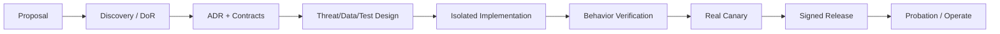

# 开发手册

状态：Draft for Review  
适用对象：产品、架构、开发、测试、模板/业务 owner、发布人员。

执行优先级：从 2026-08-01 起，Feature 日常开发与安装遵循
[Feature 快速开发、安装与测试指导](FEATURE_FAST_ITERATION_GUIDE.md)和
[ADR-0031](../adr/0031-fast-local-feature-iteration-and-automated-integrity.md)。Windows 强隔离认证
不是安装/启用门槛；包签名和 digest 由工具自动处理，不要求开发者逐次人工核对 SHA。

## 1. 从提案到交付



### 1.1 Proposal

每个功能提案必须说明：

- 用户、真实问题、成功结果和非目标；
- 2–3 段导航位置，但不先开放入口；
- 输入、输出、模板/场景、数据 owner；
- 是否创建/修改/删除 Agent 管理内容，以及哪些下游 Feature/Phase 会消费；
- 是否使用 AI/Connector，effect 分类；
- 真实验收数据/环境/业务 owner；
- 隐私、保留、迁移和回滚；
- 哪些能力尚未决定。

### 1.2 Discovery

- 只读核对 v4 资产、事故回归、模板许可和 Omnia 合同；
- 定义 `Run/Step/Event/Artifact/Patch/Operation`；
- 选择最小真实纵向闭环；
- 对不稳定事实做实测或标 `Proposed/待验证`；
- 若选择影响多个模块、信任边界或长期兼容，先写 ADR。

### 1.3 Contract-first

先提交并评审：

- Feature manifest/navigation；
- 输入/输出/error/event Schema；
- 模块数据 owner 和 migration；
- Scenario/Template/Patch/validator；
- AI capability（如有）；
- Connector operation/effect/preflight/read-back（如有）；
- Workspace 轻/重读取 profile、权威 Section/Workspace identity、scope/分页/取消/Evidence（如有）；
- Feature Documentation manifest、每个 capability 的四 Plane 实现映射和项目文档发布/回滚方案；
- Managed Object/Relation 类型 Schema、change/current/revision/tombstone、freshness、provenance 和下游查询（如适用）；
- 测试 fixture、故障矩阵与真实 canary 计划。

合同示例必须标“合同示例”，不得作为生产 UI sample 数据或假服务。

### 1.4 实现与验证

- 仅在 DoR 通过后创建/修改功能代码；
- 从 Core broker 和 Feature SDK 接线，不直接穿透边界；
- UI 最后开放：后端 action、真实状态、权限、错误、重启恢复全部存在后才可 clickable；
- 以行为、进程、迁移、故障和真实 canary 作为完成证据。

### 1.5 Shell-first 与首批独立包

首个开发里程碑是 Shell Baseline，不是静态 UI demo：

- 真实实现 Core、Registry、Package Manager、Documentation Registry、Managed Content Registry、公共合同、Store/Broker、健康、权限、三列布局和本地会话基础；
- 不编译进录制、删除元素、删除聊天记录、新建与关联的业务代码或硬编码菜单；
- Registry 为空时展示真实空状态；Provider/Connector 不可用时展示真实原因，不生成模拟结果；
- 用受信测试包验证 staged/candidate/active/disabled/previous/removed，而不是直接把源码 import 进 Shell。

随后四个 Feature 按录制 → 删除元素 → 删除聊天记录 → 新建与关联分别打包。每个包都要在上一里程碑基础上完成安装、真实闭环、禁用/恢复、升级、回滚和对前序包的隔离回归。

### 1.6 开发完成即可安装测试

- Feature-only 修改直接构建 `.ofp` 并装入专用便携测试根，不重打未变化的 Shell 或 Connector Core；
- 构建器自动生成 digest/签名，安装器自动验证，普通开发记录只保存版本、安装结果和行为测试结论；
- 不等待 Windows 强隔离认证；Worker/后台/Operation 尚未接通时，只测试已完成层并准确显示缺失依赖；
- 外部 Omnia/Provider 的首次授权实测可以作为 canary，不是所有 Feature 安装的统一前置步骤。

## 2. Definition of Ready

- [ ] 用户/业务 owner、问题、范围、非目标明确。
- [ ] Feature 是用户确认范围的一部分。
- [ ] 真实输入/模板/目标/验收环境合法可用。
- [ ] 四 Plane 责任、数据 owner 和进程权限明确。
- [ ] 每个 capability 的四 Plane 实现映射草案完成；不适用 Plane 有原因，文档 owner 明确。
- [ ] 若管理业务内容，类型 Schema、当前投影、变更历史、adopt/delete/partial/uncertain/reconcile 和 Phase 2 查询合同完成。
- [ ] 所有 Schema、状态、错误、幂等/uncertain 规则草案完成。
- [ ] 模板 default/missing/Patch/validation 规则完成。
- [ ] AI/Connector 依赖与 capability 真实可验证。
- [ ] 威胁模型、隐私、保留、备份/迁移/回滚完成。
- [ ] 单元/合同/集成/E2E/canary 计划完成。
- [ ] 跨架构决定有 Accepted/Proposed ADR。
- [ ] 未决项不会迫使开发人员猜业务/协议。

未满足 DoR 时可以继续调研和文档，不制作可点击占位功能。

## 3. Definition of Done

### 合同与实现

- [ ] Feature Package/Operation Package 通过 manifest、签名、SBOM、兼容门禁。
- [ ] 生产包只接受官方信任根；第三方、未签名、测试根和任意离线包不能激活。
- [ ] Feature 文档包通过 manifest、必备文件、版本/digest、链接、敏感信息和安全渲染门禁。
- [ ] 每个 capability 恰好记录四 Plane 实现，且与 action/schema/operation/migration/test ID 双向一致。
- [ ] Feature 不以内置 Shell 模块或跨目录 import 绕过独立包安装路径。
- [ ] 无跨 Feature import/DB，Worker 权限最小。
- [ ] Run/Event/Lease/Confirmation/Artifact 全部持久化并可恢复。
- [ ] migration dry-run、upgrade、rollback、backup/restore 通过。
- [ ] Agent 管理内容的 current/revision/change/relation/tombstone 与 Run/Command/Evidence 一致且可重启恢复。

### 真实接线

- [ ] 每个按钮/菜单/统计/筛选/搜索/导出/详情均有真实 action/data/state。
- [ ] success、empty、disabled、denied、failure、uncertain 状态完整。
- [ ] 刷新、重启、多窗口不改变后台事实。
- [ ] 后端不可用时不乐观显示成功。

### 模板/AI/Connector

- [ ] 缺失≠默认；全默认实例/provenance；最小 Patch/验证。
- [ ] Key 不回显，Feature 不持有；Custom endpoint 安全测试。
- [ ] mutation 预检/冻结/确认/幂等/token/read-back。
- [ ] uncertain 不重试；reconcile 语义与 Transport 切换阻断矩阵通过。
- [ ] Omnia mutation 只有经读回证明才推进 Managed Content current；投影提交失败通过 outbox 恢复，不重放外部 effect。
- [ ] Phase 2/其他 Feature 只通过版本化查询读取 schema/freshness/provenance。
- [ ] Remote Connector 在线升级优先 Operation Module；Core 更新经过独立必要性评审、A/B、安全窗口、probation 和 previous 回滚。

### 验证与发布

以下清单用于候选/正式发布收口。日常 Feature 快速安装不要求人工生成 publication/SBOM/SHA
报告；工具在候选或发布阶段集中产出必要证据。

- [ ] 单元/属性/合同/集成/进程/E2E 通过。
- [ ] 真实 Provider/Omnia canary 按声明完成，或明确标“未完成”且不开放相关入口。
- [ ] publication/secret/license/dependency/SBOM/reproducibility 通过。
- [ ] 文档、ADR、Runbook、release notes 更新。
- [ ] Documentation Registry 已安装不可变版本，Feature/文档 active 与 previous 指针在安装、升级、回滚中保持原子一致。
- [ ] 历史 Run 可解析到运行时冻结的 Feature 文档；卸载不会悄悄破坏审计引用。
- [ ] probation 指标正常，可回滚且 previous 可读数据。

## 4. 禁止事项

- mock/sample/hardcoded 业务数据冒充真实功能；
- 把“空 Shell”做成硬编码首批菜单、假统计、假成功或模拟业务 Worker；
- 为了首批开发方便把 Feature 源码直接编译进 Shell，绕过 Registry/Package Manager；
- 无后端的可点击按钮、菜单、卡片、搜索、筛选、导出、详情；
- 前端解析资料、调用 Provider、访问 DB/Omnia；
- Feature 直连 DB、Secret、Omnia、任意网络或 import 其他 Feature；
- Core 堆入具体场景算法；
- Connector Core 出现业务分支或任意 HTTP/系统命令；
- 为普通新 Feature 修改/升级 Connector Core，或让更新命令携带任意 URL/脚本；
- 用 Workspace 显示名/编号猜 Section，或把重抓取做成全 Pack 无界 dump；
- 跳过模板实例/provenance，直接修改模板主文件；
- 把 missing/not_evaluable 自动改成 default/pass/fail；
- mutation 提交点后自动重试或静默 fallback Transport；
- 仅靠源码正则/快照宣称进程隔离或真实闭环；
- 把生产路径、密钥路径、客户正文、Cookie/Key 写入文档/日志/fixture；
- 先发布代码后补 Feature 文档、手工复制文档冒充已安装状态，或原地编辑已安装版本；
- 文档遗漏已实现能力，或宣称包内不存在/尚未开放的 action、schema、migration、operation；
- 只写操作日志而不维护 Agent 管理内容 current，或用计划/AI/前端值覆盖已验证投影；
- 各 Feature 私自复制一份共享 Managed Content 成为事实 owner，或 Phase 2 直连其 Store；
- 远端删除后物理抹除本地 revision/tombstone/Evidence，导致历史与下游引用无法解释；
- 未经评审把 `Proposed` 选型当作最终实现。
- 更新/回滚覆盖稳定 `data`，或为便携迁机把 Secret 保存为根目录明文。

## 5. 目录所有权

未来代码目录名需在脚手架 ADR 中确认；逻辑所有权先固定：

| 区域 | Owner | 可包含 | 禁止 |
|---|---|---|---|
| Delivery/Shell | UI team | 路由、view、Shell SDK | parser/AI/DB/Connector client |
| Core contracts | Architecture owners | 公共 Schema、compat kit | Feature 私有业务字段 |
| Control service | Core team | Run/registry/store/broker/command | 场景算法 |
| `features/<id>` | 对应 Feature team | manifest/worker/ui/private migration/tests | 跨模块代码/数据 |
| Feature documentation | 对应 Feature team + docs reviewer | 包内文档 manifest、四 Plane 实现映射、数据/运维/测试/changelog | 秘密、客户正文、虚构实现、任意写项目文档目录 |
| Documentation Registry | Platform team | 不可变文档版本、candidate/active/previous、生成索引 | 业务运行状态、手工篡改 Feature 文档 |
| Managed Content Service | Data platform + domain schema owners | 对象/关系 current、revision、change、tombstone、查询合同 | Feature/Connector 直写、任意 JSON、业务规则进入微内核 |
| Connector Core | Integration core team | Transport/Session/Gate/host | 业务 operation 分支 |
| Operation packages | 对应 capability owner | allowlisted Omnia operation | 任意 HTTP/业务编排 |
| Templates | Template/业务 owner | 版本元数据、规则、validator | 未审批模板/客户数据 |
| Ops/security | Platform/security | CI、签名、SBOM、runbook | 发布私钥/环境秘密 |

CODEOWNERS 等实现为 `Proposed`，但跨 owner 变更必须有双方评审。

## 6. 版本规则

- 公共合同、Feature、Operation、Template、Scenario、validator、Core 分别版本化。
- semver 表达兼容性；publisher sequence 防 downgrade，不替代 semver。
- Run 冻结所有精确版本，活动中不漂移。
- breaking contract 需要新 major、迁移计划、双版本兼容窗口和 ADR。
- 数据 schema version 与包 version 分离。
- Feature 文档版本必须等于 Feature 包版本；任何实质文档修正至少发布 patch 版本并重新签名。
- Managed Content envelope 与各 entity/relation type Schema 分别版本化；Phase 2 必须声明可消费范围，破坏性字段变化走兼容窗口。
- 发布版本、候选版本、实际部署版本分别记录，不能混称“当前版本”。
- Remote Operation Module 支持 side-by-side 和 Run version pinning；Connector Core 使用独立版本、generation 和单调 publisher sequence。

## 7. ADR 规则

需要 ADR：

- Plane/信任边界、公共合同和存储 owner；
- 新 runtime/数据库/IPC/sandbox/Bridge 身份方案；
- 新外部 Provider/协议；
- 放宽权限、安全不变量或保留政策；
- 破坏性 migration/兼容策略；
- 跨多个 Feature 的公共能力。

ADR 状态：`Proposed → Accepted/Rejected → Superseded`。没有可靠证据时保持 Proposed；不得由开发人员擅自“先做了再补决定”。

## 8. 测试规范

每个变更按风险选择但不得跳过对应层：

| 变更 | 必需测试 |
|---|---|
| 纯算法 | unit/property + contract |
| Schema | compatibility + negative + producer/consumer |
| Migration | real DB dry-run/upgrade/rollback/backup restore |
| Worker 权限 | process/fault boundary + contract denial；不要求 Windows 强隔离认证 |
| UI action | backend integration + E2E all states |
| Template/Patch | structure/business/visual + protected region |
| AI adapter | SSRF/Secret/discovery/manual/real test |
| Connector read | Local/Remote parity + retry/deadline |
| Workspace read | 权威 identity + light/heavy scope + 同名/改名/缺父级 + pagination/cancel/partial + Local/Remote parity |
| Connector mutation | preflight/confirmation/idempotency/uncertain/read-back + real canary |
| Remote Operation 更新 | side-by-side/Run pinning/兼容/撤销/其他 Operation 连续性 |
| Remote Connector Core 更新 | 工具自动完成 update source/signature/hash/SBOM/sequence 校验 + A-B/safe window/probation/previous/no Local fallback |
| 发布/签名 | tamper/downgrade/SBOM/reproducible/rollback |

Fixture 使用合成/脱敏数据时必须标为测试数据，不能在运行产品中显示为真实业务结果。

## 9. 真实接线规则

增加一个 UI action 的合并顺序：

1. 定义 action Schema、权限、允许 Run 状态和 effect。
2. 实现 owner service、事务、Event、error、audit。
3. 实现 Feature/AI/Connector 依赖和故障语义。
4. 加 success/empty/denied/failure/refresh/restart 测试。
5. Shell 从后台 action catalog 获取可用性。
6. 仅当健康和依赖满足时开放。

检查问题：

```text
点击后是否创建真实持久状态？
刷新/重启后是否得到同一事实？
后端失败是否明确失败？
没有数据时是否真实空状态？
用户是否能辨认 snapshot 与 current？
危险 effect 是否有新鲜预检和确认？
```

任何答案为否，该入口不得开放。

## 10. Review 清单

### 架构

- [ ] 依赖方向、owner、进程边界正确。
- [ ] Core/Connector 无新业务分支。
- [ ] Proposed 选型有证据/ADR。
- [ ] 四 Plane 实现映射逐 capability 完整，真实 ID 与包内容双向一致。

### 数据与安全

- [ ] Schema 验证、大小限制、权限、Secret/PII 脱敏。
- [ ] migration/retention/backup/restore。
- [ ] effect、幂等、uncertain 和 reconcile。
- [ ] Agent 管理内容的 current/revision/change/tombstone、adopted baseline、freshness、provenance 与下游查询一致。

### 产品

- [ ] 无“+ Agent”或旧 IA 回流。
- [ ] 最大三级的混合深度导航来自 registry，二级/三级 Feature 叶子均经过真实可用性校验。
- [ ] 所有入口真实接线，禁用原因真实。
- [ ] 紧凑 UI 的键盘/焦点/缩放可用。

### 交付

- [ ] 行为测试和 canary 证据。
- [ ] 签名/SBOM/依赖/publication。
- [ ] 回滚不会重放外部 effect。
- [ ] 文档作为签名包成员通过安装器验证，并与 Feature 代码原子发布/回滚到项目文档。

## 11. 后续开发队列与非阻塞加固

- 首批四个 Feature 的逐项合同、数据策略、验收环境与业务 owner 完成 DoR；
- “新建与关联”默认文档准备项目完成并发布唯一兼容 `TemplateVersion`；该项只阻塞第四 Feature；
- 独立 Feature 包与 Shell-first 已确定；生产只允许官方签名包，首版不开放第三方或任意离线导入；
- Remote Connector 默认服务器自动下发、自动验证并在真实安全窗口激活；在线升级保持“优先模块、少升 Core”，并遵循 ADR-0028 的 new-run 截止/max-drain 规则；
- 数据根/更新边界、默认无按年龄自动删除、模板发布者和 v4 首版零迁移已确定；配额、低磁盘、checkpoint/恢复和普通 ThinkPad 基准随相关 Feature 做行为测试，不构成统一安装门槛；
- Workspace 权威轻/重抓取与 Sync 降级已确定；真实 Section identity、分页/取消/一致性和 Local/Remote parity 随依赖它的 Feature 实测；
- 通用 Feature Worker supervisor/action 路由和 Local/Remote Operation host 是当前真实实现缺口，应优先补齐；Windows sandbox/认证只作为后续加固，不阻塞安装或使用；
- 用代表性文件/设备冻结 NFR 和资源配额。

已确认：三列主界面保留聊天；首批为新建与关联、删除元素、删除聊天记录、录制；Shell Baseline 已实现，后续按录制 → 删除元素 → 删除聊天记录 → 新建与关联逐个安装独立 Feature 包，第四项完成首批四 Plane 综合验收；每个 Feature 的实现文档随签名包 staging，并通过单一 activation record 与代码一致激活到项目 Documentation Registry；后台保存 Agent 创建/修改/删除内容的 current/revision/change/tombstone，供 Phase 2 通过合同读取；Workspace 采用权威轻抓取与有界重抓取，禁止名称推断；生产只允许官方签名包且签名/hash 由工具自动处理；数据根与 release 分离，更新不覆盖 data；模板由用户或持有单次精确授权的 Codex 发布；v4 首版零迁移；Remote 面向全部版本并自动安全窗口更新；Nova 协议验证暂缓且不阻塞首批范围；Windows 强隔离认证不再是安装或使用门槛。
