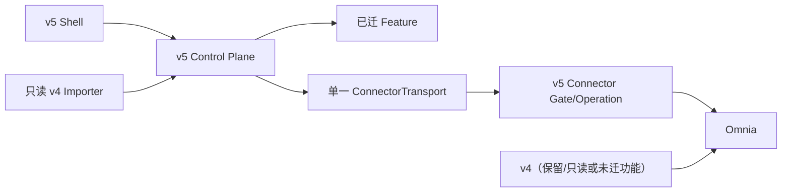
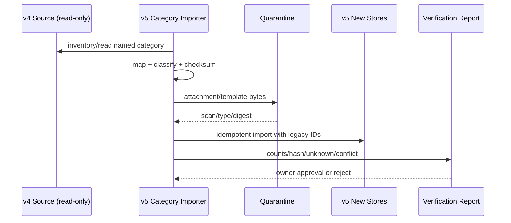

# v4 → v5 迁移路线

状态：Draft for Review  
策略：Strangler；逐条真实纵向切片迁移，任一时刻每类数据/effect 只有一个 system of record。

## 1. 目标与约束

- 保留 v4 经过真实事故修复形成的合同、安全状态机、模板规则和测试场景；
- 不搬运 v4 巨型 server/UI/Connector 业务分支和单库 KV 结构；
- v5 未达到真实闭环前不提供入口；
- 首批 Feature 已确定为“其他”下的新建与关联、删除元素、删除聊天记录和录制；开发顺序固定为录制 → 删除元素 → 删除聊天记录 → 新建与关联；新建与关联只迁入其首个 canary 需要的 APP/DB/GRA/单一关系合同，不提前迁入完整 Phase 1、Phase 2、Controls 或 EMS；
- v4 保持只读核对，本路线不修改 v4；
- 并行运行用于比较和可回滚，不允许同一业务 mutation 双写。
- Remote Connector 保留在线升级，但先迁入签名/sequence/candidate/probation/rollback 信任合同；新业务默认只升级 Operation Module。
- 每个 v5 Feature 的实现文档随包交付；v4 README/handoff 只能作为审计输入，未经重写和双向核对不能冒充已安装 v5 Feature 文档。
- v5 新增 Agent Managed Content Registry；v4 没有等价 current/revision/change 事实源，迁移器不得根据旧日志猜造完整历史。
- v5 首版从空数据根开始，不迁移 v4；只有用户以后点名某类历史资料时，才执行只读、按类打捞。
- Workspace 读取重写为权威轻抓取与有界重抓取；v4 的名称推断分类和固定 `IT Elements` 标签不得迁入。
- 生产只允许官方签名 Feature/Operation 包；Remote 更新由服务器自动下发并在真实安全窗口自动激活。
- 稳定产品根内分离 immutable releases 与 mutable data；任何升级/回滚不得覆盖 data。

## 2. Strangler 拓扑

边界：

- 已迁 Feature 的新 Run 只由 v5 创建和拥有。
- 未迁能力继续留在 v4，不能在 v5 做假入口。
- 同一 Omnia mutation 不能由 v4/v5 同时执行；切换以能力/作用域明确。
- v4 数据导入是单向只读；不做 v5→v4 同步。

## 3. 资产复用/废弃/重写矩阵

| v4 资产 | 策略 | v5 处理 | 门槛 |
|---|---|---|---|
| 安全写：预检/冻结/确认/幂等/uncertain/读回 | 复用语义，重写实现 | 统一 Run/Command/Evidence 合同 | 事故回归 + 真机 canary |
| Workflow/Agent/Capability/Command 状态经验 | 提炼 | 单一 Run/Step/Event/Lease | 重启/故障测试 |
| 官方模板与参考工作簿 | 条件复用 | Template Registry 不可变版本 | 所有权/许可/hash/semantic validation |
| Phase 1/2 模板合同与测试向量 | 复用规则/fixture | 场景/模板/validator | 不复制耦合代码 |
| Connector 签名、序列、probation 思想 | 复用信任模型 | Remote Connector 分层在线升级与 Feature/Operation 包供应链 | A/B、安全窗口、更新源、撤销和回滚测试 |
| v4 Workspace 名称分类/固定 IT Elements 标签 | 废弃 | 权威 Section + Workspace 轻抓取；选定 Workspace/capability 有界重抓取 | 真实 identity、改名、同名和无父级测试 |
| Origin/ID/target normalizer 事故 fixture | 复用测试向量 | Gate/Operation contract | 重新验证目标系统版本 |
| Local token/DPAPI/脱敏测试 | 适配复用 | v5 Secret/IPC/diagnostic | 新宿主威胁模型 |
| publication safety 脚本规则 | 重写/扩展 | CI publication gate | v5 路径/包结构 |
| `src/server.js` | 废弃结构 | 按 Core/Feature/Parser/AI 拆解重写 | 禁止复制巨型路由/算法 |
| `public/app.js`/全局 CSS | 废弃结构 | 统一 Shell/路由/功能树 | 无 Agent IA、真实 action |
| Connector Gateway/Toolkit 业务长分支 | 废弃结构 | Connector Core + Operation Module 重写 | Core 无业务名 |
| 单一主 SQLite + settings 大 JSON | 废弃数据结构 | Core + module owner stores | 专用 schema/migration |
| Agent 创建/修改/删除内容的后台登记 | v4 缺失，v5 新建 | Managed Content current + immutable revision/change + tombstone | 写后读回、partial/uncertain、Phase 2 查询测试 |
| 固定 DeepSeek 实现 | 废弃限制 | AI Gateway/adapters | Secret/SSRF/capability test |
| Employee/Group/多 Agent/+Agent | 不迁产品面 | 可只读归档/映射 | 用户明确另立 ADR 才复活 |
| Online 无登录外壳 | 废弃 | 无在线产品；Bridge 独立身份 | Remote 威胁模型 |
| Handoff/README/架构说明 | 提炼，不原样安装 | 重写为 v5 包内四 Plane 实现映射和无敏感运维文档 | 与实际 action/schema/migration/operation/test ID 双向核对 |
| Handoff 的生产路径/密钥路径/历史流水 | 不迁 | 只提炼无敏感 ADR/Runbook | publication scan |
| 运行 DB、日志、配对凭据、历史下载包 | 首版不复制 | 以后按用户点名类别只读打捞 | 独立 inventory 与安全扫描 |

## 4. 首批真实纵向切片

首批范围见 [首批 Feature 范围](../product/INITIAL_FEATURE_SCOPE.md)：

1. 录制；
2. 删除元素；
3. 删除聊天记录；
4. 新建与关联。

以上是开发、真实闭环验收和开放顺序，不是功能树排序。四项按用户决定依次进行：

| 开发顺序 | Feature | 主要验证目标 | 外部风险 |
|---|---|---|---|
| 1 | 录制 | Local/Remote、真实 Session、Connector Module、长运行状态、Artifact、Evidence、断线恢复 | Omnia 会话与隐私采集 |
| 2 | 删除元素 | 安全锁、实时预检、确认、关系解除、mutation、并发 token、写后验证、uncertain | 最高 |
| 3 | 删除聊天记录 | 三列 Shell、FeatureContext、后台事务、引用、确认、保留/清理、刷新/重启 | 本地数据删除策略 |
| 4 | 新建与关联 | 四 Plane 综合验收、模板、确认、Connector 小型 Operation、APP/DB/GRA、DB → APP 双边读回、partial/uncertain | 高；受控非生产 mutation |

该顺序是 Accepted 用户决定；如需调整，重新记录决定。每项仍须独立满足进入/退出门槛，不能因排在前面而绕过 DoR，也不能靠 mock/sample 作为发布验收。详见 [ADR-0021](../adr/0021-initial-feature-development-order.md)。

## 5. 阶段路线与门槛

### 阶段 0：文档与合同冻结

进入：v4 审计与需求评估完成。  
工作：本文档集、ADR、统一 Schema、Feature Documentation 合同、Managed Content 合同、威胁模型、首批 Feature 合同。  
退出：

- 四 Plane/依赖/数据 owner/Transport/模板/uncertain 评审通过；
- 包内实现映射和 Documentation Registry 的安装/升级/回滚规则评审通过；
- Agent 管理内容的 owner、类型 Schema、current/revision/change/tombstone、freshness 和 Phase 2 查询规则评审通过；
- 剩余待用户确认项有 owner/期限；
- 技术选型 Proposed 项有验证计划；
- 仍不创建业务脚手架或可点击占位功能。

### 阶段 0.5：不可交付的 Platform Conformance Spikes

进入：阶段 0 退出门槛通过；用户仅批准明确列出的 D5 原型范围。  
工作：使用人工构造的测试 fixture，分别验证 runtime/IPC、Worker 与 Feature UI sandbox、Store/outbox/全局备份恢复、包安装 journal/activation、Local/Remote Transport、Bridge 大文件/TTL、在线更新撤销和容量边界。每个 spike 只回答一个问题，具有量化阈值、失败退出和 ADR 回填。  
退出：

- 必需 spike 均有可重复证据；失败选型被明确排除，不因已有代码成为默认决定；
- fixture、测试菜单和 harness 不进入产品 Registry，不生成用户可见 Feature 或“已安装”记录；
- runtime、IPC、Store、sandbox、Bridge、installer/activation 与 backup 的 Proposed ADR 已依据证据转为 Accepted，或从阶段 1 范围明确排除；
- D6 第二次独立审查通过，且用户明确批准开始 Shell Baseline 正式实现。

### 阶段 1：可独立交付的 Shell Baseline

进入：阶段 0.5 退出门槛、D6 和用户开发批准全部通过。不得只凭阶段 0 文档完成就进入。  
工作分为两个可独立验收的增量，不一次实现整个控制平台：

1. **1A 最小内核激活**：真实 Shell/Core 进程边界、类型化 IPC、Feature Registry、最小 Package Manager、Run/Event 基础和空导航；只呈现真实健康与空状态。
2. **1B 平台服务逐项加入**：按独立 DoR/DoD 加入 Documentation Registry、Managed Content Registry、Artifact/Secret broker、隔离执行面、安装/更新/恢复与 Local/Remote contract harness。上一项未通过故障和恢复门禁，不加入下一项。

干净安装的业务 Registry、导航叶子、已安装 Feature 文档索引和 Managed Content 数据均为空。  
退出：

- Shell 安装物不含四个首批 Feature 的 Worker、业务 UI、私有 migration 或 Operation；
- 空 Registry、空业务树、真实聊天/会话基础状态和缺失依赖原因可在刷新/重启后恢复；
- 受信测试包可以独立 staged/candidate/active/disabled/previous/removed，签名或兼容失败不会注册菜单；
- Feature 文档 manifest、必备文件、四 Plane 映射、digest、链接、敏感信息和安全渲染校验可拒绝候选；
- Feature/Documentation 的不可变 candidate 完成 staging 后，通过单一 activation record 原子切换一致的 active/previous 指针；逐阶段崩溃恢复和 previous-readable 回滚通过；不安装的设计稿不会出现在“已安装文档”；
- Managed Content 空 Store、类型 Schema 注册、change/revision/current/tombstone、outbox 恢复和授权查询 harness 通过；不得预填样例业务对象；
- Worker 隔离、模块 A/B 故障隔离、migration/rollback；
- Run/Event/Lease 重启恢复；
- Artifact quarantine 和 Secret 边界；
- Local/Remote contract harness（Remote 可使用测试中继，不宣称产品可用）；
- Remote Connector 在线更新正式 harness：Operation side-by-side、Core A/B、安全窗口、下载中断、篡改/降级、撤销严重度、probation rollback、不 fallback；它复用阶段 0.5 证据，但不得用测试中继冒充产品 Remote 可用；
- 无业务假入口。

### 阶段 2：首批 Feature 逐项真实纵向切片

进入：首批 Feature 已确认，且目标 Feature 的数据策略、权限、验收环境和业务 owner 完成 DoR。“新建与关联”还必须先完成默认文档准备项目并发布唯一兼容的 `TemplateVersion`；该阻塞不影响前三项。  
工作：按“录制 → 删除元素 → 删除聊天记录 → 新建与关联”把四项分别构建为独立签名 Feature 包；每包同时提交文档 manifest、逐 capability 四 Plane 实现映射、数据/运维/测试/changelog，逐包完成安装→文档发布→启用→真实输入→处理→验证→交付→升级/回滚；按需加入独立签名 Connector Operation Module。新建与关联作为第四项完成首批四 Plane 综合验收。  
退出：

- 每项所有按钮真实接线；
- 每项代表性用户资料、会话或模板通过；
- 每项通过刷新/重启/崩溃/升级/回滚；
- 每项项目文档与 active 包版本一致，四 Plane 映射和实际 ID 双向一致，历史 Run 可解析原版本；
- 删除元素能为既有对象建立 adopted baseline 并写 tombstone；新建与关联能保存 RAIT/Factors、对象/GRA/关系 current 与 revision，供 Phase 2 合同查询；
- 每次新增包都不破坏 Shell 或全部已验收前序包；候选失败不替换 active；
- 若有 Omnia effect，完成授权真机 canary、写后读回与 uncertain 测试；
- 前一项达到退出门槛后再宣称下一项进入 Feature 开发；
- 四项分别通过用户/业务 owner 验收。

### 阶段 3：可选 v4 按类打捞与并行比较

进入：不属于首版默认路线；只有纵向切片稳定且用户提出具体历史类别需求时进入。  
工作：对点名类别执行只读 inventory、rehearsal、幂等 import/archive、shadow compare；禁止全库自动迁移。  
退出：

- 计数/hash/引用/渲染/业务差异报告通过；
- Secret/配对重新配置；
- 失败记录可追踪、不猜测映射；
- 明确每个能力的唯一写 owner。

### 阶段 4：逐能力 strangler

进入：至少一条切片证明标准可重复。  
工作：按同一 Feature Package 模板迁移用户选择的下一批能力。  
退出（每个能力）：

- v5 真闭环与 canary；
- 版本化 Feature 实现文档随包安装且通过漂移/安全门禁；
- Agent 管理内容的 mutation 与 Phase 2/下游查询遵守统一 Managed Content 合同；
- v4 对应入口被禁用/只读且有回退说明；
- 数据 owner 切换完成；
- 观察期无 P0/P1 回归。

### 阶段 5：v4 退役

进入：所有需保留能力已迁或明确废弃，保留期已完成。  
工作：冻结 v4、最终备份/归档、撤销配对/Secret/服务、清理文档。  
退出：

- 无活跃用户/Run/Connector 依赖 v4；
- 恢复/审计所需数据可用；
- 凭据撤销和数据删除有 Evidence；
- 退役获用户与业务 owner 批准。

## 6. 可选按类打捞

首版不执行本节流程。以后获用户对具体数据类别的明确请求后，遵守：

- 导入前冻结 v4 snapshot；不从活动数据库随意复制文件。
- 每个目标记录保存 `legacySource/system/version/id/importBatchId`。
- 数据映射与正文导入分别可重试；同一 batch 幂等。
- 未知 schema、冲突 ID、损坏文件、无许可模板进入报告，不“尽量转换”。
- v4 没有可靠 Managed Content ledger 时，只能导入可证明的当前 snapshot 或 legacy Evidence，并标 `origin/external_observed`；不得伪造 Agent 创建/修改历史。
- DPAPI Key、Connector credential 默认不迁；重新配置/配对。
- v4 活动/uncertain 命令不执行；只读归档并人工核对。
- 不扫描整个 v4 根后推定“用户想全部迁移”；每一类有独立 scope、报告和批准。

## 7. 并行运行

允许：

- v5 对 v4 不再变化的 snapshot 做只读 shadow 计算；
- 对同一输入比较规范化数据、Patch、输出和验证报告；
- v4 继续拥有未迁能力，v5 拥有已迁能力。

禁止：

- 同一业务 action 双写 Omnia；
- 把 v4 结果直接标成 v5 成功；
- v5 回写 v4 DB；
- Remote/Local 两条路径同时 active；
- 用生产客户数据在未批准的 Provider/Bridge 测试。

差异分类：`expected_contract_change | v4_defect_fixed | v5_defect | data_quality | not_evaluable`，每项需 Evidence 和 owner 决策。

## 8. Cutover 与回滚

### Cutover

1. 公告/冻结对应 v4 能力新 mutation。
2. 完成 v4 最终只读 snapshot 和 unresolved inventory。
3. 导入/验证必要数据。
4. 验证 v5 Feature/Operation/Transport/Provider/Template 精确版本。
5. 原子切换唯一入口/owner；v4 对应能力改只读或禁用。
6. 执行真实 canary，开始观察期。

### 回滚

- 停止 v5 新 Run，drain 或 reconcile in-flight；
- 不撤销已经证实的 Omnia mutation；
- 只有数据/合同兼容时把入口交回 v4；
- v5 新数据若 v4 无法理解，导出只读交接报告，不做危险逆向写；
- 保持 v5 Evidence/Artifact 供审计；
- 修复后重新走 cutover，不“热切”逃避门禁。

回滚窗口、观察期和准入阈值为 `Proposed / 待录制切片及后续 mutation 切片风险和基准测试`。

## 9. 退役

- v4 进入只读并标明截止日期；
- 导出最终 inventory、版本、数据/Artifact hash 和 unresolved；
- 依法/按用户决策保留归档，验证恢复读取；
- 撤销 Connector 配对、AI Key、Remote 身份和服务；
- 清除在线实例/运行数据前取得明确批准并生成 Evidence；
- 文档只保留无敏感的架构经验，不复制生产路径/密钥提示。

## 10. 里程碑验收

- [ ] 首批范围固定为新建与关联、删除元素、删除聊天记录、录制；ADR-0018 已记录本次范围变更。
- [ ] 开发顺序固定为录制 → 删除元素 → 删除聊天记录 → 新建与关联；ADR-0021 已记录顺序变更。
- [ ] 先交付无业务 Feature 的真实 Shell Baseline，再逐个安装首批独立 Feature 包；ADR-0022 已记录交付模型。
- [ ] “新建与关联”默认文档准备项目完成前不进入第四 Feature 实现或 canary，且不以 v4/示例文件替代。
- [ ] 每阶段进入/退出门槛有证据和 owner。
- [ ] 每类数据/effect 始终只有一个 system of record。
- [ ] v4 缺失的 Agent 管理内容登记由 v5 新建；create/update/delete current/revision/change/tombstone 和 Phase 2 查询通过 ADR-0024 验收。
- [ ] v4 首版零迁移；未来 importer 只读、按类、幂等、失败关闭且不迁 Secret/配对。
- [ ] 并行比较不双写。
- [ ] rollback 不逆向重放 mutation。
- [ ] Remote Connector 在线升级经过分层包、签名/sequence、A/B、安全窗口、probation/回滚和不 fallback 验证；普通业务变化不升级 Core。
- [ ] Remote 更新服务器自动下发并只在真实安全窗口激活；活动 mutation/uncertain 阻断不可关闭。
- [ ] Workspace 轻抓取只返回权威 Section + Workspace；重抓取只覆盖选定 Workspace/capability，v4 名称分类不迁入。
- [ ] 更新/回滚/删除旧 release 不覆盖稳定 `data` 根。
- [ ] v4 退役前完成凭据撤销、恢复验证和用户批准。
