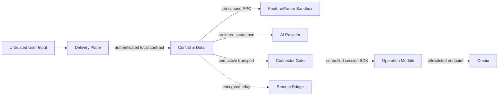
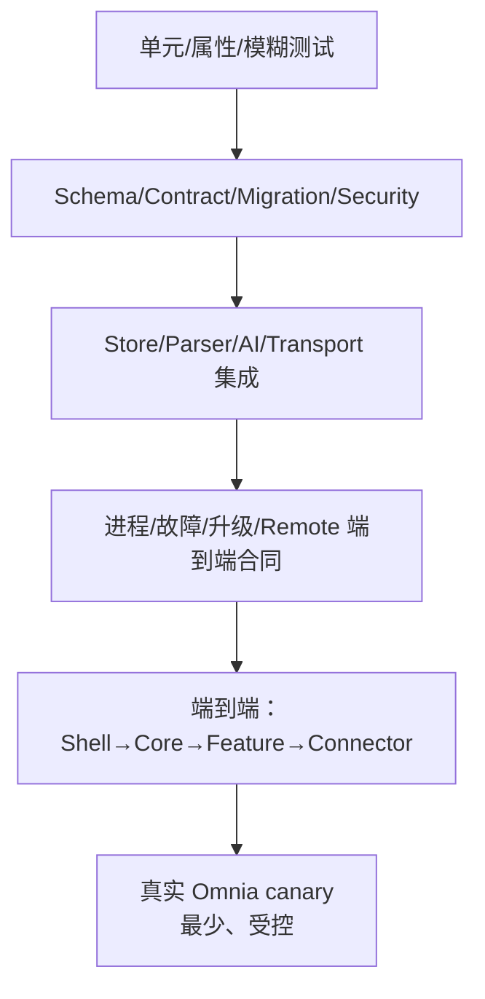

# 安全、可靠性与测试

状态：Draft for Review  
适用范围：Shell、Control & Data Plane、Feature/Parser Worker、Remote Connector Core/Operation Module、Bridge/Remote Transport、AI Provider、数据与发布。2026-08-03 起以 ADR-0035 的 Remote-only/no-fallback 决策为准。

## 1. 威胁模型

### 1.1 受保护资产

- Omnia Cookie、Authorization、登录 Session 和目标作用域；
- AI/API Key、配对私钥、启动 token 和签名私钥；
- 用户上传、模板、输出、业务数据和 Evidence；
- Run/Confirmation/Command 的完整性与状态；
- Agent Managed Content 的 current/revision/change/tombstone、RAIT/Factors 等业务字段与 provenance；
- Feature/Operation/Core 发布物和信任根；
- 本机文件系统、网络、CPU/内存和用户身份；
- Remote Bridge 的设备路由与短期密文。

### 1.2 攻击者与故障源

| 来源 | 能力/风险 |
|---|---|
| 恶意或损坏上传 | 宏、外链、解析器漏洞、压缩炸弹、资源耗尽、提示注入 |
| 恶意/被篡改 Feature 包 | 跨模块读库、读 Secret、任意网络、伪造状态、供应链后门 |
| 恶意/漂移的 Feature 文档 | 路径穿越、脚本/危险 HTML、主动外链、秘密泄漏、虚构或遗漏实际能力 |
| 恶意/被篡改 Operation 包 | 越权 endpoint、任意 HTTP、泄露 Session、重复 mutation |
| 前端/XSS/本机低权限进程 | 调本地 API、窃取 token、陈旧确认、路径探测 |
| Custom AI endpoint | SSRF、DNS rebinding、metadata 访问、数据外泄、恶意响应 |
| Remote 网络/Bridge | 重放、乱序、中间人、设备冒充、无限期保留附件 |
| 进程/电源/网络故障 | 状态丢失、半写、重复执行、响应丢失、`uncertain` |
| 操作人员错误 | 错模板、错目标、错误升级、错误恢复、越权导出 |
| 投影污染/漂移 | 把计划、AI、陈旧或 partial/uncertain 值写成 current，导致 Phase 2 使用错误业务内容 |

### 1.3 信任边界



跨边界数据都必须 Schema 校验、大小限制、授权、审计和脱敏；“同机”不等于可信。

## 2. 安全不变量

以下为 P0，不得以功能进度为由豁免：

1. Omnia Secret 不离开 Connector 工作站；AI Key 不离开 Secret Store/AI broker。
2. 前台不解析业务资料、不调用 AI、不直连 DB/Omnia。
3. Feature 无 Core/其他模块 DB、Secret、任意网络/路径/子进程权限。
4. Connector Core 无业务分支；Operation Module 无任意 HTTP/系统命令。
5. 每条 Omnia 命令冻结 Transport generation、Connector、Session、Engagement、Pack、Run、Operation、effect 和目标。
6. mutation 必须实时预检、不可变计划、明确确认、幂等、真实并发 token、写后读回/双边验证。
7. 提交点后超时、断线、崩溃或证据不足为 `uncertain`，禁止自动重试。
8. `uncertain` 只能通过新的只读 reconcile；存在非终态 mutation、未解决 uncertain、Connector Artifact 上传、状态未知或不能安全结束的只读命令时禁止 Transport 切换和危险发布。
9. Run/Event/Command 在外部 effect 前持久化；内存不是真相。
10. 多步 mutation 的 `failed/cancelled` 必须同时保存 `effectOutcome`；已创建对象、未完成关系等 partial effect 不得被终态名称掩盖或自动补偿。
11. 模板发布后不可变；缺失不等于默认；全默认也创建实例/provenance；Patch 只进白名单。
12. 快照标明采集时间和是否实时；无来源数据为 `not_evaluable`。
13. 所有包签名、hash/size、单调序列、SBOM、candidate health、probation、rollback。
14. 所有 UI 入口连接真实 backend/action/state；无闭环隐藏或明确禁用。
15. 日志、错误、Artifact、录制、Bridge 传输和诊断包都执行 schema 级脱敏。
16. Remote Connector 在线升级优先 Operation Module；Core 更新必须签名、A/B、安全 drain、probation、可回滚且失败不 fallback 到 Local。
17. Feature 文档与代码同签名、同版本、崩溃安全 staging，并由单一 activation record 一致激活/回滚；每个 capability 的四 Plane 映射必须与真实包内容双向一致。
18. Agent Managed Content current 只由已验证 Evidence 推进；删除写 tombstone，partial/uncertain 不覆盖未证明字段，Phase 2 不直连 Store。
19. Workspace Section/部分归属只来自 Omnia 权威 identity；禁止通过 `TEST`、`20000`、`IT Elements` 或其他名称推断。
20. 重抓取只访问当前 Pack、用户选定 Workspace 和 Feature capability 声明范围；Workspace 必须带权威 parentSectionId，并受对象/关系/页/字节/时长硬预算限制；禁止默认全 Pack 无界 dump。
21. 历史 Workspace observation 展示前重新证明当前 principal 的 Pack 访问；无法验证时不展示缓存业务名称。
22. 详细录制使用字段级正向白名单、落盘前源头净化、二层扫描/quarantine、硬预算和实例 DEK 静态保护。
23. 生产 Feature/Operation 只接受官方信任根；第三方、未签名、测试根和任意离线包失败关闭。
24. 更新/回滚不覆盖稳定 `data`；Secret 只由 Windows 保护，复制便携根后必须重配；实例外部资源必须由受控移除流程核对。

## 3. 安全控制矩阵

| 风险 | 预防 | 检测 | 恢复 |
|---|---|---|---|
| 重复/越界 Omnia 写入 | scope freeze、preflight、confirmation、idempotency、token | command/Evidence、写后读回 | uncertain reconcile；新计划 |
| 恶意上传 | quarantine、类型/宏/压缩 gate、sandbox | parser crash/limit 指标 | 隔离/删除，模块不受影响 |
| Feature 越权 | 进程 sandbox、job token、broker API | 权限拒绝 Audit、行为测试 | 终止/隔离包、撤销签名 |
| Connector 后门 | operation allowlist、Session SDK | endpoint/Schema contract test | 禁用/回滚 Operation 包 |
| Custom Provider SSRF | HTTPS、IP/DNS/redirect/peer 校验 | 安全事件与 egress 测试 | 禁用 profile、撤销 Secret |
| Secret 泄漏 | OS Secret Store、非回显、最小内存 | secret scan、日志 canary token | 轮换/撤销、调查 Evidence |
| 包篡改 | 签名/hash/SBOM/sequence | 启动/更新验证 | previous rollback |
| 文档包攻击/漂移 | 路径 allowlist、安全渲染、secret scan、四 Plane 双向 ID 校验 | 安装器/CI 证据、Registry 版本一致性检查 | 拒绝 candidate；代码与文档共同 previous rollback |
| Remote Connector 更新劫持/错误激活 | 固定更新源、目标绑定、A/B 槽、安全窗口、Supervisor 信任根 | offer/manifest/slot/generation/probation Evidence | 保持/恢复 previous；撤销发布，不切 Local |
| Remote 重放 | 双向身份、sequence、TTL、ACK | duplicate/replay 指标 | revoke binding、rotate keys |
| 恢复后重放 mutation | 持久 command state、fencing | startup unresolved scan | 只读 reconcile |
| Managed Content 投影污染 | 类型 Schema、expected revision、Evidence gate、唯一写 owner | current/revision/change digest 与 outbox 对账 | 停止下游查询；从 Evidence 幂等重建，不重放 mutation |

## 4. 隐私

### 4.1 数据最小化

- Feature 只接收 Run 所需 Artifact 片段/句柄。
- Managed Content 只保存已批准下游用途需要的类型化字段；不保存任意原始 Omnia response 或上传全文。
- AI 只接收用途所需片段；完整上传不默认发送。
- Bridge 只中继路由所需密文/摘要，正文 TTL 最短化。
- 普通日志不记录 prompt/response、文档正文、Key、Cookie、header、绝对路径。
- 诊断包通过字段 allowlist；用户在导出前可查看内容分类。

### 4.2 数据分类

`Proposed` 分类：`public | internal | confidential | secret`。具体分类规则与 Provider 出境/驻留限制仍待威胁评审。当前无公司级按年龄保留规定：业务数据默认保留到用户显式清理，引用/活动 effect/`uncertain` 可阻断物理删除；这不授权自动发送外部 Provider/Bridge。

### 4.3 删除

- 删除是独立的显式任务，显示真实范围、引用和保留例外。
- Artifact 物理去重不允许删除仍被其他逻辑对象引用的正文。
- Evidence 的法定/审计保留可能阻止普通删除；UI 必须说明，不能假称“已完全删除”。
- 删除完成生成 Evidence；失败/部分失败显示真实状态。

## 5. 可观测性

### 5.1 统一关联

所有日志、Event、metric、trace 使用适用的：

```text
traceId, runId, stepId, commandId, featureId, featureVersion,
managedObjectId, managedRelationId, managedContentChangeId,
transportMode, transportGeneration, connectorId, operationId
```

禁止将本机路径、客户标识正文、Secret 或原始 Provider/Omnia 响应作为 label。

### 5.2 信号

| 信号 | 最低内容 |
|---|---|
| 日志 | 结构化、异步 sink、level、messageKey、脱敏 meta、correlation |
| 指标 | Run 状态/延迟、队列、Worker crash/资源、Artifact、Provider、Transport、uncertain |
| Trace | Shell→Core→Feature/AI→Transport→Operation 的逻辑 span |
| 健康 | Core/Store/Feature/Parser/Transport/Connector/Provider 独立状态与采集时间 |
| Evidence | effect、确认、版本、hash、预检和验证的长期证明 |

OpenTelemetry 或本地等价实现为 `Proposed`。默认不上传 telemetry；任何外发需显式配置与隐私说明。

## 6. NFR 与基准

未测数字不得写成已实现目标。以下为待冻结类别：

| 类别 | 指标 | 当前状态 |
|---|---|---|
| 启动 | 冷/热启动到导航可用 | Proposed / 待普通 Win10/Win11 ThinkPad 兼容性基准；不要求生命周期/补丁认证 |
| UI | 树展开、路由、状态刷新响应 | Proposed / 待 100%–200% 缩放测试 |
| Run | 创建/事件持久化 P50/P95/P99 | Proposed / 待数据库基准 |
| Artifact | 上传大小、吞吐、并发、恢复 | Proposed / 待代表文件基准 |
| Parser | CPU/内存/时间/解压限制 | Proposed / 待正常与恶意样本 |
| Worker | 每模块并发/资源上限 | 由 manifest + 平台上限，待基准 |
| Transport | 心跳、断线检测、事件重放窗口 | Remote-only 自动化已覆盖基础链路，真实公司电脑故障 canary 待执行 |
| 可用性 | 模块故障不影响其他模块 | 强制行为目标 |
| 恢复 | RPO/RTO、备份/恢复时间 | 待数据规模和用户要求 |
| 安全 | uncertain 零自动重放、Secret 零明文泄漏 | 强制不变量 |

基准报告记录硬件、Windows SKU/build、生命周期或 ESU 状态、补丁新鲜度、Electron/Chromium/Secret Store/杀软兼容、缩放、数据规模、模板版本、网络/Omnia 环境和构建版本，用于兼容性排障和后续建议。普通 Windows 10/11 ThinkPad 不因生命周期、ESU、补丁新鲜度或 Windows 强隔离认证被统一禁止安装、连接或使用；只有真实运行时不兼容或具体 capability 依赖失败时，才禁用受影响能力并显示准确原因。

## 7. 测试金字塔



### 7.1 单元与属性测试

- 状态转换、selector、digest、默认决策、Patch 最小性；
- 输入边界、Unicode/时间/ID、错误脱敏；
- idempotency、fencing、sequence；
- Patch 重放确定性和“不触及保护区域”属性。

### 7.2 合同测试

- 所有 `omnia.* /v1` Schema 正/负/版本 fixture；
- Feature/Operation manifest、RPC、权限；
- Shell/Bridge/Remote Worker 使用同一套 Transport kit，且静态/运行时证明无 Local fallback；
- Provider adapter 的 discovery/manual/test/error/usage；
- 合同示例仅作 fixture，不驱动生产 UI 假数据。

### 7.3 集成与进程测试

- 真实 SQLite/选定 Store migration、WAL/崩溃恢复、Artifact 原子发布；
- parser 真实 Office/PDF/ZIP 类型和恶意样本；
- Worker crash、OOM、超时、越权、升级/回滚；
- Remote Connector Operation side-by-side、Core candidate/active/previous、下载中断、篡改/降级、活动 mutation 阻断、probation rollback；
- Workspace 轻抓取的权威 Section/Workspace identity，以及重抓取的分页、取消、partial、同名/改名/缺父级和 Remote 重连一致性；
- Core 重启、lease 过期、Event 重连；
- Transport 乱序、重复、丢包、提交点断线；
- AI fake server 仅用于协议/安全测试，不能作为产品功能验收；真实 Provider test 单独执行。

### 7.4 E2E

- 真实 Shell 操作与后台状态；
- 上传→quarantine→处理→模板实例/Patch→验证→交付；
- 刷新/重启/多窗口恢复；
- 所有按钮的 success/empty/denied/failure/disabled；
- 二级/三级 Feature 叶子混排时的鼠标、键盘、焦点、搜索、折叠、恢复和权限状态；
- Remote Transport 断线、恢复、协议不兼容和阻断；
- 不需要 Omnia 的功能也必须真实闭环到 Artifact/Evidence。

## 8. Worker 与 Feature UI 执行隔离验收

必须自动证明：

- Feature A 读取 Core DB/Feature B Store/Secret/任意网络失败；
- A crash/OOM/死循环不使 B 的健康和活动 Run 中断；
- A 升级/回滚不重启 Core、Connector 或 B；
- Feature A 的 UI 无法访问 Shell/Feature B 的 DOM、CSS、路由、全局 store、浏览器存储、Node、文件系统或任意网络；
- Feature UI 只能通过版本化 Shell UI Bridge 调用已授权 action；伪造 `featureId/viewInstanceId/runId/stateVersion/actionId`、错误 origin、未知字段和重放消息均被拒绝；
- Feature A UI 的死循环、崩溃、内存超限、CSP 违规、`window.open`、任意导航和下载请求只终止/隔离 A surface，不阻断 Shell、第三列聊天或 Feature B；
- 安装、升级和回滚 UI bundle 后，旧 surface 不得继续持有 Bridge capability；新 surface 必须重新取得短期绑定；
- Parser 恶意文件不继承网络/Secret，超限后其进程可被清理；
- Operation Module 越权 endpoint/系统命令被 Gate 拒绝；
- 孤儿进程、临时目录和 lease 在重启后可回收。

Windows Worker/Parser/Operation sandbox 和 Feature UI renderer/view 隔离实现未选定前，先以上述可验证能力模型和攻击测试作为选型门槛。

## 9. Remote-only 端到端合同

同一 canonical command 在 Shell、Bridge 与 Remote Worker 各跳必须保持：

- Schema/身份/effect/confirmation/idempotency；
- progress sequence 与 terminal/uncertain 语义；
- cancel/deadline/reconcile；
- Artifact digest、size、type/provenance；
- 错误分类和脱敏。

允许差异仅限传输诊断（网络时延、Bridge route ID 等），不得被 Feature 观察为业务分支。测试需覆盖重连中可取消/不可取消 read、非终态 mutation、uncertain、Connector Artifact 上传、状态未知和 Bridge TTL，并证明没有 Local 实现或 fallback。

## 10. 真实 Omnia canary

canary 前提：

- 明确非生产或授权的 canary Engagement/Pack；
- 已登录真实 Connector Session；
- 固定 Feature/Operation/template/contract 版本；
- 最小作用域、可恢复测试对象、明确操作者确认；
- 预检和清理/回滚计划；
- 禁止文档中记录真实路径、凭据或客户标识。

canary 类型：

1. 身份/能力只读；
2. 真实导出/Artifact；
3. 最小 mutation + 写后读回；
4. 人工制造响应丢失并验证 uncertain/reconcile（仅在安全环境）；
5. Shell/Bridge/Remote Worker 同合同与断线恢复对比。

“新建与关联”的首个能力 canary 进一步固定为一个 Generic APP、一个 Generic DB、两个 GRA core 和唯一 DB → APP 关系。它在首批开发顺序中位于第四项，负责综合验收四 Plane。必须保存创建读回、关系双边读回、单一 `traceId` 和 partial/uncertain 故障证据；Risk/Control、OS、Tool、SAP 和批外引用不纳入这次通过条件。

canary 未跑不代表实现失败，但发布状态必须标为“未完成真实 Omnia 验收”，不得宣称可用。

## 11. CI 门禁

每次变更至少执行：

```text
format/lint/typecheck
unit/property/fuzz
schema + contract compatibility
managed content projection/revision/tombstone/query consistency
integration + real migrations
security/static/secret/license scan
dependency vulnerabilities + SBOM
process isolation/fault injection (分层)
package allowlist/signature/reproducibility
feature docs schema/link/drift/safe-render/secret scan
publication privacy scan
```

Nightly/候选发布增加 Remote E2E、断线/重启恢复、backup/restore rehearsal、性能回归。真实 Provider/Omnia 测试使用受控环境与秘密，不在普通 PR 暴露。

已知高危/严重依赖漏洞不能只记录后继续发布；必须升级、替换、隔离或由安全负责人以有期限风险接受并有补偿控制。风险接受流程负责人待用户确认。

## 12. 签名、SBOM 与供应链

- Core、Feature、Operation、策略包均使用受信 publisher 签名；
- 生产信任集合只包含官方发布根；第三方、用户自签、未签名和开发测试根均不能激活；
- manifest 逐成员 hash/size/allowlist，包含 Feature 文档 manifest 和所有文档成员，拒绝额外文件、绝对路径、符号链接逃逸和路径穿越；
- 文档扫描覆盖脚本/危险 HTML/主动外部内容、内部链接、敏感信息和“实现 ID ↔ 包内容”双向漂移；
- publisher sequence 单调，防 downgrade；
- SBOM 包含直接/间接依赖、license、构建来源；
- 构建使用锁文件、固定工具链和可复现检查；
- 签名在隔离发布环境完成；私钥路径/细节不进入仓库文档或日志；
- 信任根轮换、撤销和应急禁用需 Runbook（实现前补充）。

## 13. 发布与回滚

### 发布前

- 文档/ADR/合同已评审；
- Feature 包内文档完整，四 Plane 实现映射与实际 action/schema/migration/operation/test ID 一致；
- Agent 管理内容类型 Schema、投影更新、tombstone、outbox 恢复和 Phase 2 查询合同已评审；
- CI、SBOM、依赖、secret/publication scan 通过；
- migration dry-run + backup/restore rehearsal；
- drain 新 Run、活动 upload 和 mutation；
- 无未处理 `uncertain`，或已明确不影响升级且可恢复；
- candidate 独立 health、合同和 canary（按风险）。

### 发布

1. 安装到 candidate，不覆盖 active。
2. 验证签名/hash/compatibility 以及文档 manifest、digest、链接、敏感信息与安全渲染。
3. 将不可变文档暂存到 Documentation Registry candidate；运行 migration/health/contract。
4. Feature Registry 与 Documentation Registry 从同一 activation record 投影相同 active/previous；文件 staging、migration、Worker health 任一步崩溃都由 journal 恢复，不能产生分叉。
5. probation 观察 crash、错误、延迟、资源、uncertain 和代码/文档版本一致性。

Remote Connector 在线发布还必须：

- 分别标记 `operation_module|connector_core|supervisor_bootstrap`；
- 业务变更选择 Operation Module，Core 变更附“为何无法模块化”的评审证据；
- 更新 offer 绑定 connector/device/channel/platform，下载源不能由命令任意指定；
- Core 激活前取得安全窗口，更新后重新验证身份、Session/Engagement、capability 和 lease；
- Remote 更新失败只恢复 previous，不触发 Local claim。
- 服务器自动下发官方签名 offer；Supervisor 自动取得/验证/暂存，只在真实安全窗口自动激活。
- 高危更新到达 newRunStopAt 后停止新高风险 Run；maxDrainUntil 不授权强杀或重放已提交 mutation。

### 回滚

- 回滚前再次阻止新 effect；
- 只有 previous 对当前数据可读时原子回滚；
- 不回滚/重放外部 mutation；按 Evidence reconcile；
- migration 不可逆时从验证备份恢复，不能假称自动回滚；
- 回滚后运行引用完整性、模块健康和真实状态恢复检查。
- Feature 代码、合同和文档指针作为一个发布单元回滚；历史 Run 的文档引用继续指向原不可变版本。

阈值和观察时长为 `Proposed / 待基准与风险分级`。

## 14. 发布验收清单

- [ ] P0 不变量全部有自动测试或真实 canary 证据。
- [ ] 关键结论不只依赖源码正则/快照。
- [ ] Feature/Operation 越权与恶意上传测试通过。
- [ ] Remote Shell/Bridge/Worker 合同与 uncertain 故障注入通过，并证明无 Local fallback。
- [ ] Remote Connector 在线更新的篡改/降级/中断/A-B/阻断/probation/previous/不 fallback 测试通过。
- [ ] 生产第三方/未签名/测试根/任意离线包全部被拒绝，且无关闭签名或撤销的设置。
- [ ] Workspace 轻/重抓取通过 parentSectionId、硬预算、访问撤销、分页/取消和 Remote 重连一致性测试，无名称推断或越权缓存展示。
- [ ] 更新/回滚/删除旧 release 不改变稳定 `data`；复制便携根不会复制可用 Secret 或绕过敏感正文静态保护。
- [ ] 受控移除实例能核对 OS Secret、Remote 注册/租约、产品根外 PendingRevocationCapsule 和 Supervisor/服务；直接删除文件夹不会被标记为完整卸载。
- [ ] 详细录制的字段白名单、源头净化、二层扫描/quarantine、硬预算、导出授权和真实清理通过负面样本。
- [ ] Secret/客户正文/绝对路径未进入日志、诊断、包和 Bridge。
- [ ] SBOM、依赖、签名、可复现和 publication gate 通过。
- [ ] 文档必备类型、四 Plane 映射、路径/链接/digest、安全渲染和敏感信息门禁通过。
- [ ] Feature 与 Documentation Registry 的 candidate/active/previous 在安装、升级、失败和回滚中保持一致。
- [ ] create/update/delete/adopt/partial/uncertain/reconcile 的 Managed Content current/revision/change/relation/tombstone 与 Evidence 一致。
- [ ] RAIT/Factors 等 Phase 2 字段通过类型 Schema、权限、freshness、provenance 和投影恢复测试。
- [ ] backup/restore、升级/回滚在候选数据规模演练。
- [ ] UI 无未接线可点击入口。
