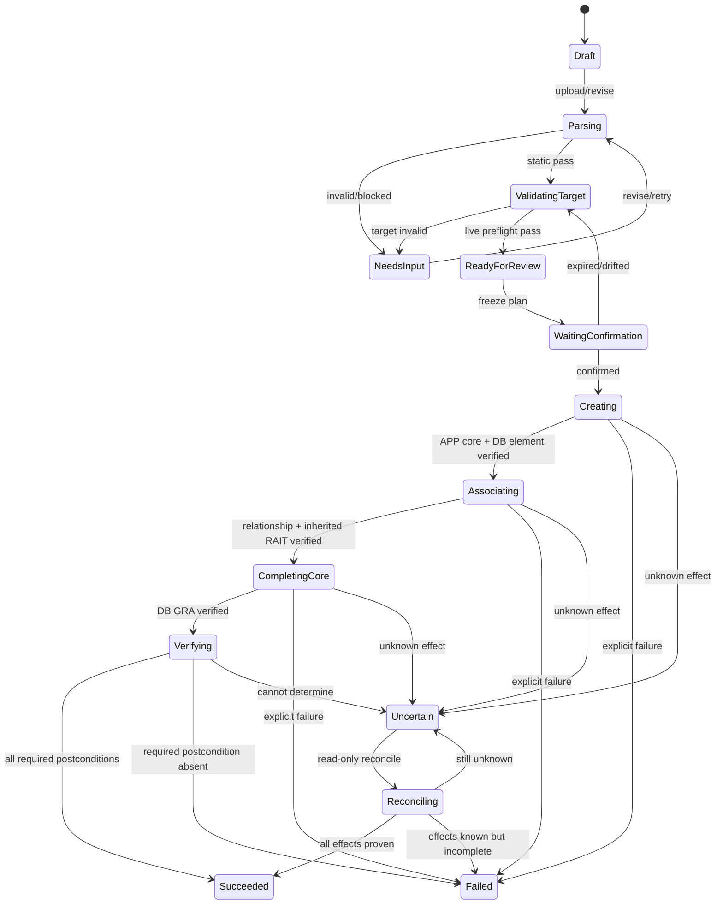

# Feature 详细设计：新建与关联

> 2026-08-04 current implementation: `omnia.create-associate@0.2.2` / sequence 4 on Shell 0.4.8 uses a two-column, three-step Surface—“上传资料 → 校验 → 回传”。It exports the exact signed `Phase1-用户填写模板V3.xlsx`, accepts picker/drop through one managed Artifact chain, shows APP/DB/OS/Tool review with 11 canonical checks, permits direct revision of official user fields, and reruns all local/live checks after a CAS save. 返回上传 explicitly clears persisted Review/Progress state while retaining the current Run; the left-rail 重新开始 action cancels only an editable Run through Core CAS, preserves audit history and projects a fresh upload layer. Neither action calls Connector mutation. `isDataAvailable` is not user input; new APPs freeze the signed `false` default and existing APPs may only preserve an authoritative live boolean. APP create/resume/reuse/recycle-bin disposition comes from a signed read-only identity Operation; only a second create-only preflight can grant the one-time object-create permit. AI review remains an honest `not_evaluable` warning until a typed Feature AI port is released. The real SAP ECC Omnia canary remains pending and is not claimed here.

> 2026-08-03 implementation update: `omnia.create-associate@0.1.0` sequence 1 now implements the four-stage Remote control loop and is bundled as an auto-installed signed Feature in Shell 0.4.3. Production mutation remains disabled because a real target Omnia/Pack canary has not been executed; automated Connector-harness evidence is not a canary. The product is Remote-only and never falls back to Local transport.

> 2026-08-03 supersession：Connector 产品链现为 Remote-only，以下历史 “Local/Remote 等价” 表述仅保留为设计沿革；当前实现与验收以 ADR-0035 为准，不提供 Local Transport 或 fallback。

状态：Accepted Product Scope / Detailed Design Draft  
用户可见名称：新建与关联  
首批定位：第四开发切片；首批四 Plane 综合验收  
DoR 状态：0.2.2 源码与签名 Operation 已完成；候选打包与 Shell 0.4.8 用户入口验证在本轮发布阶段执行，真实 SAP ECC Pack canary 待完成；0.2.1 历史证据见[0.2.1 验收记录](../reviews/CREATE_ASSOCIATE_0_2_1_ACCEPTANCE.md)
v4 对应能力：ITGC Toolbox 的 Phase 1

## 1. 用户目标

用户上传官方系统信息模板或在受控工作台中补齐必要字段，系统对输入和当前 Omnia 状态做确定性校验，生成一份可复核、可追溯的“新建与关联计划”。用户明确确认后，系统在指定 Engagement/Workspace 中新建受支持的 IT Element 与 GRA，建立计划要求的关系，并用 Omnia 实时读回证明结果。

该 Feature 被安排为首批第四条开发切片，并用于最终综合验收四 Plane，因为它必须同时经过：

```text
Delivery：接收资料、展示计划和交付结果
  → Execution：解析、归一化、计算确定性计划
  → Control & Data：持久化、确认、编排、幂等和证据
  → Integration：绑定真实 Omnia 会话、执行小型 Operation、读回
```

验收目标不是“页面能从头点到尾”，而是同一个 `traceId` 能证明四个 Plane 均处理了同一条真实 Run，并且 Omnia 中的目标对象和关系与冻结计划一致。

## 2. 产品位置

当前建议菜单路径：

```text
其他
└─ 元素管理
   └─ 新建与关联
```

它与“删除元素”同属元素管理。菜单文案以后可以调整，但 Feature 身份、权限、合同和历史 Run 不随菜单路径变化。

## 3. 范围分层

### 3.1 Feature 完整产品范围

- 下载和识别唯一已发布的官方系统信息模板；
- 接收 APP、DB、OS、IT Tool 的结构化行，但只开放已经通过当前 Omnia 版本真实 canary 的类型；
- 通过权威轻抓取解析 Engagement/Pack/Section/Workspace，再按选定 Workspace 与 capability 有界重抓取 IT Element、GRA 和外部引用；
- 生成 `create | reuse | resume | reference | blocked` 的逐项决策；
- 新建受支持的 IT Element 与 GRA；
- 建立合同明确的 IT Element 关系和 Risk/Control 关系；
- 对每个必需对象和关系执行写后读回；
- 交付逐项结果、Evidence 和可下载结果 Artifact；
- 对部分成功、明确失败和不确定结果给出可恢复但不自动重放的后续路径。

完整范围不等于第一次开发时同时开放所有类型。每个类型和关系必须单独进入 capability matrix，只有 `contract verified + real canary passed + read-back passed` 才能在 UI 中可选。

### 3.2 本 Feature 的首个真实 canary

本 Feature 的首个 canary 固定为一个窄而真实的场景：

1. 在用户批准的非生产 Engagement/Workspace 中；
2. 使用一份只含一个全新 `Generic Application` 和一个全新 `Generic Database` 的官方模板；
3. DB 与 APP 位于同一批次、同一 Workspace，DB 只关联这一个 APP；
4. 用户明确填写两个唯一业务 ID、Workspace、APP 的 `Higher|Lower`、Factors Considered 和 Application 的 risk consideration，两个 GRA 名称按发布合同确定性派生；DB 不要求 risk consideration；
5. 创建并精确读回 APP IT Element/GRA core 和 DB IT Element；risk consideration 只通过 GRA `/documentation` 写入“在此记录”文字并读回；
6. 建立唯一的 Infrastructure–Application 关系，从关系双方读回并验证 DB 继承 RAIT；
7. 创建并精确读回 DB GRA core；
8. 保存四 Plane trace、命令、事件、对象 ID、关系端点和读回 Evidence；
9. 把已验证对象、关系、APP RAIT、Factors Considered 及 provenance 写入 Agent Managed Content Registry，供后续 Phase 2 查询。

只有两个 core 新建结果和这条必需关系都取得读回证据，canary 才通过。Risk/Control 后处理、OS、Tool、SAP ECC、批外 APP 引用、多 APP 关系、解除和替换关系均不纳入本 Feature 的首个 canary。

### 3.3 后续逐类扩展

该 canary 通过后，才按对象/关系 capability matrix 逐类增加：

- Generic/UNIX/WIN OS → APP；
- Oracle/SQL Database → APP；
- 经过新一轮合同与真实 canary 的 Tool；
- Risk/Control 后处理；
- 批外引用、多 APP、解除或替换关系。

每一类都必须重新证明解析、计划、实时身份、写入、双边读回和失败恢复，不能因 Generic APP/DB 通过而自动开放。

无论后续开放何种 DB、OS 或 Tool，它们都不复用 Application 的评分体系或“在此记录”：不生成评分项，不调用 `/riskLevel`，也不写 risk consideration `/documentation`。它们仍可按各自已发布合同处理 RAIT 继承、GRA core、提交和关系。

## 4. 明确非目标

- 通用对象创建器、任意字段编辑器或任意关系管理器；
- 前端解析 Excel、决定默认值、拼接 Omnia 请求或保存业务状态；
- 由 AI 猜测 Workspace、对象 ID、RAIT、关系端点或 Risk/Control；
- Connector 内实现“Phase 1”或“新建与关联”的多步业务分支；
- 在未确认的生产 Engagement 运行 canary；
- 自动删除或补偿已经成功创建的 Omnia 对象；
- 自动重试提交点之后结果未知的 mutation；
- 用本地 fixture、历史响应或录制内容冒充实时 Omnia 验收；
- 把 Omnia 的“+文件记录”解释为真实附件：本 Feature 不创建、不上传、不绑定附件；只有 Application 写“在此记录”的 GRA 主文档文字；
- 为 DB、OS、Tool 生成 Application 评分项、开启评分分类或写“在此记录”；
- 把尚未通过真实 canary 的 APP/DB/OS/Tool 类型显示为可点击能力。

## 5. 四 Plane 职责

| Plane | 必须负责 | 禁止负责 |
|---|---|---|
| Delivery | 下载/上传入口、结构化修正、真实校验报告、diff、右上角确认卡、进度和结果交付 | 解析工作簿、选择模板、计算计划、持有凭据、直接调用 Omnia |
| Execution | 在隔离 Worker 中解析发布模板、归一化、确定性校验、生成逐项计划和期望后置条件 | 访问 Core DB、调用 Connector、读取其他 Feature 数据、决定用户确认 |
| Control & Data | quarantine、模板解析委托、Run/Step/Event、计划 digest、一次性确认、命令编排、幂等映射、Artifact/Evidence、Managed Content current/revision/change、恢复 | 依赖前端内存保存进度、把聊天文本当确认、在 Connector 中隐藏业务状态 |
| Integration | 绑定 active Transport/Connector/Session/Engagement，执行签名白名单 Operation，返回真实进度和读回证据 | 选择业务模板、解析 Excel、调用 AI、决定 create/reuse/skip、编排整个 Feature |

Feature Worker 生成的是声明式计划，不是 Connector 脚本。Control & Data Plane 把计划拆成已注册的小型 Operation；Connector Core 只做身份、作用域、Schema、effect、并发、提交点和证据 Gate。

## 6. 输入与模板合同

### 6.1 输入

首批支持：

- 后台 Template Registry 提供的当前官方系统信息模板；
- 用户上传的 `.xlsx` 原始 Artifact；
- 用户在结构化修正页明确修改的白名单字段；
- 当前 active Connector 读取的 Engagement/Workspace 和对象实时状态。
- Omnia 返回的权威 Section/Workspace identity；禁止按 `TEST`、`20000`、`IT Elements` 等显示名称推断。

前台只上传字节和用户声明。文件先进入 quarantine，再由受限 Parser/Feature Worker 处理。

### 6.2 模板规则

- 发布模板不可原地修改，必须有 `templateId/version/schemaVersion/hash/owner/license`；
- Run 冻结原始上传、解析后规范数据、模板版本、规则版本和每次修正的 revision；
- GRA 名称等派生值只能来自已发布的确定性规则；
- “缺失”不能解释为默认；身份、Workspace、目标类型、关系端点和写入授权均不可默认；
- 用户修改不会覆盖原始上传，必须生成新的 Run 专属 Artifact；
- 计划只能包含 capability matrix 当前允许的对象类型和关系类型。

用户提出的“全默认时直接使用模板”在本 Feature 中只允许用于下载或生成待填写 Artifact，**不能**直接授权 Omnia mutation。创建真实对象至少需要用户给出唯一业务身份、目标 Workspace 和明确确认。

## 7. 计划与确认

计划至少冻结：

| 类别 | 字段 |
|---|---|
| 身份 | Run、Feature、模板、输入 revision、Connector、Session、Engagement、Workspace Facet |
| 对象 | logical item key、对象类型/子类型、名称/编号、GRA 名称、期望 create/reuse/resume/reference |
| 关系 | 关系类型、不可变端点、方向、是否必需、期望写前/写后状态 |
| 安全 | capability 版本、并发 token、实时读取时间、过期时间、安全锁快照 |
| 证据 | 每项预检摘要、期望后置条件、计划 digest |

确认规则：

- 结构化工作台只负责上传、修正、预检和生成计划；
- 右上角消息卡是“确认推送、执行进度、取消请求和结果”的唯一交互 owner；
- 确认必须显示目标 Engagement/Workspace、新建数量、复用数量、关联数量、阻断/警告和关键 diff；
- 确认只绑定一个 plan digest、一个输入 revision 和一个有效期；
- 任何输入、目标、并发 token、capability 或安全锁变化都会使确认失效；
- “继续检查”与“确认推送 Omnia”是两个不同 action，前者不得产生写入。

默认使用一次明确的“确认推送 Omnia”覆盖整份逻辑计划：确认时必须已经冻结新对象的业务唯一身份、既有关系端点的 logical key、关系类型和期望后置条件；Omnia 在创建时返回的新对象内部 ID只能由后台绑定回该 logical key。若关联目标或关系语义在创建后仍不能唯一确定，原确认不得继续覆盖关联，必须重新计划并要求第二次确认。

## 8. 状态机

Feature 私有状态：



公共 Run 仍使用统一 `created/preparing/waiting_confirmation/queued/running/succeeded/failed/not_evaluable/uncertain` 投影。私有状态不得发明另一套公共成功语义。

## 9. 幂等、部分成功与恢复

### 9.1 幂等

- 每个逻辑对象和关系拥有稳定的 Run 内 logical key；
- 每个 mutation Command 有唯一幂等键并绑定计划 digest；
- 写前实时查询决定 `create/reuse/resume/reference/blocked`；
- 请求只在明确未越过提交点时允许受控重试；
- 提交点后失联立即进入 `uncertain`，禁止自动重放。

### 9.2 部分成功

Omnia mutation 不假设具备事务回滚：

- 已读回验证成功的对象保留其 Evidence；
- 后续关系明确失败时，公共 Run 为 `failed`，结果明确显示“新建已完成、关联未完成”，不能显示整体绿色成功；
- 结果未知时为 `uncertain`，禁止新 Run 和 Transport 切换影响同一目标；
- 系统不得为“保持整洁”自动删除已经创建的对象；
- 用户再次尝试必须创建新 Run，重新读取实时状态，安全复用已验证对象，只处理仍缺失的必需后置条件。

### 9.3 Reconcile

Reconcile 只能读取：

- 精确对象身份和活动/回收站状态；
- GRA 与 IT Element 绑定；
- 关系双方的当前状态；
- Risk/Control 关联；
- 当前并发版本。

它不能复用原 mutation Command，也不能补写缺失关系。对账证明全部已应用则原 Run 成功；证明部分/全部未应用则原 Run 失败，后续补写需要新计划、新确认和新命令。

### 9.4 写入 Agent Managed Content Registry

本 Feature 不把创建结果只留在 Run/Event 或结果文件中。每个 mutation target 在执行前创建 `ManagedContentChange` intent，只有真实读回或 reconcile 证明后，Managed Content Service 才能提交：

- APP、DB 和两个 GRA 的规范化对象身份、类型 Schema、external ID、Workspace 和 current revision；
- APP 的 RAIT 与 Factors Considered，以及字段来源、模板/输入 revision、Run、Command 和 Evidence；
- DB 的有效/继承 RAIT 及其来源关系，具体字段由域 Schema 冻结；
- DB → APP 关系的类型、方向、两端 ID、revision 和双边读回 Evidence；
- `create/reuse/resume/reference` 的真实来源，不能把 reused/adopted 对象伪装成 Agent 新建。

提交规则：

- 全部成功时，revision/change 与 current projection 在一个本地事务中提交；
- partial 时只提交逐项 Evidence 已证明的对象、字段和关系；未完成关系保持 unresolved；
- uncertain 时保留最后已验证 current，绝不把计划中的 RAIT/Factors 或预计 external ID 写入 current；
- Omnia 已成功但本地投影失败时，Run 不得宣称完整成功，也不得重放创建；后台由持久 Evidence/outbox 幂等补写；
- 后续 Phase 2 只能通过 `ManagedContentQuery` 按 schema/freshness/provenance 读取，不能直连 Feature Store 或从工作簿重新猜测。

详细设计见 [Agent 管理内容登记簿](../data/AGENT_MANAGED_CONTENT_REGISTRY.md)和 [ADR-0024](../adr/0024-agent-managed-content-registry.md)。

## 10. Connector Operation 边界

Operation ID 在合同冻结阶段确定，语义必须拆成类似以下小型能力：

- Workspace 精确解析与安全锁读取；
- IT Element/GRA/回收站精确查询；
- 单个受支持类型的 IT Element 创建；
- 单个 GRA 创建；
- 单类关系的 associate；
- 单类 Risk/Control associate；
- 对象和关系的精确 read-back。

禁止提供 `executePhase1(plan)`、`executeCreateAndAssociate(workbook)`、任意 HTTP 或任意脚本入口。新对象类型通过新的签名 Operation Module/版本加入，不修改 Connector Core 的 Transport、Session 和 Gate 结构。

## 11. Remote-only（取代历史 Local/Remote 等价设计）

- Feature、计划、确认、Command、幂等键、状态和 Evidence 均绑定唯一 `RemoteConnectorTransport`；
- 不提供 Local Transport、router 或 fallback；Remote 不可用时明确失败；
- Run 冻结 Connector/Session/authority instance/tenant-or-org/Pack/Engagement/Workspace；任一 canonical identity 缺失或漂移即 fail-closed；
- 在途 mutation 或 `uncertain` 阻断升级/切换，且禁止自动重放；
- 自动化 Connector harness 证据不是真实 Omnia canary。
- 新增对象/关系能力优先在线升级独立 Operation Module，不因本 Feature 扩展而升级 Connector Core；
- 若基础 Session/Gate/受控 SDK 合同确需 Core 更新，活动 Run 继续固定旧版本，Core 按 Remote A/B 安全窗口完成在线升级后才向新 Run 宣告新 capability。

## 12. UI 与布局

- 保留三列主界面，第三列继续保留聊天、上传、消息卡和交付；
- 工作台使用紧凑树/表格展示输入行、检查项、对象和关系，不用大字号卡片堆叠；
- 右上角提供统一 `− 百分比 +`；
- 模板区/输入表、检查清单/详情、计划/差异等相邻长期区域使用统一 Splitter；
- loading、empty、blocked、expired、running、failed、uncertain 均来自后台真实状态；
- 类型或关系未通过 capability gate 时禁用并显示真实原因，不显示一个最后才失败的假入口；
- Run 终态后自动重读后台 Run、Omnia 目录投影、Managed Content 投影和结果 Artifact，不沿用提交前缓存。

## 13. AI 边界

本 Feature 的首个 canary 不依赖 AI。确定性合同负责身份、必填、类型、RAIT、关系、模板 exact set 和安全判断。

未来 AI 只能辅助解释 Factors Considered 或生成非授权建议，并且：

- 结果只能是 `pass/warning/not_evaluable` 等已定义建议状态；
- 不得创造对象 ID、Workspace、关系或默认写入值；
- Provider 不可用不能把确定性失败改成通过；
- AI 输出本身不能成为 Omnia mutation 授权。

因此 DeepSeek、Custom Provider 和延后的 Nova 精确协议不阻塞本 Feature 的首个 canary。

## 14. 四 Plane 链路验收

| 关卡 | 必须证明 |
|---|---|
| Delivery | 功能树节点、上传、修正、确认、进度和结果均来自真实后台 action/state |
| Execution | 隔离 Worker 从真实 Run Artifact 生成版本化规范数据、计划和期望后置条件 |
| Control & Data | Run/Step/Event、计划 digest、确认、Command、幂等映射、Managed Content current/revision/change 和 Evidence 可在重启后恢复 |
| Integration | 当前 Connector/Session/Engagement 执行 allowlisted Operation，并返回真实读回 |
| 跨 Plane | 单一 `traceId` 可串起输入 Artifact → 计划 → 确认 → Commands → Omnia Evidence → 结果 |
| 隔离 | 本 Feature Worker 崩溃、升级、回滚或禁用不影响删除元素、删除聊天记录和录制 |
| Transport | Remote-only；无 Local fallback，不可用时 fail-closed |
| 真实性 | 没有 mock/sample/hardcoded 数据参与发布验收；真实 canary 的来源和环境可审计 |

本 Feature 首个 canary 的通过条件：

- [ ] 仅在已批准非生产 Engagement/Workspace 执行；
- [ ] Workspace 所属 Section 来自权威 identity；轻抓取/重抓取按 ADR-0025 有界、分页、可取消，名称改动不改变 scope。
- [ ] 创建前对象/GRA/回收站精确查询为唯一、可解释状态；
- [ ] 用户确认绑定当前 plan digest，确认后漂移会失效；
- [ ] Generic Application、Generic Database 和两个 GRA core 均取得精确不可变 ID 与写后读回；
- [ ] 唯一 Database → Application 关系经双方读回证明存在；
- [ ] APP RAIT、Factors Considered、DB 有效 RAIT、两个 GRA 和 DB → APP 关系以类型化 revision/provenance 写入 Managed Content Registry；
- [ ] Phase 2 查询可读取本次已验证 current；partial/uncertain 或投影未提交时返回明确 blocker；
- [ ] UI 刷新、应用重启和 Worker 重启后结果一致；
- [ ] Connector 在提交点后断线会进入 `uncertain` 且不会自动重放；
- [ ] 结果 Artifact/Evidence 可以从后台重新取得；
- [ ] 清理不属于本 Run 自动补偿；如需删除，走独立“删除元素”计划与确认。

## 15. 开发前仍需确认

以下内容不影响把 Feature 纳入首批范围，但会阻断真实 canary：

1. 完成“新建与关联默认文档准备”项目，发布唯一兼容的 `TemplateVersion`；
2. canary 使用哪个非生产 Engagement/Workspace；
3. canary 测试对象的命名规则、保留时间和清理责任人；
4. 模板与 APP/DB 创建和关联规则的业务 owner/审批人；
5. APP 和 DB 测试对象的精确命名、APP RAIT 和 Factors Considered；
6. Remote 真实 canary 使用哪个隔离的非生产 Pack/Workspace，以及如何获得并复核 canonical authority identity。

这些问题的意思和推荐决策已合并到[剩余评审项说明](../reviews/OPEN_DECISIONS_GUIDE.md)；其中仍影响生产能力边界的项目必须在真实 canary 授权和正式发布前逐项确认。
# 0.1.0 implementation status (2026-08-03)

The signed Feature candidate implements real XLSX intake, persistent Run/artifact/issue/revision state, V8-derived managed governance, a separate signed runtime-template base, and a newly generated auditable workbook per Run. V8 is not a user template and its bytes are never returned as a Run result.

The complete Return control loop is implemented and covered by automated tests: structured intent freeze, actionable Comments confirmation, exact Remote authority preflight, durable command/evidence checkpoints, mutation readback, response-loss `uncertain` handling, read-only reconcile, and verified-current projection. The real mutation action nevertheless remains disabled in production because scoped capability evidence and a real Omnia canary for the exact authority/tenant/Pack/engagement/Workspace binding are still missing; this is an independent release gate on implemented code.
