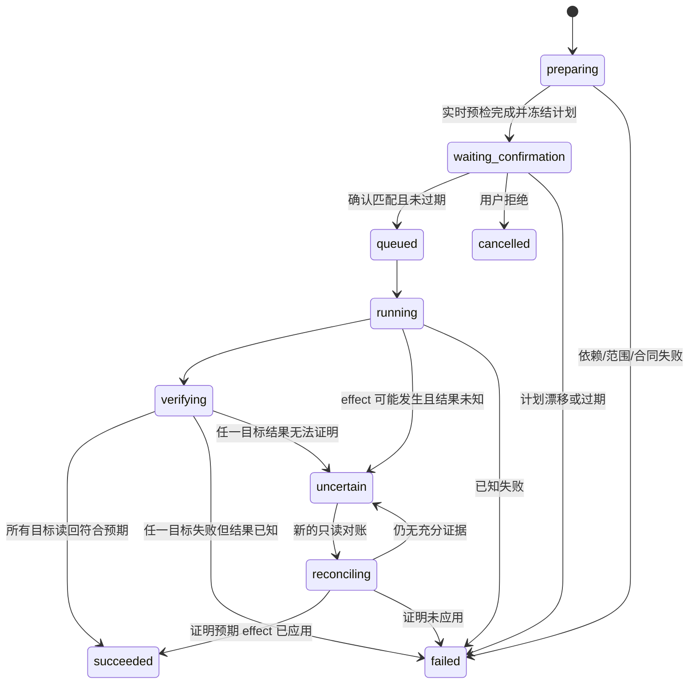

# Feature 详细设计：删除元素

状态：Product Direction Accepted / Technical Contract Pending  
用户可见名称：删除元素  
原 v4 名称：删除安全锁内元素  
所属范围：首批 Feature / 其他

## 1. 用户目标与边界

用户在当前已连接的 Omnia Engagement/Pack 中，查看安全锁允许范围内的真实元素，选择目标，复核实时影响并明确确认后，由系统安全解除已验证的阻塞关系、执行删除并读回终态。

名称缩短不改变任何安全条件。“安全锁”从标题移到后台强制策略和确认摘要中，不能由 UI、Feature 参数或 Connector 调试开关绕过。

不属于本 Feature：

- 删除 v5 本地聊天、配置、模板或文件；
- 删除安全锁外元素；
- 连带删除关联对象；
- 支持没有真实读/写/验证合同的对象类型；
- 用数据库直改、任意 HTTP 或浏览器脚本猜测 Omnia effect；
- 把一次录制中观察到的关系类型、数量或顺序当成通用规则。

## 2. v4 经验的处理

### 保留

- 显式 Workspace 锁与全局 Section 关联锁是两个独立边界；全局锁只接受 Omnia 权威 Section GUID，并冻结其精确 Workspace 成员，拒绝 v4 名称分类；
- 计划确认时冻结安全锁、目标、关系、并发 token 和摘要；
- 真正执行前重新实时预检，任何漂移使旧确认失效；
- 逐项解除关系，每轮写后重新读取阻塞集合；
- 关联对象本身不连带删除；
- 每个元素独立记录进度和结果；
- 提交后失联时进入 `uncertain`，不自动重放；
- 只有真实读回才能报告成功。

### 不直接迁移

- v4 巨型 Gateway 和 server 中按类型累积的业务分支；
- 前端把原始元素列表直接转成可执行请求；
- 对特定 tab、关系数量、端点顺序或单次录制值的假设；
- 任何尚未重新进入 v5 Operation 合同、签名包和验收矩阵的类型。

v4 已验证的类型和端点是迁移证据，不是 v5 自动授权。每种对象类型/关系方向仍需单独列入 capability 和回归矩阵。

### 已确认的证据复用与测试方式

删除 Feature 不要求用户另行准备专用 Pack。v5 以当前 v4 仓库、Handoff、完整录制、合同测试和真实写后读回作为候选 capability/Operation 的首轮输入，具体清单见 [v4 删除与录制证据基线](../research/V4_DELETE_RECORDING_EVIDENCE_BASELINE.md)和 [ADR-0030](../adr/0030-v4-evidence-seeded-recertification.md)。

现有证据覆盖 Information、Workpaper、GRA、Application、Database、Operating System 和 Tool 的不同分支，但不等于这些类型在 v5 中自动全部开放。开发时按证据等级逐项执行：

1. 从固定 v4 commit/录制 digest 提取候选读、计划、解除、删除和验证合同；
2. 先用 synthetic fixture 重放正常、漂移、阻塞、部分失败和响应不确定分支；
3. 使用届时已有的非生产 Pack/Workspace 做轻抓取、重抓取和只读计划验证；
4. 按 capability 选择最小、唯一、可清理对象做单项或小批 canary；
5. mutation 前实时复核，发送一次后独立读回，禁止复用旧对象 ID、旧计划或旧录制中的数量/顺序。

TEST、TEST-Auto 或其他既有工作区可以继续作为测试环境，但其名称不参与授权、分类和合同选择。若当前 Omnia 返回与 v4 证据冲突，当前权威读取/完整录制优先，该 capability 保持禁用直到合同和测试更新。

## 3. 四 Plane 责任

| Plane | 责任 | 禁止 |
|---|---|---|
| Delivery | 展示实时列表/锁摘要/计划 diff/进度/Evidence；收集选择和确认 | 解析 Omnia 响应、构造删除请求、乐观宣布成功 |
| Execution | 按对象类型生成标准化解除/删除计划，校验 Feature 私有业务规则 | 直接访问 Connector、Secret 或其他 Module Store |
| Control & Data | 创建 Run/Plan/Confirmation/Command，冻结身份，编排逐项执行和恢复；维护 Managed Content delete change、关系 revision 与对象 tombstone | 让 UI 状态成为事实、在内存中保存唯一计划、物理抹除受管内容历史 |
| Integration | 绑定 Session/Engagement，执行已签名 Operation，读回验证 | 任意 HTTP、跨安全锁选目标、改变业务计划 |

## 4. 真实依赖

- 当前 Feature 包已安装、签名有效、版本兼容且 Worker 健康；
- active Transport 为 local 或 remote，且仅有一个 active lease；
- Connector 在线、已配对、版本与 capability 满足目标类型；
- 已绑定唯一 Omnia Session 与 Engagement/Pack；
- 后台能轻抓取当前 Pack 的权威 Section/部分 + Workspace，并对用户选定 Workspace 重抓取当前 capability 允许的锁、元素和关系摘要；
- 每个目标类型都有获批的读取、关系探查、解除、删除和验证合同；
- 当前无会阻断安全锁的其他 mutation、录制或 `uncertain`。

任何依赖未知时入口禁用或操作失败关闭，不显示缓存列表为“当前可删”。

## 5. 持久对象

| 对象 | Owner | 关键内容 |
|---|---|---|
| DeletionRun | Core Run service | Feature/version、Session、Engagement、effect、状态 |
| DeletionPlan | Feature Module Store | 目标不可变 ID、类型、关系、锁 digest、并发 token、计划 digest、过期时间 |
| Confirmation | Core Confirmation service | plan digest、影响摘要、决定、过期/失效原因 |
| ConnectorCommand | Core Command service | Operation/version、身份绑定、幂等键、active lease generation |
| ItemResult | Feature Module Store | 每项 phase、解除结果、删除结果、验证结果、错误 |
| ManagedContentChange | Managed Content Service | delete intent、baseline revision、逐项目标、partial/uncertain、projection 状态 |
| ManagedObject/Relation tombstone | Managed Content Service | 最后已验证 payload/关系、删除 revision、Run/Command/Evidence |
| Evidence | Evidence Store | 预检/确认/命令/写后读取的 digest 和脱敏摘要 |

计划只保存执行所需的规范化事实和引用，不复制 Secret、Cookie 或未脱敏原始响应。

## 6. 状态与执行语义

批次中只要有一个目标失败，父 Run 不能显示 `succeeded`；已经成功删除的目标必须如实保留在 ItemResult/Evidence 中，系统不假装事务回滚。后续处理失败目标必须创建新 Run、重新预检和确认。

## 7. 端到端流程

1. Delivery 请求 `workspace_light_read`，展示 Omnia 权威 Section/部分及其 Workspace；显示名称不参与分类。
2. 用户选定 Workspace 后，Core 校验 Feature/Transport/Connector/Session，并发起按 Pack/Workspace/capability 有界、分页、可取消的 `workspace_heavy_read`。
3. Connector 返回当前锁范围内的真实元素、关系摘要和 capability；Core 持久化 observation 元数据。无权威父级 identity、partial 或 stale 都不能显示为“当前可删”。
4. 用户选择目标；Execution 对每项做类型、身份、锁和关系计划校验。
5. Core 逐项重新预检并冻结 DeletionPlan；尚未登记的 Omnia 对象先以实时读取建立 `adopted_on_mutation` baseline。
6. Delivery 展示精确元素、关系解除动作、锁摘要、未知项和不可逆影响。
7. 用户明确确认；Core 原子消费 Confirmation 并创建第一个命令。
8. 每个目标按“重新预检 → 逐关系解除并读回 → 阻塞集合归零 → 删除 → 读回不存在/soft-deleted”执行。
9. Managed Content Service 按逐项 Evidence 把已解除关系和已删除对象追加 revision/change 并改为 tombstone；partial/uncertain 不覆盖未证明部分。
10. 所有事件先持久化再投影到 UI；重启后从 Core 恢复。
11. 终态展示真实成功、失败、未知数量和逐项原因。
12. 终态自动对受影响 Workspace 执行新的有界重抓取；失败时目录标 stale，不改变已经读回证明的删除结果。

远端删除与本地审计删除是两件事。删除成功后，Managed Content 默认 active 查询不再返回该对象，但其外部身份、最后业务字段、关系历史、删除时间和 Evidence 继续保留，保证 Phase 2 和历史 Run 不把已删除对象误认为仍有效，也能解释旧引用。物理清理必须走独立数据治理流程。

## 8. Connector Operation 结构

Connector Core 只识别统一 Gate 合同。业务能力拆成小型签名 Operation，例如：

- 查询安全锁和允许范围；
- 列出特定类型目标；
- 查询阻塞关系；
- 对一种已验证关系执行解除并双向读回；
- 对一种目标执行 soft delete/delete；
- 查询目标和关系终态。

Operation manifest 必须声明 effect、endpoint allowlist、对象类型、关系方向、所需 Session、超时、read-back 和 Evidence schema。新增对象类型优先增加/升级 Operation 包，不在 Connector Core 增加业务 `if/else`。

## 9. UI 与错误状态

- UX 责任分工见 [删除元素 UX 复核](../reviews/DELETION_UX_REVIEW.md)；
- 删除工作台只负责实时浏览、搜索、选择和创建计划；
- 删除确认、执行进度、终止和结果只在右上角 Agent 消息卡展示，不在工作台底部重复渲染；
- 计划进入任何终态后，工作台自动强制刷新真实元素目录；
- 删除模式固定使用紧凑两栏，移除常驻“待删除元素”篮子；底栏只显示已选数量，完整选择清单在确认消息卡复核；
- 首屏先显示依赖与实时读取状态，不先展示旧缓存计数；
- 搜索只过滤当前真实 snapshot，snapshot 失效时停止选择；
- 零结果和读取失败是不同状态；
- 未支持类型可显示“为何不可删除”，但复选框禁用；
- 确认摘要必须显示计划生成时间、目标数、关系数、安全锁范围和过期状态；
- 执行中逐项显示真实 phase，不用动画进度推算百分比；
- `uncertain` 明确说明“可能已删除，禁止重试”，只开放只读对账。

## 10. 验收门槛

- [ ] 锁外目标无法通过 UI、API、陈旧计划或 Connector Operation 删除。
- [ ] 锁、Engagement、对象 ID、关系、并发 token 任一漂移都会使确认失效。
- [ ] 零匹配、多匹配、未知关系和未知类型失败关闭。
- [ ] 关联对象不被连带删除。
- [ ] 每次关系解除和最终删除都有真实写后读取。
- [ ] 每个已验证删除都更新 Managed Content 对象/关系 tombstone；默认 active 查询不可见，历史 revision 可解释。
- [ ] 非 Agent 创建对象先建立 adopted baseline；无法建立足够 baseline 时失败关闭或明确标记不完整，不能伪造历史。
- [ ] partial 只 tombstone 已证明目标；uncertain 保留最后已验证 current 并阻断要求新鲜数据的 Phase 2 查询。
- [ ] Omnia 删除成功但本地投影失败时不重放删除，由 Evidence/outbox 幂等恢复。
- [ ] 命令响应丢失不会自动重放 mutation。
- [ ] 单项失败不会伪装批次成功。
- [ ] 进程崩溃/重启后恢复同一 Run、计划和 uncertain 状态。
- [ ] 工作台不重复渲染确认/进度/结果，右上角消息卡是唯一计划交互 owner。
- [ ] completed/failed/terminated/invalidated/cancelled 后均强制重读真实目录。
- [ ] local/remote 使用同一命令合同和结果语义。
- [ ] Feature 崩溃、升级或回滚不影响新建与关联、删除聊天记录与录制 Feature。

## 11. 尚待冻结

- 基于 v4 evidence baseline 静态审计后形成的首批重新认证元素类型和关系矩阵；不再要求用户提供专用 Pack；
- 计划有效期数值；
- 一个 Run 的最大批次数与并发度；
- 对各种 Omnia soft-delete 终态的统一 Evidence 标准；
- v4 Operation 资产的逐项 retain/refactor/retire 结果。
