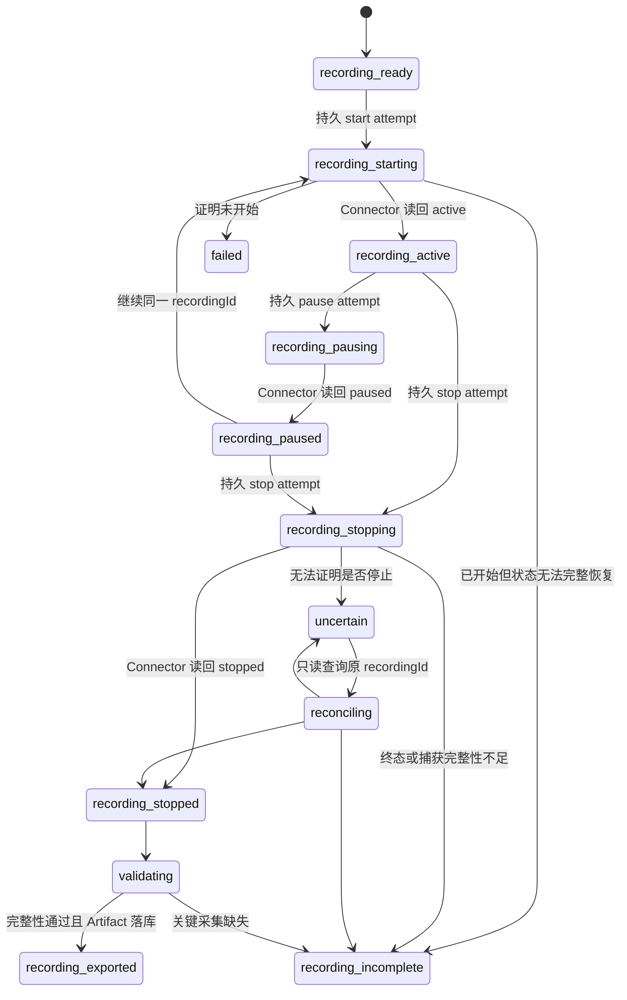

# Feature 详细设计：录制

状态：Product Direction Accepted / Technical Contract Pending  
用户可见名称：录制  
v4 名称：录制操作  
所属范围：首批 Feature / 其他 / 第一开发切片

## 1. 用户目标与用途

用户通过当前 active Connector，对已经登录、已经绑定并属于当前 Engagement/Pack 的 Omnia 页面执行一次受控操作录制，得到带完整性报告的真实录制 Artifact，供合同分析、问题诊断和后续功能验证。

录制是观察和取证能力，不自动授权用户在 Omnia 中执行写操作，也不把录制内容直接变成可执行 Connector Operation。

## 2. 首批范围

包含：

- 开始、暂停、继续、停止；
- 当前真实状态和跨重启恢复；
- Session/Engagement/页面白名单绑定；
- 沿用 v4 的详细采集深度：记录 capture policy 允许的请求/响应、事件、segment、时序与必要正文，不降级为只有操作名称的摘要；
- 完整性、范围和脱敏检查；
- 完整录制导出；
- 不完整录制的受限诊断恢复；
- Artifact/Evidence 持久化；
- local/remote Transport 等价。

暂不包含：

- 自动生成并发布可执行 Connector Operation；
- 从单份录制自动推断通用业务合同；
- 在 Agent 中回放用户操作；
- 录制非 Omnia 页面、其他 Engagement、邮件或聊天工具；
- 无容量门禁、引用检查和用户显式清理能力的无限制录制；
- 未验证的 Nova/AI 自动分析链路。

## 3. v4 经验的处理

### 保留

- 必须使用已绑定的现有 Omnia 页面，不自行新开或猜测标签页；
- 仅限当前 Engagement 和 HTTPS 白名单；
- 开始前检查没有其他任务占用 Connector 安全锁；
- pause 不关闭页面，关闭悬浮控件不等于 stop；
- 完整与不完整录制使用不同终态和交付语义；
- Cookie、Authorization、headers、密码和 Token 不进入导出；
- 录制 ID、Session、Connector 和 Engagement 在整个生命周期冻结；
- start/stop attempt 发送前持久化，响应丢失后只读查询，不自动重放；
- 原始录制不进入 Git、公开服务或未经批准的模型。
- 详细采集不意味着采集凭据；Secret 必须在 Connector 源头、进入 Artifact 分块前剔除。

### 重构

- v4 仅 Online 可用的宿主限制改为统一 ConnectorTransport；
- 录制编排从巨型 server/Gateway 分支拆为独立 Feature Worker 和小型 Operation；
- Artifact、Evidence、保留和恢复进入统一后台；
- Remote Bridge 只中继加密命令/事件/Artifact，不理解录制业务。

### 已确认的 v4 证据基线

录制 Feature 不要求用户另行准备专用 Pack。v5 以 v4 当前 Recorder 源码、Handoff、完整/不完整真实录制和自动化合同测试作为详细采集的行为基线，见 [v4 删除与录制证据基线](../research/V4_DELETE_RECORDING_EVIDENCE_BASELINE.md)与 [ADR-0030](../adr/0030-v4-evidence-seeded-recertification.md)。

可直接作为候选合同和测试语料的 v4 能力包括：

- 已绑定 target/Engagement 限定，不为录制新开页面；
- 开始、暂停、继续、停止与同一 `recordingId`；
- segment、Network/交互事件、JSON/form 请求体和 JSON 响应体；
- 关键正文捕获、停止排空、遗漏原因与完整/不完整终态；
- popup/frame 范围、目标漂移、登录/Session 异常；
- Secret/认证字段剔除、导出门禁和不完整诊断恢复。

代表性真实完整录制已经证明 `stopped`、`integrity.complete=true`、`1,833` events、`532` network requests、`0` dropped 和关键响应 `4/4`；同时也有真实不完整录制证明缺失项必须显式报告。数字只说明 v4 证据完整度，不是 v5 的固定容量或成功阈值。

v5 不整块搬迁 v4 Recorder，也不把历史 host/path/body 字段自动永久放行。先以这些证据建立 synthetic fixture、等价合同和候选 capture policy，再在届时已有的非生产页面流程做一次当前 allowlist、完整性和脱敏复核；无需固定为某个 Pack。

## 4. 四 Plane 责任

| Plane | 责任 | 禁止 |
|---|---|---|
| Delivery | 展示绑定目标、真实状态、控制动作、完整性和导出 | 在浏览器内采集、伪造计数、把不完整文件标为成功 |
| Execution | 编排 RecordingRun、解释完整性报告、生成受控摘要 | 保存 Secret、直接控制 CDP、绕过 Connector |
| Control & Data | 持久 Run/attempt/event/Artifact/Evidence，恢复、保留、权限 | 仅在内存维护 active recording |
| Integration | 绑定真实 Omnia target、采集、脱敏、流式回传、查询状态 | 录制外部页面、跨 Engagement、保存凭据 |

## 5. 真实依赖

- active Transport 已健康且只有一个 active lease；
- Connector 身份、签名版本和 recording capability 有效；
- 当前会话唯一绑定一个已存在的 Omnia 页面和 Engagement/Pack；
- 页面仍登录且在允许域名/路径内；
- Connector 安全锁没有被冲突 mutation/recording 占用；
- Artifact Store 可用且有足够配额；
- 当前用户具备录制和导出权限；
- 数据位于当前实例稳定 `data` 根；默认不按年龄自动删除，用户显式清理且引用/活动状态检查可判定。

缺少任何依赖时，开始按钮禁用并显示后台原因。

## 6. 状态机

状态名称是 Feature 合同，不替代公共 Run 状态；后台同时维护公共 Run 投影。`recording_exported` 才允许把文件描述为完整录制。

## 7. 身份与防重放

RecordingSession 冻结：

- recordingId；
- connectorId/device identity；
- transport lease ID/generation；
- Omnia Session/target ID；
- Engagement/Pack 不可变 ID；
- Feature/Operation/contract version；
- start/pause/stop attempt ID 和序列；
- capture policy digest；
- createdAt/deadline。

每个控制动作先持久化 attempt，再由 Gate 发送。若请求或响应丢失，系统查询同一 recordingId 的真实状态；不得生成新 recordingId 或自动再次发送 stop 来“碰碰运气”。

## 8. 捕获与脱敏

Connector 在源头拒绝：

- Cookie、Authorization、认证 header、密码、Token、私钥；
- 非白名单 host/path；
- 其他 Engagement/未绑定 target；
- 浏览器扩展页、本地文件、邮件和聊天页面；
- 超出 capture policy 的请求/响应类型。

“详细抓取”使用正向 Schema 白名单，不只依赖 Secret 名称黑名单。每个 capture policy 必须冻结：

- host、path pattern、method、content-type、事件类型；
- URL query、request body、response body、WebSocket/二进制内容分别允许的字段/结构；
- 每个字段的 `capture|redact|hash_only|drop` 规则和最大正文大小；
- 每 Run 的 maxDuration、maxBytes、maxEvents、maxRequestBodyBytes、maxResponseBodyBytes；
- 导出角色、内容分类和 policy digest。

Connector 在任何磁盘、临时文件、Bridge 分块或普通 Event 之前先生成净化后的捕获对象；原始凭据/禁止字段不得“先落盘再脱敏”。后台接收后执行第二层 Secret/敏感信息扫描，扫描失败或出现未声明字段时进入 quarantine，不能标记完整、不能普通导出。

业务请求体和响应体即使通过凭据剔除，仍可能含客户名称、对象 ID、人员信息和描述，应作为敏感 Artifact。后台只为 UI 生成必要的脱敏摘要；原始正文不进入日志、Event 或 AI 请求。

完整性报告至少记录计划捕获/已捕获关键响应、缺失项、segment、异常、范围违规、脱敏版本和 digest。

录制 Artifact 默认保留在稳定 `data` 根，程序更新/回滚不得覆盖。录制正文使用实例 DEK 静态保护，DEK 由 Windows Secret Store 包装；复制目录不能直接读取，跨设备使用受控导出。当前没有按年龄自动清理；用户显式清理时必须检查活动录制、Run/Evidence/诊断引用并报告未能物理删除的内容。低磁盘或任一 capture budget 达限时停止/受控结束当前录制并报告 partial/incomplete，不静默截断为完整，也不删除既有 Artifact。

## 9. Local/Remote

- Feature、Run、状态、权限和 Connector Operation 合同完全相同；
- local 直接到本机 Connector；remote 经 Bridge 到远端 Connector；
- Bridge 不解包或解释录制正文，具体 E2E 与大文件续传待 Bridge 技术 ADR；
- remote 断线不切回 local，也不新建录制；
- active/paused/stopping/uncertain 录制阻断 Transport 切换和影响其归属的聊天删除；
- 恢复必须找到原 Connector、原 recordingId 和原 Engagement。

## 10. Artifact 与交付

| 产物 | 交付规则 |
|---|---|
| 完整录制 | 完整性通过后生成不可变 Artifact，可按权限导出 |
| 不完整恢复文件 | 仅用于受控诊断，显著标注 incomplete，不作为完整合同证据 |
| 完整性报告 | 与录制绑定、不可变、包含 digest 和缺失项 |
| UI 摘要 | 从后台 Artifact/Evidence 投影，不含原始敏感正文 |
| 候选合同 | 不属于首批录制 Feature；未来单独 Feature/步骤评审 |

关闭录制控件不能停止后台录制。应用退出、更新、聊天清理或 Connector 解除配对前，必须查询并安全终止或保留恢复 tombstone。

导出前重新执行 digest、完整性、内容分类、授权角色和二层扫描。Crash dump、诊断包、普通日志和 AI 输入永久排除录制正文。

## 11. 验收门槛

- [ ] 只能录制当前绑定的一个 Omnia target 和 Engagement。
- [ ] 多标签、目标漂移、页面关闭和登录失效均失败关闭。
- [ ] local/remote 使用同一合同，remote 中断不静默 fallback。
- [ ] start/pause/continue/stop 跨重启保持原 recordingId 和 attempt。
- [ ] 响应丢失后不自动重放控制 mutation。
- [ ] 凭据、Cookie、认证 header 和 Secret 不进入 Artifact、日志或 UI。
- [ ] host/path/method/content-type/body-field Schema 白名单和每 Run 硬预算均冻结；URL/WebSocket/二进制负面样本通过。
- [ ] 源头净化发生在任何落盘/Bridge 分块之前；后台二层扫描失败进入 quarantine。
- [ ] 录制正文静态保护、受控导出和真实清理器均通过，复制便携根不能直接读取正文。
- [ ] 详细请求/响应/事件采集与 v4 目标等价，并有 segment、计数、缺失项和 digest 完整性证明。
- [ ] 不完整录制不会出现“成功”或普通下载入口。
- [ ] Artifact 摘要、事件数和完整性均来自真实 Connector 结果。
- [ ] active/uncertain 录制正确阻断 Transport 切换、聊天删除和解除配对。
- [ ] Feature Worker 崩溃不丢失录制归属，且不影响另外三个首批 Feature。

## 12. 开发中与候选前 Conformance 复核

录制仍是第一个用户可见业务 Feature，顺序不变。以下 conformance 项随对应实现并行测试，最迟在候选/相关 capability 开放前完成；它们不构成开始开发、生成 `.ofp` 或安装到便携测试根的统一前置门槛，也不要求 Windows 强隔离认证：

- IPC 背压、Worker crash、lease/checkpoint 和 Shell 重启；
- Artifact 分块、digest、断点、磁盘满、finalize 与引用恢复；
- LocalTransport 与 RemoteBridgeTransport 的同合同测试，包含断线、重复/乱序、TTL 和大文件；
- Connector capture source allowlist、凭据剔除和越权目标拒绝；
- Worker/UI sandbox、资源回收和 Bridge 消息边界。

kit 只使用人工构造 fixture 并产出测试 Evidence；不注册录制菜单，不创建“已安装录制”状态，不用测试中继宣称 Remote 产品可用。任一边界失败时先回填对应 ADR，不在 Core 加录制专用分支。

## 13. 尚待冻结

- Remote Bridge 的 E2E、大文件续传和 TTL；
- Artifact 配额、最大录制时长/大小和低磁盘阈值；默认无按年龄自动删除；
- capture policy 的精确 host/path/body allowlist；以 v4 完整录制和当前源码为候选基线，在首次现有非生产页面复核后冻结，不要求专用 Pack；
- 不完整恢复文件的访问角色和用户显式清理语义；
- v4 recording Operation 的兼容/重写边界。
