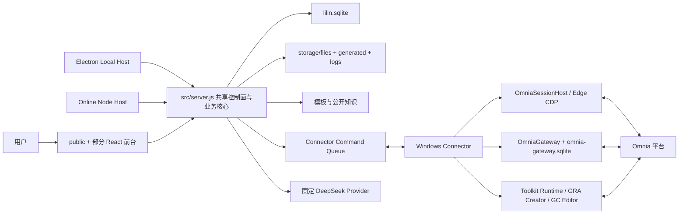
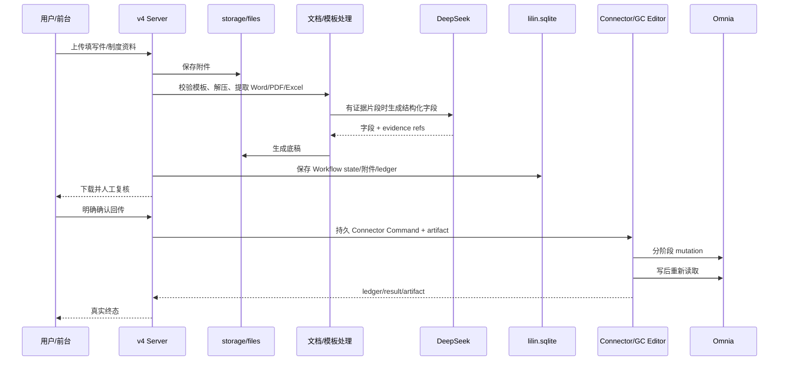

# Omnia Agent v4 全面审计

> 审计对象：`D:\Codex\Projects\工作\omnia-agent-v4`  
> 审计日期：2026-07-30（Asia/Shanghai）  
> 审计性质：只读源码、配置、文档与测试核验；未修改、启动或部署 v4，未访问 Omnia，未执行任何业务读写。  
> v4 审计基线：Git `d44198a23e7a6b305e176313eca3394b18ced084`，分支 `agent/document-connector-transport-plan`，工作树在审计前后均为 clean。  
> 证据写法：除非另有说明，路径均相对 v4 根目录；`路径:行号` 指当前审计基线。生产环境状态只引用交接记录，不视为本次在线复验。

## 0. 执行摘要

Omnia Agent v4 不是一个简单聊天 Agent，而是一套已经形成真实闭环的 IT 审计自动化工作台：它包含在线与 Windows Local 两种宿主、Web/Electron 前台、Node 控制面、SQLite 与文件存储、Agent/Capability/Workflow/Connector 多层运行状态机、Windows Connector、Edge/CDP 会话、Omnia Gateway、Excel/PDF/Word/图片处理、Phase 1/Phase 2/Controls、EMS 快照分析、安全删除、录制、MCP 和签名发布体系。

v4 最值得保留的不是现有物理结构，而是其经过事故修复沉淀出的安全不变量：精确的 Room/Connector/Engagement/Run 归属、实时预检、不可变计划、显式确认、幂等键、并发令牌、写后双向读回、`uncertain` 禁止自动重试、持久化状态、重启对账、工作区安全锁、附件边界、秘密不出 Connector、签名与单调升级序列。这些不变量必须成为 v5 的跨模块协议和验收门禁，而不能只留在提示词或某个实现文件中。

但 v4 的“模块化”尚未达到 v5 所需的独立升级与部署隔离：

- `src/server.js` 为 21,259 行，仍同时承担 HTTP 路由、依赖组装、文件/知识处理、多个工作流、状态恢复、日志、模板定位和大量业务实现；`public/app.js` 也有 5,818 行。
- Connector 不是纯 gate。`connector/src/omnia-gateway.js` 为 8,009 行，`connector/src/toolkit-runtime.js` 为 2,369 行，后者通过长 `command.kind` 分支直接认识录制、关系、各类删除、Domain Read 等具体业务；`toolkit-runtime.js:106-371`。
- `src/omnia-agent/modules/registry.js` 的模块注册主要提供元数据、提示词与 capability 归属；所有模块共用 `prompts/core.md`，仍在同一进程、同一发布物、同一数据库中运行。它不是进程隔离、数据隔离或独立部署单元；`src/omnia-agent/modules/registry.js:4-105`、`src/server.js:602`、`src/server.js:3588-4026`。
- v4 文档已经规划 Remote/Local 共用一个 Connector Transport 合同，但代码中还没有该抽象。Local 现实是 Electron 自动生成本地令牌、启动本地服务、生成配对码并强制启动随包 Connector；远程现实是在线控制面保存设备、命令与结果。规划见 `README.md:11-36`、`handoff.md:9-17`，现实见 `apps/desktop/electron/main.cjs:225-299`、`apps/desktop/electron/main.cjs:316-353`、`apps/desktop/electron/main.cjs:458-488`、`src/connector-service.js:75-92`。
- AI Provider 被服务端固定为 DeepSeek：URL 为 `https://api.deepseek.com`，模型为 `deepseek-v4-flash`；设置页和 API 只接受 API Key，明确拒绝用户选择 Base URL/模型；`src/ai-provider.js:1-10`、`src/server.js:1420-1430`、`src/db.js:2561-2569`、`public/app.js:3910-3937`、`tests/managed-ai-config.test.js:22-38`。
- v4 只有一个主 SQLite `data/lilin.sqlite` 承担产品、任务、聊天、运行、Connector 控制面、设置与 EMS 大 JSON；Connector 另有本机 `omnia-gateway.sqlite` 存 endpoint contract 和 semantic snapshot。后台业务数据库没有按功能模块隔离；`src/db.js:18-31`、`src/db.js:138-475`、`src/domains/omnia-ems/ems-service.js:10-16`、`connector/src/toolkit-runtime.js:878-885`、`connector/src/omnia-gateway.js:93-124`。

因此，v5 不应把 v4 目录重新命名为“前台/中台/后台/connector”。正确方向是保留业务合同与安全状态机，重新定义模块边界、统一 Feature Package 合同、独立 worker/数据所有权和稳定 Connector Gate，再按可验证的 strangler 路线逐能力迁移。

## 1. 审计范围与验证方法

### 1.1 阅读和交叉核验范围

重点核验了：

- 权威/交接文档：`handoff.md`、`README.md`、`Omnia-Agent-开发交接说明.txt`、`connector/README.md`、`docs/`。
- 入口与部署：`package.json`、`docker-compose.yml`、`Dockerfile`、`.env.example`、`apps/online/`、`apps/desktop/`、`ops/`、`scripts/`。
- 前端：`public/index.html`、`public/app.js`、`public/modules/`、`web/app-shell/`、`web/omnia-workflow/`、`web/omnia-workspace-tools/`。
- 控制面和业务：`src/server.js`、`src/db.js`、`src/agents/`、`src/capabilities/`、`src/domains/`、`src/omnia-*`。
- Connector/MCP/Toolkit：`connector/src/`、`connector/compatibility-*`、`mcp/`、`toolkit/tools/`。
- 测试：`tests/` 的目录、关键合同和全量执行结果。

### 1.2 实际验证结果

- v4 共有 135 个 `*.test.js` 文件。
- 运行 `node --test --test-reporter=tap`：`1109` tests，`1109` pass，`0` fail，耗时约 93.8 秒。
- 测试后 `git status --porcelain=v1 -uall` 仍为空，未污染 v4。
- 需要校准测试数字的含义：静态盘点发现 71 个测试文件直接读取源码文本，105 个测试文件包含 `assert.match`/`assert.doesNotMatch`。这类“源码形状合同”对防回归有价值，但不能等同于独立进程、真实浏览器、真实数据库迁移或真实 Omnia E2E。典型例子见 `tests/local-bundled-connector.test.js:11-75`、`tests/managed-ai-config.test.js:22-38`、`tests/omnia-module-architecture.test.js:33-48`、`tests/deployment-stability-governance.test.js:13-51`。

### 1.3 本次没有验证的内容

- 未连接公司电脑 Connector，未验证当前生产 Agent/Connector 版本、在线状态和 Omnia 合同。
- 未执行 `npm run check`，因为该命令会重建并可能改写 v4 的受跟踪 Web 产物；本次任务要求只读 v4。
- 未重建 Local ZIP、Connector 签名包或 Docker 镜像。
- 未验证交接文档中生产服务器路径、备份哈希和真实 canary；这些只作为历史经验，不作为当前在线事实。

## 2. 产品定位与真实功能清单

### 2.1 产品定位

当前源码将 v4 定位为“online-first、共享核心、暂停/次要 Electron 宿主”；`package.json:2-5`。README 则描述为“一套共享代码、两个运行外壳”，并强调在线优先发布、Local 额外打包；`README.md:3-9`、`README.md:328-366`。

真实产品更准确的定位是：

1. 前台接收聊天、文件、确认和工作流操作。
2. 控制面保存 Room、消息、附件、工作流、Agent/Capability/Connector Run 和设置。
3. 业务层在服务端进行 Excel/资料处理、AI 调用和编排。
4. 所有真实 Omnia 会话和业务 API 访问最终由 Windows Connector 所在工作站执行。

### 2.2 用户可见的真实入口

当前前台不是 v5 设想的“第二列固定功能树”，而是：

- 第一列窄 rail：品牌与设置；`public/index.html:22-31`。
- 第二列 Agent/Room 列表：顶部存在“+ 添加 Agent”及 profile 选择器；`public/index.html:33-55`、`public/app.js:741-863`。
- 每个 Omnia Room 通过工具箱图标打开三级弹出菜单；`web/app-shell/shell.tsx:29-44`、`public/index.html:56-163`。
- ITGC → IT 元素 → 新建与关联；ITGC → 控制 → 底稿编制。
- 其他 → 工作区备份、安全删除、删除聊天、删除 Agent、操作录制。
- ITGC beta → 批量创建。
- EMS → 当前/历史 Pack。
- 设置页包含 AI、Connector、EMS、能力模块、提示词模块、日志、系统；员工、群聊、通用知识/能力等旧页签仍生成但设为 hidden；`web/app-shell/shell.tsx:203-217`。

因此，v5 的“删除 + Agent、把第二列改为一级/二级/三级功能列表”不是小样式调整，而是导航信息架构、Room 模型和相关 API 的产品收敛。

### 2.3 真实业务能力

| 能力 | 真实实现与证据 | 当前边界 |
|---|---|---|
| Omnia 会话/Pack 连接 | SessionHost 打开/复用 Edge/CDP；Connector 回传连接与 Engagement；`connector/src/toolkit-runtime.js:117-199`、`src/db.js:1561-1624` | 凭据留在工作站；必须绑定 Room/Connector/Engagement |
| 通用 Agent/Capability Runtime | 有界 plan-act-observe-verify，持久化 Agent Run/Memory，显式确认；`src/agents/runtime.js:15-224`、`src/capabilities/runtime.js:8-82` | 专用 Omnia 旧路径仍优先，架构并未完全统一；`docs/agent-runtime.md:3-26` |
| Phase 1 IT Element/GRA | 官方系统信息模板、Excel 静态合同、实时工作区/对象校验、用户确认、Creator 执行、状态/恢复；`src/omnia-phase1.js`、`src/omnia-phase1-validation.js`、`docs/PHASE1_UPLOAD_VALIDATION_FLOW.md` | 强依赖 v4 服务端与 Connector/Creator 特定状态 |
| Phase 2 底稿编制 | 选择 APP、生成冻结填写件、上传填写件/制度资料、Word/PDF/Excel/ZIP 提取、AI 辅助、生成底稿；`src/omnia-phase2-design.js:47-149`、`src/server.js:7715-9008` | 单功能逻辑跨多个大文件，不可独立部署 |
| Controls 回传 | GC Editor 生成计划、按字段/阶段写入、终态 ledger、重新导出验证；`src/omnia-controls.js`、`toolkit/tools/gc-editor/src/` | Connector 与 Toolkit 均认识业务细节 |
| 工作区备份 | 从实时 Connector 数据生成 Excel 附件；`src/server.js:2405-2465`、`src/omnia-it-audit-backup.js` | 在线/Local 均走共享服务和 Connector |
| 安全删除 | 工作区/全局安全锁、冻结计划、逐项预检、有限并发、checkpoint、取消/终止、写后验证；`src/server.js:1452-2531`、`src/omnia-workspace-deletion.js`、`connector/src/omnia-gateway.js` | 业务规则严重分布在 server、gateway、toolkit-runtime 和前端 |
| EMS | 用户触发同步、Pack 快照、最多 5 个内容版本、APP 草稿/回传；`src/domains/omnia-ems/ems-service.js:6-35`、`:119-180`、`:770-844` | 快照和历史作为 JSON 存 settings KV；没有专用表 |
| IT 审计关系图/完整性/影响/证据 | 确定性读取 EMS 持久快照，不自动同步、不写 Omnia；`src/domains/omnia-it-audit-graph/graph.js:9-220`、`docs/it-audit-*.md`、`docs/omnia-it-audit-test-evidence-assistant.md` | 多数是 API/Capability，文档明确“不新增普通前端入口” |
| 安全写编排器 | 关系计划、确认 token 摘要、幂等键、执行前再预检、双向验证、`uncertain`；`src/domains/omnia-safe-write/safe-write-service.js:3-180` | 计划同样存 settings KV；当前只开放少量已验证关系 |
| 操作录制 | SessionHost/Recorder 记录经过白名单和 Engagement 校验的浏览器/API 事件，完整性不满足则拒绝普通导出；`connector/src/toolkit-runtime.js:201-257`、`connector/src/omnia-recorder.js` | README 说 Local 未开放；在线经远端 Connector |
| MCP | 同机 Connector 设备凭据或临时最小授权，只开放硬编码只读 capability；`src/server.js:3192-3304`、`mcp/server.mjs`、`docs/codex-mcp.md` | 不是第二个 Agent/SQLite owner |
| AI/知识处理 | DeepSeek Chat Completions；公开项目知识 JSON、可选许可 SQLite、用户附件知识入库、Word/PDF/Excel/图片提取；`src/server.js:19453-19672`、`src/domains/knowledge/` | Provider 固定；许可库缺失 fail closed |
| Local 启动/恢复 | 随机 256-bit token、随机端口、loopback、自动配对/启动随包 Connector、新鲜心跳、有限重启；`apps/desktop/electron/main.cjs:95-140`、`:225-299`、`:316-488` | 只有本地随包模式，没有用户可选 Remote Transport |
| 签名发布 | Agent commit/manifest/hash 门禁；Connector Ed25519、单调 sequence、Supervisor probation、Capability Pack；`scripts/package-agent-release.mjs:20-79`、`connector/README.md:19-39`、`docs/omnia-v3-architecture.md:37-53` | Local 明确禁用 Connector 热更新，只允许完整便携包 |

### 2.4 仍存在但不应迁入 v5 产品面的旧能力

数据库和服务端仍保留 IC、PBC、数据处理、邮件、执行人、复核人、开发者等旧 Employee，通用 Group Room、Task、Knowledge、Prompt 和可编辑 Capability；`src/db.js:79-135`、`src/db.js:247-417`。

Standalone bootstrap 只投影 Omnia Employee/Room；`src/server.js:3441-3470`。但通用 `/api/employees`、`/api/rooms`、`/api/knowledge`、`/api/prompts`、`/api/capabilities` 路由仍存在；`src/server.js:2604-3088`。在 online 无用户认证模式下，这些不是可靠的安全隐藏。v5 应明确删除、隔离为管理面或迁移数据，不能继续靠 `hidden` 和 bootstrap 过滤维持产品边界。

## 3. 当前总体、运行时与部署架构

### 3.1 当前物理架构



关键事实：

- Online 入口只是设置环境后导入共享 server；`apps/online/main.js`。
- Local service 同样导入 `src/server.js`；`apps/desktop/service.js:4-13`。
- 前台、控制面、文档处理、编排和后台数据并未物理分层。
- Connector 有自己的进程/数据目录和本机 Gateway SQLite，这是有效的凭据边界，但业务代码远超 gate。

### 3.2 当前运行时状态链

典型工作流动作的持久关联为：

```text
Workflow Run
  -> Agent Run（可选）
  -> Capability Run（可选）
  -> Connector Command
  -> Connector 本机执行
  -> progress / result / artifact
  -> 服务端状态与附件
  -> 前端重新读取真实状态
```

证据：

- Workflow Run 具有幂等键、唯一活动 Room 索引、超时、`submitted` 和终态事件；`src/db.js:360-386`、`src/db.js:451-455`、`src/domains/omnia-workflows/workflow-run-store.js:9-13`、`:69-170`。
- Action Service 在重启时将活动 Run 标为 interrupted/timed_out，并取消关联 Connector Command；`src/domains/omnia-workflows/action-service.js:59-96`。
- Agent/Capability 状态转换使用事务；`src/domains/agent-runs/run-service.js:43-76`、`src/domains/capability-runs/run-store.js:24-63`。
- Connector Command 保存 `workflow_run_id`、`agent_run_id`、`capability_run_id`、deadline、progress、result 和附件；`src/domains/connector-commands/command-service.js:23-95`。

这条可追溯链是 v4 的核心优点，应迁为 v5 的统一 Run Envelope，而不是继续维护四套相似状态机和外键。

### 3.3 在线部署

- Node 24 slim 镜像，非 root 用户运行；`Dockerfile:1-19`。
- Docker Compose 挂载 `data`、`storage` 和只读 Connector 下载目录，loopback 映射 `3090:3077`，带 healthcheck、PID limit、no-new-privileges 和日志限制；`docker-compose.yml:1-40`。
- Caddy 反代，部署脚本使用不可变版本/commit 镜像、drain、活动 mutation/upload 检查和回滚；`ops/deploy_remote.sh:11-45`、`:137-234`。
- Agent 发布包要求受跟踪源码等于 HEAD，生成逐文件 SHA-256 manifest，并复验归档成员；`scripts/package-agent-release.mjs:20-79`、`:112-156`。

### 3.4 Local 部署

- Electron 数据写入 `app.getPath('userData')/data|storage|connector`；`apps/desktop/electron/main.cjs:175-186`、`:316-330`。
- 共享前端仍通过本机 HTTP；Electron 使用 webRequest 添加启动 token；`apps/desktop/electron/main.cjs:316-369`。
- Local 固定启动随包 Connector，等待 `localBundledMode=true`、`updatePolicy=full_portable_package_only` 和本次启动后的新鲜心跳；`apps/desktop/electron/main.cjs:245-261`。
- Local Connector 更新在 UI、服务端和 Connector CLI/进程层禁用；`src/server.js:1348-1355`、`connector/src/index.js:214-217`、`:688-700`。

## 4. 模块审计

### 4.1 前端

优点：

- 已将 Room、聊天、连接/设置外壳和工作流工作台逐步迁到 React + TypeScript；`web/app-shell/shell.tsx`、`web/omnia-workflow/workbench.tsx`。
- 前端动作合同（标签、危险性、输入、可取消、重试）可由后端返回，减少权限/动作表重复；`src/domains/omnia-workflows/workflow-contract.js:40-71`、`:170-187`。
- 多个 UI 流程会在操作后重新读取服务端状态，不只依赖本地布尔值。

问题：

- `public/app.js` 仍是 5,818 行全局状态与 DOM 命令中心；React 是局部挂载，不是统一应用边界。
- `public/styles.css` 约 12,070 行，多个独立窗口和旧 DOM/React 共享全局样式，修改影响面难以证明。
- 第二列仍是 Room 列表，功能藏在每个 Room 的浮层菜单；`public/index.html:33-163`。
- “+ Agent”前后端均真实存在，不只是视觉元素；删除它需要同时处理创建/删除 Room API、profile、历史数据和 Local 默认 Room；`public/app.js:844-947`、`src/server.js:2705-2903`。
- 设置页把旧模块设为 hidden，但对应路由仍存在。UI 隐藏没有形成安全边界。

对 v5 的约束：

- 前台只负责交付、上传、选择功能、展示真实状态和确认；不得导入 Excel/PDF/AI 处理库。
- 建立服务端驱动、最大三级且允许二级/三级 Feature 叶子的 `Feature Navigation Manifest`，第二列固定渲染功能树；只有模块处于 `installed + healthy + authorized` 才可点击。该深度规则已由 ADR-0020 收敛。
- 删除 Agent profile/Room 创建产品概念；如果对话上下文仍需要 Room，应把它降为后台 Session，而非用户可创建的 Agent。
- 使用一个前端状态/路由体系，禁止继续扩大 `public/app.js` 式全局脚本。

### 4.2 服务端与任务编排

优点：

- 已抽出 tasks、workflow runs、capability runs、agent runs、connector commands 等领域层。
- 多数状态迁移有白名单、事务、幂等键和重启恢复。
- 不把父工作流的一次确认扩张为敏感子 capability 的 blanket approval；`src/capabilities/runtime.js:25-29`、`:60-78`。

问题：

- `src/server.js` 仍是 composition root、router、workflow implementation、file processor、AI gateway、recovery daemon 和 logger 的混合体。
- 多类任务各自有状态表/状态枚举/恢复逻辑，缺少统一 Run 协议；某些运行状态仍在进程内 Map，例如连接、租约、Phase 2、Controls、EMS job；`src/server.js:554-566`、`:8203-8205`、`:9687-9690`、`src/domains/omnia-ems/ems-service.js:33-35`。
- 进程内状态与 settings KV 补偿恢复的组合难以支持模块独立升级和多 worker。
- 所有功能作为静态 import 在服务启动时加载；功能部署必然重启/替换整个 Agent。

对 v5 的约束：

- 建立统一 `Run`、`Step`、`Event`、`Artifact`、`Checkpoint`、`Lease`、`Confirmation`、`MutationEvidence` 协议。
- 中台每个功能是独立 Feature Worker/进程，使用相同 SDK 和状态协议；一个功能部署、崩溃、限流不得阻塞其他功能。
- API Gateway/Orchestrator 只做鉴权、功能发现、Run 生命周期和消息路由，不含 Phase 1/Phase 2/删除业务。
- 所有可恢复状态必须落库；内存 Map 只能是缓存/本进程 lease 投影。

### 4.3 数据存储与后台

当前主库：

- `node:sqlite` 同步 `DatabaseSync`，WAL、`foreign_keys=ON`、`synchronous=FULL`、250ms busy timeout；`src/db.js:18-31`。
- 单库包含 employees、rooms、messages、attachments、tasks、knowledge、prompts、settings、AI usage、capability/workflow/agent runs；Connector devices/commands、MCP grants 也创建在同一库；`src/db.js:138-475`、`src/connector-service.js:44-72`、`src/domains/connector-commands/command-service.js:23-95`、`src/mcp-grants.js:9-22`。
- 附件元数据在 SQLite，二进制文件位于 `storage/files`；`src/db.js:186-207`、`:1755-1789`。
- 大量工作流状态、EMS 快照/历史、安全写计划使用 settings KV JSON。EMS 最多保留当前 + 4 个历史内容版本；`src/domains/omnia-ems/ems-service.js:10-16`、`:770-844`。

优点：

- SQLite 事务和 WAL 对单机 Local 很合适。
- 主业务数据与安装目录分离。
- 秘密迁移、敏感历史清洗和外键约束已有实践；`src/db.js:478-507`、`:510-599`。

问题：

- “一个 settings 表保存多领域大型 JSON”没有 schema 查询、外键、局部更新、独立保留策略和模块配额。
- 交接记录中的生产 SQLite 已增长到数百 MB 甚至约 964 MB，这与 EMS/命令/快照存储方式一致，但本次未在线核实具体构成；`handoff.md:19-28`。
- 同步 SQLite API 运行在 HTTP 主线程，重型查询、迁移或 JSON 序列化可拖慢所有模块。
- 迁移以 `ensureColumn` 和启动期函数序列为主，没有显式全局 schema version/可逆迁移目录；`src/db.js:460-507`、`:2492-2496`。
- v4 的后台并非用户设想的独立数据/模板服务；模板定位、生成和工作流仍在 `src/server.js`。

对 v5 的约束：

- 后台作为独立服务拥有业务数据库、模板注册表、文档/Artifact Store 和数据转换 API。
- 控制面元数据与功能业务数据分库或至少分 schema/owner；每个 Feature 只能访问自己的 repository 接口。
- EMS Snapshot、Run、Artifact、Template、TemplateVersion、Evidence 使用专用表；禁止把大型业务状态继续塞入通用 KV。
- 从第一天采用版本化、前向可恢复、可 dry-run 的迁移框架，并为 v4 数据建立显式导入器。
- 模板是不可变版本化资产：`template_id + scenario + version + semantic_digest + file_digest + compatibility`。

### 4.4 模板与文档处理

优点：

- 已存在真实模板资产：Phase 1 系统信息、两份风险控制参考、Phase 2、Go 演示；`source_file/`。
- Phase 1 官方模板有固定 SHA、表头、必填和验证测试；`tests/omnia-phase1-official-template.test.js:15-47`。
- Phase 2 使用 semantic digest，包含公式语义而非只比文件字节；`tests/omnia-phase2-template-contract.test.js:16-90`、`src/domains/omnia/phase2/template-contract.js`。
- 文档提取覆盖 Excel、DOCX、PDF、ZIP 和图片，并有大小/字符/片段上限；`src/server.js:10-14`、`:443-448`、`:19453-19672`。

问题：

- 文档处理直接在主服务进程执行；恶意/超大/复杂文件会影响全体功能。
- 模板选择仍由路径扫描和多个 legacy filename fallback 实现；`src/server.js:460-479`、`:21049-21067`。
- `Dockerfile` 直接复制整个 `source_file`，与 Local 打包脚本的精确 allowlist 策略不完全一致；`Dockerfile:10-14`、`apps/desktop/scripts/package-portable.ps1:157-170`。
- v4 尚没有统一的“极端默认模板直传 / 普通场景最小差异 patch”后台协议。Phase 2 已接近该思想：没有制度或资料时保留未知字段为空并仍生成可核对底稿，但这不是跨场景统一模板引擎；`handoff.md:45-54`。

对 v5 的约束：

- 上传只落入隔离的 intake/quarantine；前台不得解析。
- 文档解析器以受限 worker 运行，设 CPU/内存/时间/解压比/文件数上限，产出规范化 Document Model。
- 每个场景先选择默认模板并生成 `TemplateInstance`；处理模块只提交声明式 Patch/Diff，后台负责验证、应用和生成。
- 零有效输入时允许直接返回已审核默认模板，但必须记录 `template_version`、`input_assessment=all_default` 和 `modifications=[]`，不能伪装为 AI 处理成果。
- 普通场景只修改确有证据支持的字段；每个 patch 带 source reference、reason、validator 和 before/after。

### 4.5 AI Provider

当前现实：

- Provider URL/模型在代码中固定为 DeepSeek；`src/ai-provider.js:1-10`。
- 保存配置时调用 `managedAiProviderConfig` 覆盖用户输入；`src/db.js:2561-2569`。
- `/api/ai-config` 只读取 `body.api_key`；`src/server.js:1420-1430`。
- 设置页只显示 password API Key；`public/app.js:3910-3937`。
- 普通配置 API 不返回 provider URL、模型或 key；`src/server.js:20761-20777`。
- Online key 用 AES-256-GCM，Local 用 DPAPI CurrentUser；`src/security/secret-store.js:5-28`、`:31-92`。

优点：

- 减少浏览器控制任意 endpoint 的 SSRF/数据外发风险。
- 密钥不回显、按宿主加密，错误日志做类别化。
- AI usage 有独立事件表；`src/db.js:311-320`、`:1959-1970`。

问题：

- 与 v5“DeepSeek 或 Nova/其他模型可选”的明确产品需求冲突。
- Provider、模型、能力、价格/上下文/结构化输出兼容性没有抽象。
- 多处业务函数直接组装 Chat Completions payload 和调用 `postJson`，切换 provider 会散落修改；例如 `src/server.js:7652-7662`、`:19294-19295`、`:19820-19821`、`:20102-20170`。

对 v5 的约束：

- 建立 `AIProviderAdapter`：`validateConfig`、`listModels`、`testConnection`、`chat/structuredOutput`、`normalizeUsage`、`classifyError`。
- Provider 插件由受信任 manifest 注册；DeepSeek 可以展示官方连接入口和模型列表，Nova API 作为另一 adapter。
- Base URL 不能完全任意直通。优先使用已登记 provider endpoint；自定义 OpenAI-compatible endpoint 需显式“高级模式”、HTTPS、阻断 loopback/内网/metadata IP、DNS rebinding 防护和用户确认。
- 密钥按 provider/profile 独立加密；API 只返回 `hasSecret` 和脱敏配置。
- Feature 声明所需模型能力，而不是写死模型名。

### 4.6 Connector

值得保留：

- 设备凭据只存哈希，配对码单次/过期，设备可撤销；`src/connector-service.js:39-72`、`:105-172`。
- Omnia Cookie/Authorization 留在工作站，Gateway 只使用安全 header allowlist；`connector/src/omnia-gateway.js:6362-6368`。
- SessionHost 单独拥有浏览器身份，更新后严格核对才能复用。
- 签名、同源 HTTPS、SHA-256、大小、单调 sequence、Supervisor 健康 probation 和回滚是成熟的供应链防护；`docs/omnia-v3-architecture.md:37-45`。
- Artifact 字段和大小有显式合同，结果有双层脱敏；`connector/src/v3-tool-engines.js:5-18`、`connector/src/outbound-sanitizer.js`。

不符合 v5 gate 目标的现实：

- `ToolkitRuntime.execute` 直接认识大量业务命令；`connector/src/toolkit-runtime.js:106-371`。
- Gateway 本身包含关系、Information/Workpaper/GRA/Application/Tool/DB/OS 删除的业务预检、写入与验证，文件达 8,009 行。
- 新增删除种类或 Omnia API 往往要改 Connector、Gateway、runtime、server 和测试，并重新发布 Connector。
- Toolkit 的 GRA Creator/GC Editor 是独立本机进程，但仍由 Connector 的特定代码管理；`connector/src/toolkit-runtime.js:374-430`。

对 v5 的约束：

- Connector 核心只能拥有：连接/认证、Session、Gate、标准命令信封、模块进程监督、资源配额、Artifact 通道、结果回传、审计与协议协商。
- Connector 核心不得包含 Phase 1、Phase 2、Controls、删除、EMS 等业务名或对象分支。
- Omnia endpoint allowlist 仍应在本机执行，但作为签名 `Connector Capability Module` 数据/代码包加载；模块使用统一 SDK。
- 新功能正常路径只部署中台 Feature + 必要的签名 Connector Capability Module，不修改 Connector Core。只有 Transport/Session/Gate 协议变化才升级 Core。
- 每个模块独立进程、版本、健康、权限、并发池和回滚；模块崩溃不影响 Connector 心跳与其他模块。

### 4.7 Local / Remote Transport

文档规划：

- Remote：开发机共享框架 → 服务器桥接 → Omnia 机器 Connector。
- Local：Electron/Local Service → 本机受保护通道 → 随包 Connector。
- 两者应共用业务状态机、Schema、安全和测试；`README.md:15-36`、`handoff.md:9-17`。

当前现实：

- 没有 `ConnectorTransport` 接口或 Remote/Local adapter 目录。
- 两种模式都复用控制面数据库队列和 HTTP Connector API。
- Local 在启动时自动创建一次性配对码、配对并启动随包 Connector，没有模式选择；`apps/desktop/electron/main.cjs:225-299`、`:458-464`。
- `connectorStatusPayload()` 固定返回 `mode: 'remote'`，即使 Local 再由外层投影 `managedByLocalHost`；`src/connector-service.js:75-92`。
- 用户设置中没有“本地/远程”持久选择。

对 v5 的约束：

- 定义唯一 `ConnectorTransport` 合同：pair/bind、capability negotiation、submit、claim/stream、progress、artifact、cancel、reconcile、health。
- `LocalTransport` 与 `RemoteBridgeTransport` 必须通过同一套合同、安全、掉线、未知结果和负载测试。
- 首次启动默认 `local`；设置切换到 `remote` 后持久化为本机配置，重启沿用。
- 切换必须是状态机：检查活动 Run 为零 → 解除旧 Transport lease → 建立新 Transport → capability/identity 验证 → 原子提交 active mode。不能只隐藏本地 Connector。
- Remote Bridge 只中继最小密文/状态并设 TTL；不得持久保存 Omnia 凭据、AI key 或无限期客户附件。

### 4.8 认证、安全与隐私

优点：

- Local：随机 token、精确 Host/Origin、loopback、API no-store；`src/security/request-security.js:23-37`。
- Online mutation：精确 Origin；`src/security/request-security.js:65-78`。
- CSP、DENY frame、nosniff、referrer/permissions policy；`src/security/request-security.js:11-20`。
- JSON mutation content type 门禁；`src/security/request-security.js:81-84`。
- Connector 独立凭据、常量时间比较；`src/connector-service.js:164-172`、`src/security/request-security.js:86-90`。
- 日志/持久化数据有敏感字段与 bearer/token 脱敏；`src/security/sensitive-data.js:1-43`、`src/db.js:510-599`。
- 发布安全脚本拒绝 secret、运行数据、handoff、私有 DB 和带个人/外链元数据的工作簿；`scripts/check-publication-safety.mjs:14-73`。

主要风险：

- 当前 Online 明确无用户登录。知道公网地址的人可以读页面/只读 API，并可在同源页面发 mutation；Origin 是 CSRF 控制，不是身份认证或授权；`README.md:56`、`:164-171`、`tests/online-no-user-auth.test.js:10-21`。若复制到 v5 remote bridge，这是 P0。
- Hidden 的管理 API 仍存在，且 Online 无用户身份/角色授权。
- `/api/logs` 返回服务器绝对日志路径，Online 无用户 auth；`src/server.js:21001-21017`。
- 本地 HTTP 仍是过渡方案，尚未迁移到类型化 IPC；`README.md:216-224`。
- `handoff.md` 虽被 `.gitignore` 排除，但包含生产路径和本机私密签名 key 路径提示；`handoff.md:189-197`。此类信息不应进入 v5 仓库内工作区文档。

### 4.9 日志与可观测性

当前能力：

- JSONL 文件日志，time/level/message/meta，写前脱敏；`src/server.js:20947-20979`。
- UI 可读、清空、下载日志；`src/server.js:1434-1437`、`:2627-2635`。
- Online 有 Docker json-file rotation 和 logrotate；`docker-compose.yml:17-22`、`ops/omnia-agent.logrotate`。
- Workflow/Agent/Capability/Connector 各有持久事件，可做诊断时间线；`src/domains/omnia-workflows/diagnostics.js:58-286`。

不足：

- 同步 `appendFileSync` 在请求主线程写日志。
- 没有统一 correlation/trace ID 贯穿 HTTP → Workflow → Capability → Connector Module → Omnia。
- 没有结构化指标导出、OpenTelemetry、告警或模块级 SLO。
- 日志 API 暴露本机路径；Local 也没有明确独立的滚动策略证据。
- 大量历史状态靠 handoff 人工记录，难以查询和比较。

v5 要求：统一 `trace_id/run_id/step_id/command_id/module_id`，异步日志 sink，模块健康/延迟/队列/失败/uncertain 指标，敏感字段 schema 级脱敏，诊断包明确 allowlist。

### 4.10 升级、发布与测试

值得保留：

- 不可变 Agent release、精确 commit、逐文件 hash、成员 allowlist。
- Connector 固定公钥、签名 manifest、单调 sequence、candidate probation、previous rollback。
- 部署 drain 和活动 mutation/upload 检查。
- Local 数据/程序分离，完整便携包替换不覆盖 userData。

缺点：

- 当前没有 `.github/workflows` 或其他自动 CI；文档也明确承认；`Omnia-Agent-开发交接说明.txt:667-673`、`:811-819`。
- 依赖审计仍有 ExcelJS 间接链 9 high/0 critical，文档选择等待兼容上游；`README.md:246-251`、`Omnia-Agent-开发交接说明.txt:793-803`。
- 测试数量很高，但源码正则合同占比也高；真实 Local/Remote Transport 等价、模块独立部署、故障隔离并没有自动验证。
- handoff 是 323 KB、1,357 行的倒序时间日志，包含大量“当前/历史/候选/未部署”状态，认知成本很高。

v5 要求：

- CI 至少包含 lint/typecheck/unit/integration/migration/security/publication/SBOM/dependency scan/package reproducibility。
- 每个 Feature Package 必须通过同一 contract test kit。
- 增加真实进程隔离测试：升级模块 A 时模块 B 的 Run 不间断；模块崩溃不影响 gate；Local/Remote 对同一 replay fixture 输出等价。
- 保留少量源码结构门禁，但发布结论必须以行为测试、进程测试和受控真实 canary 为主。

## 5. 关键数据流与控制流

### 5.1 资料上传与 Phase 2



问题不在闭环缺失，而在每一步的实现同时散布于 `src/server.js`、Phase 2/Controls 模块、GC Editor、Connector runtime 和 Gateway，无法独立升级。

### 5.2 安全 mutation

v4 的正确控制流是：

1. 只读实时解析目标与范围。
2. 冻结 Pack、对象 ID、工作区/全局安全锁、并发状态和计划摘要。
3. 生成短期计划与确认 token 摘要。
4. 用户显式确认，提交 idempotency key。
5. 执行前再次实时预检；任何 scope/identity/concurrency 漂移即停止。
6. 仅调用 allowlisted mutation。
7. 从 Omnia 重新读取，必要时双向验证。
8. 只有证据完整才 succeeded；提交后断线或读回不足为 uncertain，禁止自动重试。

证据见 `docs/omnia-safe-write-orchestrator.md:11-30`、`src/domains/omnia-safe-write/safe-write-service.js:28-180`。这是必须原样迁移语义、重新实现结构的 P0 不变量。

### 5.3 Connector 控制流

Connector 每 15 秒 heartbeat，长轮询领取命令；普通命令串行，部分删除命令限并发 3；`connector/src/index.js:231-299`、`:350-375`、`connector/src/command-concurrency.js:1-64`。命令结果、进度和 artifact 回传控制面。

v5 应保留这一标准信封与可靠性语义，但把 `ToolkitRuntime.execute()` 中所有业务分支移到独立 Capability Module。

## 6. 文档声明与代码现实差异

| 文档声明 | 代码现实 | 结论 |
|---|---|---|
| 产品/README 为 `0.7.14`；`README.md:38-50` | `handoff.md` 顶部“当前生产权威”为 Agent `0.7.9`、Connector `0.4.7`；`handoff.md:19-28`，而 package 为 Agent `0.7.14`、Connector `0.4.11`；`package.json:2-4`、`connector/package.json:2-4` | 源码候选、文档产品版本和生产版本是三个概念，必须分别建模 |
| 已有“模块注册” | 模块共用 core prompt、同一 server import/handler registry、同一 DB/发布物；`src/omnia-agent/modules/registry.js:4-105`、`src/server.js:3588-4026` | 只有逻辑目录/元数据，不是独立部署模块 |
| V3 “legacy tools 是 driver，可替换而不改 server capability”与未来 Domain Pack；`docs/omnia-v3-architecture.md:3-15` | Connector runtime/Gateway 仍有大量业务分支，新增删除类型修改核心文件 | 方向正确，迁移未完成 |
| Remote/Local 只差 Transport；`README.md:32-34` | 尚无 Transport adapter；Local 强制配对随包 Connector，Remote 依赖在线控制面 | 纯规划，不能标为完成 |
| Local 只显示 Go；`README.md:43-46` | Server profile allowlist Local 只有 Go；`src/server.js:408-413` | 已实现 |
| Online 无登录；`README.md:56` | 测试明确拒绝 OIDC/Auth；`tests/online-no-user-auth.test.js:10-21` | 文档准确，但这是不能带入 v5 Remote 的安全债 |
| 设置只收 key，provider 由服务端管理；`README.md:230-236` | DeepSeek URL/模型硬编码，UI/API 都只收 key | 文档准确；与 v5 新需求冲突 |
| EMS 应迁专用表是高优先级缺口；`handoff.md:997-999` | EMS/Safe Write 仍以 settings JSON 保存 | 文档准确，v5 必须解决 |
| `docs/capabilities.md`/`agent-runtime.md` 描述 Lilin v0.2 和旧工作区 | 当前仓库为 v4、能力目录已扩展到 35 个 built-in key；`src/capabilities/catalog.js:1-648` | 文档过时，不应作为 v5 当前合同 |
| Connector README 以 0.3.x bootstrap/MCP 描述 | 当前 Connector package 为 `0.4.11`，能力远超 README 简表 | 原理仍有效，版本/命令说明陈旧 |
| “模块/功能页只有真实后端才展示” | 主产品入口多数遵守；但旧管理路由仍存在、只在 UI hidden | 真实性原则较好，安全/产品移除不完整 |

## 7. 优点与值得保留的设计

1. **真实性纪律**：不以 mock/hardcode 冒充完成；无真实后端时隐藏/禁用。这是 v5 的产品级 Definition of Done。
2. **mutation 安全状态机**：预检、冻结、确认、幂等、并发、写后验证、uncertain 对账。
3. **身份链**：Room → Connector → Engagement → Run → Object ID 全链路绑定。
4. **Connector 本地凭据边界**：Omnia cookies/authorization 不上控制面。
5. **持久运行证据**：Workflow/Agent/Capability/Connector Run 与事件时间线。
6. **模板合同**：文件 hash + semantic digest + Excel 结构/公式验证。
7. **快照语义**：`currentStateVerified:false`、capturedAt、not_evaluable，不把历史快照说成当前事实。
8. **供应链与发布**：签名、单调 sequence、immutable release、probation、rollback、drain。
9. **Local 安全**：随机端口/token、loopback、Host/Origin、DPAPI、userData。
10. **隐私门禁**：公开知识/许可知识分离、附件/日志/发布扫描与 fail closed。

## 8. 缺点、技术债与根因

1. **巨型核心与双重巨型网关**：server/gateway/runtime/public app 的规模和职责混合使任何修改都有跨模块回归成本。
2. **逻辑模块不等于部署模块**：静态 registry 无法独立安装、升级、回滚、限流、数据迁移。
3. **Connector 业务化**：每种功能继续修改 Connector，违背“Connector only gate”。
4. **单库 + KV 大 JSON**：模块所有权、保留、查询和迁移边界模糊。
5. **状态机重复**：Workflow/Agent/Capability/Connector/删除/EMS 各自演化，恢复语义不完全统一。
6. **前端半迁移**：React 与 5.8k 行旧 app.js、12k 行 CSS 共存。
7. **在线无认证**：个人测试假设写入产品架构，无法安全扩展。
8. **AI 硬编码**：安全但不可扩展。
9. **文档时间线替代架构文档**：handoff 过大，当前/生产/候选概念混杂。
10. **测试结构偏斜**：大量源码正则门禁，缺少独立部署/真实 Transport 故障隔离测试。
11. **无 CI 与已知高危依赖债**。
12. **本机 HTTP 过渡边界未完成 IPC 化**。

## 9. v4 经验教训转化为 v5 强制约束

### 9.1 四层职责

- **前台**：会话/功能树、上传、确认、真实状态、下载；不解析资料、不调用模型、不持有业务规则。
- **中台**：独立 Feature Worker；接收规范化输入，运行领域逻辑，输出 Patch/Plan/Artifact 请求；功能间不得直接读彼此数据库。
- **后台**：业务数据库、Template Registry、Document Model、Artifact Store、Run/Event/Evidence、AI Provider Broker。
- **Connector**：Transport + Session + Gate + 签名 Capability Module Host；不含业务功能分支。

### 9.2 统一 Feature Package 合同

每个新功能都必须具有同样目录和 manifest：

```text
feature.json
api/
domain/
worker/
schemas/
templates/
migrations/
connector-capability/   # 可选
tests/contract/
tests/integration/
```

Manifest 至少声明：`feature_id`、version、API schema、input/output、permissions、effects、required connector capabilities、templates、migrations、timeouts、concurrency、retry policy、confirmation policy、artifact types、healthcheck、rollback compatibility。

### 9.3 独立升级门禁

- Feature A 升级不得重启 Gateway、后台数据库或 Feature B worker。
- migration 只触及 A 的 schema，支持 expand/contract 和回滚窗口。
- Connector Capability Module 与 Feature 独立版本协商；不兼容时仅禁用 A。
- UI 入口由真实 capability negotiation 驱动；不可用显示明确原因或不展示。

### 9.4 必须迁移的安全不变量

以下均为 P0，任何 v5 功能不得豁免：

1. Omnia 凭据、Cookie、Authorization 不离开 Connector 工作站。
2. 每个命令绑定唯一 Connector、Session/Room、Engagement、Run 和 effect。
3. 所有 mutation 必须显式声明 effect；未知/未登记 endpoint fail closed。
4. 写前实时预检和不可变 ID 解析；零匹配、多匹配、类型/范围漂移停止。
5. 不可变计划摘要 + 短期确认 + 明确用户确认。
6. 幂等键只处理完全相同计划；不得把自动重试用于未知 mutation。
7. 超时、502/503/504、进程退出、响应丢失不代表失败；进入 `uncertain`。
8. `uncertain` 必须重新只读对账并创建新计划，禁止原命令重放。
9. 使用目标自身真实并发 token；不得猜 token/tab/version。
10. 写后从 Omnia 重新读取；关系写入按双方验证。
11. 安全锁快照随计划冻结，锁变化使旧计划失效。
12. 重启恢复只读对账，不自动重放 mutation。
13. 进度/终态来自后台真实 Run/Event，不使用前端定时器假成功。
14. Artifact 字段、大小、类型、hash、来源和保留期严格 allowlist。
15. 日志、结果、错误、录制和附件双层脱敏；秘密不进入 Run payload。
16. Snapshot 必须携带 capturedAt/source/schema，历史分析固定 `currentStateVerified:false`。
17. 无法证明时为 `not_evaluable`，不能推断 pass/fail。
18. 发布前 drain 活动 mutation、artifact upload 和未终态 Run；发布后核对。
19. Connector/Module 更新必须签名、hash/size 校验、单调序列、健康 probation 和安全回滚。
20. 没有真实后端/状态/数据的 UI 入口不得可点击。

## 10. 可复用资产与不应迁移资产

### 10.1 建议复用（先重验所有权、许可与合同）

| 资产 | 复用方式 |
|---|---|
| `source_file/omnia-system-info-template.xlsx` | 导入 v5 Template Registry，保留 SHA/结构合同 |
| `source_file/omnia-phase1-risk-control-reference*.xlsx` | 作为版本化规则资产，补来源、适用版本和语义 digest |
| `source_file/omnia-gc-phase2-template.xlsx` | 保留 semantic contract 和公式验证 |
| `src/domains/omnia/phase1|phase2/*-contract.js` | 迁移测试向量与规则，不直接复制耦合代码 |
| `src/domains/omnia-workflows/workflow-run-store.js` | 提炼统一 Run/Event/Idempotency 语义 |
| `src/domains/omnia-safe-write/` | 提炼 Plan/Confirm/Uncertain/Evidence 合同 |
| `connector/src/release-crypto.js`、更新测试 | 复用信任模型与测试向量；重新设计模块发布物 |
| `connector/src/omnia-origin-policy.js`、ID/target normalizer | 复用经过测试的校验思想和 fixture |
| `src/security/*` | 复用 Local token、DPAPI/AES、脱敏测试向量；适配新 secret store |
| `scripts/check-publication-safety.mjs` | 作为 v5 publication gate 起点 |
| `tests/omnia-*.test.js`、`tests/connector-*.test.js` | 提取真实业务事故回归场景，改写为 contract/integration test |
| `docs/STABILITY_GUARDRAILS.md` | 重写成 v5 ADR + 不变量清单，不原样堆叠历史 |

### 10.2 不应直接迁移

- `src/server.js`、`public/app.js`、`public/styles.css`。
- `connector/src/omnia-gateway.js` 与 `connector/src/toolkit-runtime.js` 的业务长分支。
- Online 无登录产品外壳、Caddy/个人测试站点假设。
- Employee/Group/多 Agent profile 和“+ Agent”产品模型。
- `settings` KV 中的大型 EMS/Safe Write JSON 结构。
- 固定 DeepSeek provider 代码。
- `handoff.md` 的生产路径、个人密钥路径和超长倒序流水账。
- 旧 Lilin v0.2/v2/v3 文档中的过时工作区和“future”状态描述。
- Go 演示、历史下载归档、运行数据库/日志、Connector 配对凭据。
- 兼容 driver 的现有打包耦合；应通过新 Connector Capability Module 合同重建。

## 11. 风险分级

### P0：立项/架构阶段必须关闭

1. **安全 mutation 语义在重构中丢失**：可能造成重复或越界写入。以第 9.4 节作为不可减门禁。
2. **Connector 继续承载业务**：无法做到新功能不改 Core、独立部署和故障隔离。
3. **Remote Bridge 复制 v4 Online 无认证模式**：公网地址即拥有控制能力。Remote 必须有设备/用户身份、授权范围、撤销和审计。
4. **Local/Remote 两套业务实现**：会再次产生行为漂移。必须先冻结统一 Transport contract。
5. **单进程/单库伪装模块化**：任何功能升级仍影响全部功能。必须有独立 worker 和数据 owner。
6. **v4 数据迁移未定义**：Room/附件/模板/AI key/EMS/活动 Run/Connector 配对若直接复制会丢失或越权。先建清单、只读导入、校验和回滚。
7. **模板默认直传缺少证据语义**：必须区分默认模板、用户修改、Agent patch，不能把零输入输出表述为已分析用户资料。
8. **秘密/客户资料进入 Remote Server**：Bridge 必须最小化、加密、TTL，AI key 保持本地后台秘密库。

### P1：v5 首个可用版本前关闭

1. Provider adapter、DeepSeek/Nova 选择、模型能力校验和自定义 URL SSRF 防护。
2. 专用 Template/Snapshot/Run/Artifact schema 与版本化迁移。
3. 自动 CI、依赖/SBOM/secret scan 和可复现打包。
4. 行为测试替代关键源码正则合同；增加独立升级/崩溃/断线/对账测试。
5. 统一 trace/metrics/logging，移除绝对路径和敏感业务值。
6. 文档解析 sandbox、解压炸弹/资源配额/恶意文件门禁。
7. 本地/远程选择持久化和安全原子切换。
8. 清除隐藏但可调用的旧管理 API。
9. 解决或隔离 ExcelJS 间接高危依赖链。
10. 前端统一 React/TypeScript 路由与功能树，不继续依赖巨型全局脚本。

### P2：可在稳定后持续治理

1. 本机 HTTP 迁往类型化 IPC/MessagePort。
2. 清理 `lilin.sqlite`、Lilin v0.2 等历史命名。
3. 将历史 handoff 拆为 ADR、Runbook、Release Record 和 Known Issues。
4. 优化大 Pack 并发、缓存和批处理，但不得突破 mutation 安全门禁。
5. 完善软删除/恢复、数据保留和用户自助诊断。

## 12. 对下一位 v5 架构文档 Agent 的输入要求

下一步文档不应直接画四个大框，而应至少产出：

1. v5 产品范围与明确非目标。
2. 前台/中台/后台/Connector 的职责和禁止事项矩阵。
3. C4 Context/Container/Component 图。
4. Feature Package、Run/Event、Artifact、Template/Patch、Connector Transport、Connector Capability Module、AI Provider 的版本化 Schema。
5. Local 默认、Remote 可选、重启保留选择的状态机。
6. mutation 安全状态机和 uncertain 对账状态图。
7. 模块独立安装/升级/回滚/故障隔离流程。
8. 数据库所有权、迁移、备份、保留和 v4 导入策略。
9. 模板默认直传与最小 Patch 的决策表。
10. DeepSeek/Nova/自定义 Provider 的安全配置模型。
11. 威胁模型、隐私数据流和 secret 边界。
12. 测试金字塔、真实 canary、发布门禁与可观测性。
13. 按 P0/P1/P2 的阶段计划；第一阶段仍只做文档和合同，不开发产品功能。

## 13. 未决项（必须标注“待验证”，不得假设）

- **待验证**：v4 Local 当前真实签名便携包 `0.7.14` 是否已生成并完成真机运行；本次只核验源码。
- **待验证**：生产目前究竟运行 handoff 所述 `0.7.9/0.4.7`，还是后续版本；本次未在线访问。
- **待验证**：Nova API 的准确协议、认证、模型列表和是否 OpenAI-compatible。v5 文档应先定义 adapter，不猜 endpoint。
- **待验证**：v5 是否需要迁移 v4 Local 的现有 SQLite、附件、DPAPI AI key 和 Connector 配对，还是全新安装。
- **待验证**：默认模板是否允许在“用户资料全默认”时直接回传 Omnia，哪些场景仍需要人工确认或 Omnia 写前实时校验。
- **待验证**：Remote Bridge 是否只供开发/验收，还是也会成为普通用户选项；两者身份与审计要求不同。
- **待验证**：哪些 v4 功能进入 v5 首批范围。建议先冻结 Phase 1、Phase 2/Controls、备份、删除、EMS 的优先级，避免一次迁移全部历史功能。
- **待验证**：模板、参考工作簿、公开/许可知识库的版权、客户数据和内部资料迁移许可。

## 14. 最终判断

v4 证明了 Omnia 自动化可以形成真实闭环，也证明了安全写入、Connector 本地凭据边界、模板合同和持久化证据的重要性；它是一套有价值的业务原型和事故知识库。

v4 同时证明：仅靠目录拆分、模块 registry、局部 React 和共享 server 无法获得真正的功能隔离。v5 的重构成功标准不应是“界面更像 Navicat”或“目录分为四层”，而应是：

- 新功能按统一 Feature Package 开发；
- 不修改 Connector Core 即可增加绝大多数功能；
- 任一功能可独立安装、升级、回滚和崩溃；
- 前台不处理资料；
- 后台以版本化模板 + 最小 Patch 生成；
- Local/Remote 只有 Transport 差异；
- DeepSeek/Nova 通过安全 provider adapter 使用；
- v4 的 mutation 与隐私安全不变量全部由协议、代码和自动化测试共同强制。

达到这些条件后，v5 才真正解决 v4 的时间成本根因，而不是把同一套耦合换一组新名称。

---

## 附录 A：首批 Feature“新建与关联”只读补充审计

> 补充日期：2026-07-30。  
> 审计范围：v4 `README.md`、`handoff.md`、Phase 1 上传/模板文档、Creator 关系执行器、Connector/Safe Write 合同及对应测试。  
> 证据分级：本附录把“历史真实 Omnia 闭环”“当前代码和自动化合同”“文档声称”“仅 UI/命名暗示”严格分开。历史生产记录未经本次在线复验，不能自动外推为当前生产版本仍已通过相同 canary。

### A.1 结论先行

v4 的“新建与关联”不是任意对象 CRUD，也不是通用关系编辑器。当前用户公开的主路径是 Phase 1：

1. 读取官方系统信息工作簿；
2. 新建或安全复用 IT Element；
3. 为每个元素新建或安全续建对应 GRA；
4. 对 DB/OS，在创建基础设施 GRA 前先建立 `Infrastructure–Application` 关系并验证继承 RAIT；
5. 最后执行 Risk/Control 后处理。

当前官方 V2 模板公开四类对象：Application、Database、Operating System、IT Tool；但只给 DB、OS 提供“关联系统 ID”输入，因此当前普通用户明确开放的关系只有 **DB/OS → Application**。APP 和 Tool 在官方 V2 中都没有关系输入列；`docs/PHASE1_UPLOAD_VALIDATION_FLOW.md:62-73`、`:101-128`，模板哈希及精确表头测试见 `tests/omnia-phase1-official-template.test.js:14-40`。

v4 确实保留了 Tool → Application/Infrastructure 的 Creator 执行器和 legacy 导入能力，也有独立的 Codex-only `Infrastructure–Application associate/disassociate` Safe Write 能力；但这两者都不能被解释为当前普通用户的通用“关联”入口：

- 官方 V2 测试明确断言 Tool 不产生关系；`tests/omnia-phase1-official-template.test.js:42-73`。
- legacy parser 仍可读取旧 Tool 关系字段，但官方模板不下载、不打包这类字段；`docs/PHASE1_UPLOAD_VALIDATION_FLOW.md:64-73`。
- Safe Write 测试明确要求“接好服务端和 Connector，但不新增 UI 入口”；`tests/omnia-safe-write.test.js:251-258`。
- README 也把独立关系管理标为 `other` 下的 Codex/Agent 能力，普通用户 UI 尚不开放；`README.md:58-60`、`:75-86`。

因此，v5 首批 Feature 不能用一个宽泛的“新建与关联”按钮暗示支持任意对象、任意方向、替换或解除关系。能力清单、输入 Schema 和 UI 必须共同限制真实范围。

### A.2 当前真实对象范围

| 对象族 | 当前官方 V2 可执行类型 | 创建结果 | 当前公开关联输入 | 证据结论 |
|---|---|---|---|---|
| Application | `Generic`；`SAP ECC` 可解析但因专用内容合同未验证而禁止真实推送 | IT Element + 对应 GRA；APP 自己提供 `Higher/Lower` 和 Factors Considered | 无；可作为 DB/OS 的目标 | `docs/PHASE1_UPLOAD_VALIDATION_FLOW.md:101-119`；SAP fail-close 测试 `tests/omnia-phase1-v2.test.js:47-55` |
| Database | `Generic`、`Oracle`、`SQL` | Infrastructure IT Element + 对应 Infrastructure GRA；RAIT 从 APP 继承 | 必须关联至少一个 APP；可引用批内 APP 或经实时唯一验证的批外 APP | `docs/PHASE1_UPLOAD_VALIDATION_FLOW.md:105-128`、`:285-309` |
| Operating System | `Generic`、`UNIX`、`WIN` | Infrastructure IT Element + 对应 Infrastructure GRA；RAIT 从 APP 继承 | 与 DB 相同，必须关联至少一个 APP | 同上；当前 Creator 使用同一个 Infrastructure–Application 合同 |
| IT Tool | `工单工具`、`身份和访问管理工具` | IT Tool Element + 对应 GRA | **官方 V2 无关系列** | `docs/PHASE1_UPLOAD_VALIDATION_FLOW.md:103-124`；官方模板测试 `tests/omnia-phase1-official-template.test.js:24-39`、`:69-73` |

额外边界：

- DB/OS 可关联多个 APP，但所有 APP 的 RAIT 必须一致；不一致即阻断，不能猜测；`docs/PHASE1_UPLOAD_VALIDATION_FLOW.md:112-128`。
- 批外 APP 只能作为 `reference`，必须实时证明唯一、活动、同工作区、GRA 唯一且 RAIT 可确定；`docs/PHASE1_UPLOAD_VALIDATION_FLOW.md:281-309`。
- 创建不是“裸建一个 IT Element”。Phase 1 的完成合同包含 IT Element 与对应 GRA 的核心身份；当前生产文档明确只有计划内全部核心都具有唯一身份、精确 ID 和完整计数证据时，批次核心才成功；`handoff.md:140-146`。
- README 记录五种 Database GRA 类型 `Generic/DB2/HANA/Oracle/SQL` 曾真实关联到同一个 APP 并完成双边读回；但当前官方 V2 新建白名单只有 `Generic/Oracle/SQL`。这只能证明关系 API 覆盖，不代表 DB2/HANA 仍是当前公开新建输入；`README.md:64-65`、`:88-90` 对照 `docs/PHASE1_UPLOAD_VALIDATION_FLOW.md:103-110`。

### A.3 关系类型与开放级别

| 关系/动作 | 当前普通用户 Phase 1 | 代码/测试合同 | 历史真实 Omnia 证据 | 判定 |
|---|---|---|---|---|
| DB/OS → APP `associate` | 已开放；由 DB/OS 的 `关联系统ID` 驱动 | 写前读双方、已有关系幂等跳过、`POST .../itelement/associate`、写后双方搜索；`toolkit/tools/gra-creator/src/phase1-relationships.js:135-198`，行为测试 `tests/omnia-phase1-creator-contract.test.js:904-978` | 2026-07-26 Phase 1 真实闭环创建并读回 4 类元素、4 个 GRA 和 3 条目标关系；`handoff.md:325-337` | **已真实闭环，但当前版本仍需重新 canary** |
| DB/OS → APP `disassociate` | Phase 1 不提供 | Codex-only Safe Write 支持；显式确认、幂等、双边读回；`README.md:77-100`、`docs/omnia-safe-write-orchestrator.md:3-30` | README 记录过真实关系接口与五类 DB 的关联双边验证，但本次未见当前普通 UI 的解除闭环证据 | **内部能力，不是首批用户入口** |
| Tool → APP | 官方 V2 不提供 | Creator legacy 执行器支持 `ItToolApplication`、tab `802`、写前读和写后读；`toolkit/tools/gra-creator/src/phase1-relationships.js:201-288` | 2026-07-26 的“三条目标关系”未在交接行中逐条列出类型，不能仅据数量断言这一条一定被覆盖 | **实现存在，当前未公开** |
| Tool → Infrastructure | 官方 V2 不提供 | Creator legacy 执行器支持 `ItToolInfrastructure`、tab `803`；同上 | 当前交接没有足够逐关系 live 证据证明最新路径 | **实现存在，当前未公开** |
| Risk → Control | Phase 1 后处理自动执行，不是通用关系编辑器 | 按真实目录唯一匹配、幂等读回、最终一致性有界等待；`tests/gra-creator-eventual-consistency.test.js:37-138`、`:601-672` | 历史生产运行有成功、缺目录和读回兼容问题；当前合同把它与核心创建结果分开；`handoff.md:140-146` | **独立后处理合同，不应混进“新建与关联”首个关系 canary 的成功定义** |
| `replace`、任意关系类型、跨 Engagement/跨工作区关系 | 未开放 | 明确拒绝 | 无 | **不得显示可用入口**；`README.md:86`、`:92-100` |

这里必须特别防止两种误读：

1. 菜单文字 `IT元素 → 新建与关联` 只是工作流名称；`README.md:48`。它没有证明任意对象或任意关系都可操作。
2. Safe Write 的计划/幂等服务与 Phase 1 Creator 是两条不同编排链。Safe Write 的确认 token 和幂等键测试很强，但不能假称 Phase 1 已经复用了同一服务；相关 Safe Write 状态机见 `docs/omnia-safe-write-orchestrator.md:11-30`，Phase 1 自己的确认/预检合同见下一节。

### A.4 证据分层：什么被真正证明了

#### A.4.1 历史真实 Omnia 闭环

交接文档记录了一条最强的真实证据：2026-07-26 经 `Agent → Connector → 公司电脑 → Omnia`，在 `TEST-Delete` 使用四个唯一对象完成 Phase 1，模板、必填、枚举、唯一性、同名冲突、关系和实时工作区 `10/10` 通过；创建并读回 APP、DB、OS、Tool 四个 IT Element、四个对应 GRA 和三条目标关系。随后又按冻结 ID 和写后验证删除全部八个对象，最终目录 `remaining=0`；`handoff.md:325-337`。

这证明 v4 的四类核心创建和至少一组关系链曾形成真实 E2E，而不只是 UI 演示或 stub 测试。但有三个限制：

- 它是历史 `0.6.89/0.3.91` 记录，不是本次对当前源码或当前生产的在线复验。
- 交接只写“三条目标关系”，没有在该行逐条给出 relation type；不能据此单独宣称 Tool→APP 和 Tool→Infrastructure 都被当前路径验证。
- 后续 Phase 1/Connector 修复虽已发布，交接明确说发布时没有重新执行 Omnia mutation，真实 mutation canary 仍待独立非生产夹具；`handoff.md:140-165`。

另有一组真实但失败的证据同样重要：

- workflow run `203` 曾成功创建 10 个 APP，31 个 DB/OS 主体也返回真实 `itElementId`，但因旧代码没有选中正确 tab-602 而在关联 APP 前失败；两个 Tool 主体和 GRA 已创建但后续评估失败；`handoff.md:1120-1143`。
- R02 的真实恢复运行只让 4/40 个对象进入创建/续跑，并因回收站冲突、目录缺项和 Control 读回形状问题结束为错误；禁止原样盲重试；`handoff.md:1230-1245`。

这些失败说明“POST 返回 ID”不足以证明 Feature 完成；必须验证关系、GRA 核心、最终状态和部分写入恢复。

#### A.4.2 当前代码和自动化合同

本次 v4 全量测试 `1109/1109` 通过。与“新建与关联”直接相关的行为合同包括：

- 官方模板哈希、四类表头、枚举和“Tool 不猜关系”；`tests/omnia-phase1-official-template.test.js:14-73`。
- Infrastructure 必须先取得 APP 依赖和 RAIT，再创建/关联；关系必须早于 Infrastructure GRA；`tests/omnia-phase1-creator-contract.test.js:648-659`、`:761-813`。
- DB/OS→APP 使用录制的 tab-602 body，并验证 Infrastructure 和 Application 两侧；`tests/omnia-phase1-creator-contract.test.js:904-978`。
- 批外 APP/Tool 目标必须重新读取，不可用目标在 mutation 前跳过；`tests/omnia-phase1-creator-contract.test.js:661-740`、`:1063-1113`。
- 同一 Creator Job 在服务重启后只恢复观察，不重新分发工作簿；`tests/omnia-phase1-server-contract.test.js:295-330`。
- 已经或可能发生部分写入时禁止直接重新 push；只有终态证据确认零写入才开放原始重试；`tests/omnia-gra-retry-safety.test.js:21-66`、`tests/omnia-phase1-execution-state.test.js:36-48`。

但其中仍有不少“源码形状断言”和 stub API。它们是回归门禁，不替代当前版本的真实 Connector canary。

#### A.4.3 文档声称

Phase 1 文档对当前 V2 输入、实时校验、确认和推送顺序描述完整；`docs/PHASE1_UPLOAD_VALIDATION_FLOW.md`。README 声称独立关系能力已实现、五类 Database 已经真实双边关联；`README.md:75-100`。这些可作为设计证据，但遇到冲突时应遵循 handoff 顶部“最新节为权威”的规则；`handoff.md:3-7`。

`docs/omnia-safe-write-orchestrator.md:41` 仍写着当时 Connector 尚未部署，是开发阶段快照；README 后续状态说能力已实现。v5 不应复制这种“开发文档与现状混在一起”的写法，应分别维护 ADR、Capability Manifest、Release Record 和 Canary Record。

#### A.4.4 仅 UI/命名暗示或未开放

- “新建与关联”名称不能推导为任意关系管理。
- APP/Tool 没有当前官方关联字段。
- SAP ECC 只有解析能力，没有真实执行能力。
- Tool legacy 关系、独立 `disassociate`、`replace`、跨工作区、模糊匹配、批量关系编辑均不是当前普通用户开放能力。
- Safe Write 有 API 和 Capability，不代表存在普通用户 UI。

### A.5 确认、幂等、读回与失败恢复合同

| 合同 | Phase 1 当前做法 | v5 必须保留或加强的约束 |
|---|---|---|
| 确认 | “继续”只进入 `validated`，不写 Omnia；用户还要单独点击“确认推送 Omnia”；`docs/PHASE1_UPLOAD_VALIDATION_FLOW.md:386-407` | 前台确认必须引用后台生成的不可变 plan/version/digest，不能提交客户端自造对象 ID 或关系 |
| 写前重验 | 推送前重新转换 Creator plan、核对 Engagement、实时读 Workspace、应用安全锁、重新读取 IT Element/GRA/回收站并重新裁剪安全子集；同上 | 任何确认后身份、Workspace、Connector、Pack、模板版本变化都使计划失效 |
| 对象幂等 | 实时结果分为 `create/reuse/resume/reference/skip`；复用/续建要求名称、编号、类型、子类型、Workspace、GRA 绑定和 RAIT 精确一致；`docs/PHASE1_UPLOAD_VALIDATION_FLOW.md:225-279` | v5 必须使用不可变 ID 和唯一约束；“同名”只能进入冲突/精确恢复，不能直接当作同一对象 |
| 关系幂等 | DB/OS→APP 先双边读；已关联直接返回 `idempotent=true`；未关联才写；`toolkit/tools/gra-creator/src/phase1-relationships.js:135-198` | 相同 relation key 的重放只返回原结果；不得再次 mutation |
| 创建读回 | 核心结果分别记录 `itElementCreated`、`graCreated`、`reused`、`resumed`；历史真实 canary 读回元素/GRA；`handoff.md:332`、`:1136-1143` | 每个对象必须保存请求意图、不可变 ID、类型、Workspace、GRA 绑定、RAIT 和读回证据 |
| 关系读回 | Infrastructure–Application 必须验证双方视图一致；单边不一致在写前或写后均失败；`toolkit/tools/gra-creator/src/phase1-relationships.js:143-198` | 成功定义必须是双边目标状态，不是 HTTP 2xx |
| 暂态读取 | Creator Job 创建前的标识读取只对明确暂态网络错误有限重试，最多三次；`docs/PHASE1_UPLOAD_VALIDATION_FLOW.md:409-415` | 只读可以有界重试；mutation 必须由不同策略治理 |
| 响应丢失/不确定写 | 关系写入遇到浏览器导航型不确定错误时只读回；若读回证明已应用则恢复成功，否则失败且不自动重复 POST；`toolkit/tools/gra-creator/src/phase1-relationships.js:157-195`、`:258-287` | `uncertain` 是持久终态/待对账态；禁止自动重放、自动反向补偿或“重试直到成功” |
| 部分失败重试 | 已经或可能写入时禁用原工作簿盲重推；只有零写入证据可重试。重置只清本地流程，不删除/回滚 Omnia 对象；`tests/omnia-gra-retry-safety.test.js:21-66` | 新计划必须先重新发现当前状态，精确选择 `reuse/resume/create/skip`，并重新确认 |
| 服务重启 | 恢复精确 Creator Job observer，不重新调用 `/api/run`；`tests/omnia-phase1-server-contract.test.js:321-330` | Run/Event/Mutation Attempt 必须持久化；中台重启只对账，不重发未知 mutation |
| 核心与后处理 | `coreStatus/coreSucceeded` 与 Risk/Control 的 `associationStatus/warnings/failures` 分离；`handoff.md:140-146` | v5 的结果模型必须把“核心已创建”“关系已验证”“GRA 已完成”“后处理警告”分别表达，不能用一个绿色/红色布尔值覆盖 |

### A.6 “新建与关联”首个 canary 的最窄真实范围

建议把该 Feature 的首个 canary 固定为：

> **在一个隔离的非生产 Engagement 和一个已列入工作区安全锁的 Workspace 中，新建 1 个 `Generic Application` 与 1 个 `Generic Database`；Application 使用一个明确的 `Higher` 或 `Lower` RAIT 和合法 Factors Considered，Database 只引用该 Application；创建并读回两者的 IT Element 与 GRA 核心，并建立、双边读回唯一一条 `Infrastructure–Application` 关系。**

这是最窄范围的理由：

- 两个对象是一条关系的数学最小集合。
- Application + Database 是当前官方 V2 明确开放且历史真实验证最充分的组合。
- 同批、同工作区、单 APP 可排除批外引用、多 APP RAIT 一致性、跨工作区和多目标歧义。
- `Generic` 避开 SAP ECC 未验证合同，也不把 Oracle/SQL/OS/Tool 的 subtype 差异混入该 Feature 的首个 canary。
- 创建两个 GRA 核心可以验证 v4 最关键的顺序：APP 核心可用 → DB IT Element → DB 关联 APP → 继承并读回 RAIT → DB GRA 核心完成。

最小成功证据必须同时包含：

1. 确认前零 mutation，确认引用不可变 plan digest。
2. APP 与 DB 各自唯一的 IT Element ID、Work Item ID、Workspace Facet ID。
3. APP 与 DB 各自唯一的 GRA ID、绑定关系、类型与 RAIT 读回。
4. DB 侧已关联 APP，APP 侧也能读到该 DB；集合均按不可变 ID 比较。
5. 关系 POST 最多一次；若响应不确定，只对账，不自动重放。
6. Run、每个 Mutation Attempt、读回 Evidence、终态和耗时可查询。
7. 重新执行同一 canary plan 只能得到原幂等结果或“计划已终结”，不得产生第二组对象或第二次关系写入。

该 Feature 的首个 canary **明确排除**：

- OS、Tool、SAP ECC、Oracle、SQL；
- Tool→APP、Tool→Infrastructure；
- 多 APP、批外 APP、已有对象 `reuse/resume`；
- `disassociate`、`replace`、删除与自动回滚；
- Risk/Control 目录最终一致性和后处理完整度。

如果 v5 首批 Feature 仍把 Risk/Control 后处理打包在同一个 Feature Package 中，它必须作为单独 stage 报告真实结果，但不得用后处理 warning 抹掉已经验证的核心与关系证据，也不得把核心成功反向解释成“全部业务已完成”。更合理的 v5 切分是：“新建与关联”的首个 canary 只验 `IT Element + GRA core + Infrastructure–Application`，Risk/Control 后处理使用自己的 canary。

测试夹具应使用唯一、可识别、可清理的命名空间。清理必须是另一个显式确认、重新预检、逐项读回的操作，不能在 canary 失败时自动“回滚”；历史 v4 的真实 canary 也采用先记录创建证据、再独立删除并最终目录读回的方式；`handoff.md:332-333`。

在第四阶段的“新建与关联”验收内部，LocalTransport 应先运行这条 canary；RemoteBridgeTransport 后续必须运行完全相同的 Feature/Transport 合同和断线/响应丢失变体。两条链路不得各自定义“成功”。

### A.7 对 v5 首批 Feature 文档的直接约束

1. Feature Manifest 只声明当前可执行对象与关系枚举；未知类型默认拒绝。
2. 官方模板、前端表单、后端 Schema、Creator/Feature Worker 和 Connector Capability Manifest 必须来自同一版本化合同，不能再出现 legacy 字段仍可解析但 UI 暗示已公开。
3. Connector Core 只接收通用 `read/execute/reconcile` envelope；`Infrastructure–Application` 的 endpoint、tab-602、双边读回和 RAIT 业务顺序属于可独立升级的 Connector Capability Module。
4. 后台保存 immutable Plan、对象/关系 selector、Workspace/Pack/Connector 绑定、Mutation Attempt、Readback Evidence 和 `uncertain` 对账状态；不能继续把计划大 JSON 混在通用 settings KV。
5. 前台只做模板下载/上传、校验结果展示、显式确认、进度和证据交付；不在浏览器解析 Excel 或自行构造真实 Omnia ID。
6. “创建成功”“关系成功”“GRA 核心成功”“Risk/Control 后处理完成”必须是四个可组合但不可互相冒充的状态。
7. 未开放的 Tool 关系、`disassociate`、`replace` 和其他对象类型必须隐藏或明确 disabled/coming soon，不能留下可点击假入口。
8. 发布记录必须分别写清：代码/自动化通过、Connector Capability 已发布、真实非生产 canary 通过。三者不能再合并成一个“已完成”。
